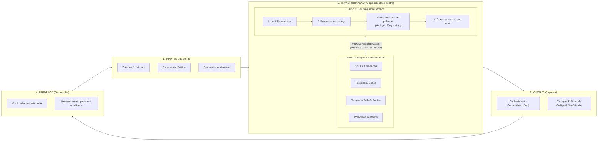

# 🧠 10 - O Sistema Completo: Segundo Cérebro Humano & Segundo Cérebro da IA

> *"Você é a fonte. A IA é o multiplicador. Multiplicação de zero = zero."*  
> *"Mais arquivos ≠ mais inteligência. O que fica inteligente são os arquivos."*  
> *"Memória é Commodity. Utilidade é Moat. Construa o que sobra."*

---

## 🧭 O Manifesto da Simbiose Soberana

Este documento materializa a união entre **Seu Segundo Cérebro (Zettelkasten / Reflexão Autoral)** e o **Segundo Cérebro da IA (J.A.R.V.I.S. / Skills / Workflows Testados)** sob o rigor do **Método P.A.R.A. (Tiago Forte)**.



---

## 1. ⚔️ As Três Leis Fundamentais do Sistema

### Lei I: A Fronteira Clara de Autoria

- **A IA não escreve por você. Pensa COM você.**
- A IA lê, busca, compara e sugere.
- **VOCÊ decide, escreve e sintetiza.**
- Misturar anotações geradas cegamente por LLMs com notas autorais destrói o compounding cognitivo. O vault humano guarda o *insight* processado; o espaço da IA guarda os *mecanismos de execução*.

### Lei II: O Antídoto ao Mito do Compounding Automático

Seu cofre digital não fica inteligente sozinho apenas acumulando texto:

- **A Rota da Degeneração**: Acúmulo passivo $\rightarrow$ Duplicatas $\rightarrow$ Contradições $\rightarrow$ Lixo acumulado $\rightarrow$ **"Wiki que ninguém mantém"**.
- **A Rota da Utilidade Viva**: Revisão periódica $\rightarrow$ **Poda ativa de arquivos** $\rightarrow$ Atualização das diretrizes (`GEMINI.md` / `CLAUDE.md`) $\rightarrow$ **"Sistema cada vez mais útil"**.

> [!IMPORTANT]
> A recente redução de 66.5% no token budget das 165 skills em `C:\Users\Ad\.gemini\config\skills` foi a aplicação exata desta lei: **podar o ruído para que a inteligência do sistema aumente**.

### Lei III: Memória é Commodity, Utilidade é Moat

- **O que a maioria tenta construir**: *"Sistemas de memória infinita"*, logs de tudo, dumps desorganizados. Quando os modelos resolverem contexto nativo infinito a custo zero, essa camada perde todo o valor.
- **O que sobra (O Seu Moat Perpétuo)**:
  1. **Notas autorais com o SEU pensamento** (visão, premissas, sínteses zettelkasten).
  2. **Fluxos de trabalho testados** (scripts PowerShell/Bash determinísticos, pipelines validados).
  3. **Skills e processos operacionais** (o arsenal criptografado em `E:\.skill-registry`).

---

## 2. 📁 O Espaço de Trabalho da IA (Fluxo 2)

Dentro do ecossistema soberano em `E:\.skill-registry`, o ambiente da IA é modular e estritamente delimitado:

```text
E:\.skill-registry\ (ou seu Workspace de Trabalho)
├── 01_OUTPUTS/          → Entregas geradas, relatórios forenses, artefatos
├── 02_SKILLS/           → 143 Skills canônicas catalogadas e validadas
├── 03_SPECS/            → Especificações técnicas, ADRs, contratos de API
├── 04_ELEMENTOS/        → Prompts de agentes, personas, subagents
├── 05_TEMPLATES/        → Esqueletos padronizados, blueprints de projetos
├── 06_DECISOES/         → Histórico de decisões de arquitetura (ADRs imutáveis)
└── 07_BRIEFINGS/        → Contexto de projetos, requisitos de negócio (ex: Markitos-ERP)
```

---

## 3. 🗂️ Estrutura P.A.R.A. Aplicada ao Cofre Soberano

| Pilar P.A.R.A. | Definição (Tiago Forte) | Instanciação Prática no Ecossistema |
| :--- | :--- | :--- |
| **P — Projects** | Iniciativas ativas com prazo e critério de conclusão claro | • `Markitos-ERP` (Faturamento, Asaas, Kardex)<br>• `Ascensao-Nivel-9` (Mineração e Flagships) |
| **A — Areas** | Esferas de responsabilidade contínua sem prazo final | • `Ciberseguranca-Defesa`<br>• `Engenharia-de-Software`<br>• `Governanca-de-Agentes-IA` |
| **R — Resources** | Tópicos de interesse, repositórios de referência e bibliotecas | • `06 - GitHub Starred Repositories (2.168 repos)`<br>• `Arsenal de 143 Skills`<br>• `Templates e Manuais` |
| **A — Archives** | Itens inativos preservados perpetuamente para auditoria | • `Baseline Hyperion v1.0.0 (Selada)`<br>• `Backups Criptografados`<br>• `Quarentena (118 tombstones)` |

---

## 4. 🔄 O Ciclo de Execução Contínua

1. **A Fricção Humana**: Ler a documentação e a regra de negócio. Sintetizar na cabeça antes de delegar cegamente.
2. **A Alavancagem da IA**: A IA recebe o briefing limpo, aplica a skill especializada, executa testes em sandbox e entrega a implementação.
3. **A Validação Crítica**: Você revisa o output e consolida o aprendizado.
4. **Poda e Lapidação**: Atualização dos checkpoints e eliminação de artefatos temporários.

> **"Se qualquer parte não existe, você não tem um sistema. Tem uma pasta."**
