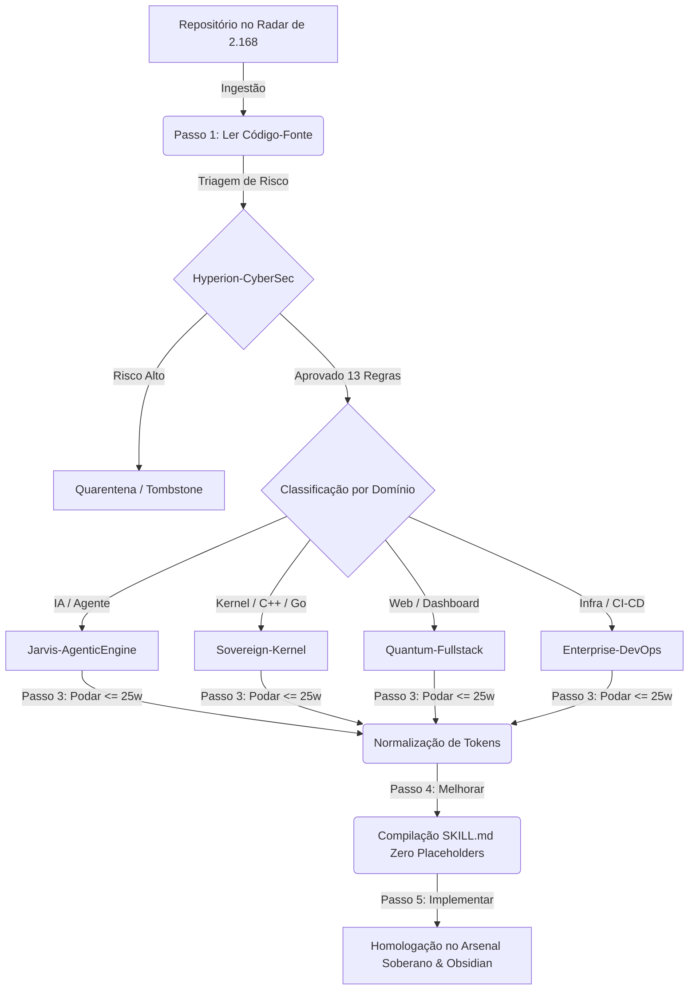

# 🤖 Esquadrões de Subagentes J.A.R.V.I.S. // Swarm Multiagente Soberano

> [!IMPORTANT] 🏛️ Filosofia Operacional do Swarm
> Em conformidade com a regra de governança **Sovereign Architecture First** e **Zero Placeholders**, o J.A.R.V.I.S. não opera como um modelo monolítico genérico. O poder cognitivo é distribuído entre **5 Esquadrões de Subagentes Especializados**, cada um ancorado em um cluster de repositórios minerados do GitHub e municiado com skills canônicas do Arsenal Soberano.

---

## 🧭 Visão Geral dos 5 Esquadrões Especializados

```text
               ╔════════════════════════════════════════════════╗
               ║       J.A.R.V.I.S. COGNITIVE ORCHESTRATOR      ║
               ║               (Nível 9 Sovereign)              ║
               ╚═══════════════════════╦════════════════════════╝
                                       ║
      ╔══════════════╦═════════════════╬═════════════════╦══════════════╗
      ▼              ▼                 ▼                 ▼              ▼
┌────────────┐ ┌────────────┐   ┌────────────┐   ┌────────────┐   ┌────────────┐
│ HYPERION   │ │ JARVIS     │   │ SOVEREIGN  │   │ QUANTUM    │   │ ENTERPRISE │
│ CYBERSEC   │ │ AGENTIC    │   │ KERNEL/SYS │   │ FULLSTACK  │   │ DEVOPS/OPS │
│ 343 Repos  │ │ 649 Repos  │   │ 546 Repos  │   │ 496 Repos  │   │ 134 Repos  │
└────────────┘ └────────────┘   └────────────┘   └────────────┘   └────────────┘
```

---

## 🛡️ 1. Esquadrão `Hyperion-CyberSec` (Defesa e Análise Forense)

- **Comandante Tático**: `Hyperion-CyberSec Agent`
- **Volume de Repositórios**: **343 repositórios**
- **Foco Técnico**: Engenharia reversa, análise de binários, detecção de anti-debug/anti-VM, proteção de memória, auditoria de código para vulnerabilidades (OWASP Top 10, CWE).
- **Repositórios de Referência Chave**:
  - `KiExitDispatcher/GoDefender` (Anti-Virtualization, Anti-Debug, VM Detect em Go)
  - `ac3ss0r/obfusheader.h` (C++14 compile-time metaprogramming obfuscation)
  - `sqlmapproject/sqlmap` (Deteção e exploração automatizada de SQLi)
  - `zaproxy/zaproxy` (Auditoria dinâmica DAST e proxy tático)
- **Skills Atribuídas**:
  - `sql-injection-testing`
  - `sqlmap-database-pentesting`
  - `broken-authentication`
  - `api-security-testing`
  - `frontend-mobile-security-xss-scan`
  - `burp-suite-testing`
- **Diretriz de Segurança**: Fail-Closed irrestrito. Nenhuma proposta é promovida ao Arsenal sem 13/13 regras passadas no laudo de segurança soberana.

---

## 🧠 2. Esquadrão `Jarvis-AgenticEngine` (Orquestração e Síntese Cognitiva)

- **Comandante Tático**: `Jarvis-Agentic Engine`
- **Volume de Repositórios**: **649 repositórios**
- **Foco Técnico**: Sistemas multiagente, conversações colaborativas, loops de avaliação contínua, RAG avançado, reranking vetorial e compressão de contexto.
- **Repositórios de Referência Chave**:
  - `microsoft/autogen` (Framework de conversação multiagente desacoplada)
  - `crewAIInc/crewAI` (Role-playing autonomous AI agents)
  - `vllm-project/vllm` (High-throughput & low-latency LLM serving engine)
  - `langchain-ai/langchain` (Primitivas de orquestração de LLMs)
- **Skills Atribuídas**:
  - `autogen` (Canônica sintetizada no Hyperion)
  - `subagent-driven-development`
  - `dispatching-parallel-agents`
  - `context-compression`
  - `context-engineering`
  - `agent-skill-stack`
  - `ai-engineer`
- **Diretriz de Governança**: Poda Ativa Inegociável ($\le 25$ palavras na descrição do sistema) para cumprimento rigoroso da Lei do Mito do Compounding.

---

## ⚡ 3. Esquadrão `Sovereign-Kernel & Systems` (Baixo Nível e Performance Extrema)

- **Comandante Tático**: `Sovereign-Kernel Agent`
- **Volume de Repositórios**: **546 repositórios**
- **Foco Técnico**: Rust, Go, C/C++, manipulação de drivers de kernel do Windows/Linux, concorrência lock-free, compilação JIT, otimização SIMD e parsers AST de alta performance.
- **Repositórios de Referência Chave**:
  - `al-khaser/al-khaser` (PoC de evasão e análise de malware do Windows)
  - `mimikatz/mimikatz` (Auditoria de credenciais e lsass em Windows)
  - `libuv/libuv` (Engine assíncrona multiplataforma)
- **Skills Atribuídas**:
  - `bash-defensive-patterns`
  - `linux-troubleshooting`
  - `code-simplification`
  - `domain-modeling`
  - `systematic-debugging`
- **Diretriz Operacional**: Execução local, soberana e determinística. Sem emuladores, sem caixas-pretas de nuvem.

---

## 🎨 4. Esquadrão `Quantum-Fullstack UI/UX` (HUD Holográfico e Ergonomia Cognitiva)

- **Comandante Tático**: `Quantum-Fullstack Agent`
- **Volume de Repositórios**: **496 repositórios**
- **Foco Técnico**: Glassmorphism avançado, síntese de áudio Web Audio API, Web Speech API nativa, CSS Vanilla puro sem bloat de frameworks externos, dashboards de alta densidade informacional.
- **Repositórios de Referência Chave**:
  - `tailwindlabs/tailwindcss` (Gramática moderna de design de tokens)
  - `shadcn-ui/ui` (Design system acessível e desacoplado)
  - `facebook/react` (Arquitetura de componentes reativos)
- **Skills Atribuídas**:
  - `frontend-ui-engineering`
  - `frontend-design`
  - `web-design-guidelines`
  - `gsap-scrolltrigger`
  - `assistant-ui`
  - `shadcn`
- **Diretriz Estética**: Visual de ficção científica funcional. Efeitos de neon cyan, sombras holográficas, feedback auditivo tático e tempo de resposta instantâneo ($< 16\text{ ms}$ no DOM).

---

## 🚀 5. Esquadrão `Enterprise-DevOps & Cloud` (Infraestrutura e Confiabilidade)

- **Comandante Tático**: `Enterprise-DevOps Agent`
- **Volume de Repositórios**: **134 repositórios**
- **Foco Técnico**: Pipelines de CI/CD resilientes, GitHub Actions, contêineres Docker herméticos, migrações sem downtime, observabilidade de banco de dados e telemetria OpenTelemetry.
- **Repositórios de Referência Chave**:
  - `actions/checkout` (Workflows seguros de automação GitHub)
  - `docker/compose` (Orquestração de microserviços desacoplados)
  - `prometheus/prometheus` (Telemetria e monitoramento de métricas em série temporal)
- **Skills Atribuídas**:
  - `github-actions-templates`
  - `ci-cd-and-automation`
  - `database-migrations-sql-migrations`
  - `database-migrations-migration-observability`
  - `distributed-tracing`
  - `deploy-to-vercel`
  - `use-railway`
- **Diretriz de Resiliência**: Zero downtime, migrações atômicas e rastreabilidade total de cada alteração com rollback instantâneo.

---

## 🔄 Fluxo de Trabalho Integrado Entre os Esquadrões


