# 🛡️ 17 - Protocolo de Segurança Soberana v13 (SSP-v13)

> [!IMPORTANT] 🏛️ Diretiva Institucional Soberana
> O **Protocolo de Segurança Soberana v13 (SSP-v13)** estabelece a governança definitiva e as **13 Leis Invariantes** que blindam o ecossistema J.A.R.V.I.S., o arsenal de habilidades canônicas e o Segundo Cérebro Obsidian contra vazamento acidental de segredos, ataques de injeção em cadeia de suprimentos, desvio de quarentena e degradação de tokens.

[[00 - J.A.R.V.I.S. Cognitive Vault|⬅️ Voltar ao Painel Mestre]] | [[02 - Security & Quarantine Ledger|🛡️ 02 - Quarentena & Custódia]]

---

## 🏛️ As 13 Leis Invariantes de Segurança Soberana

```mermaid
graph TD
    SSP[Protocolo de Segurança Soberana v13] --> Core[Núcleo Criptográfico & Merkle]
    SSP --> Containment[Barreira de Quarentena Fail-Closed]
    SSP --> Secrets[Proteção & Sanitização de Segredos]
    SSP --> Tokens[Governança de Tokens & Desempenho]
    SSP --> PublicGate[Portão de Auditoria Pré-Publicação]

    Core --> INV2[SSP13-02: Merkle Root SHA-256 Imutável]
    Core --> INV8[SSP13-08: 870 Pinos Criptográficos]
    Core --> INV12[SSP13-12: Livro-Razão Forense JSONL]
    
    Containment --> INV3[SSP13-03: Quarentena & Waiver Auditado]
    Containment --> INV7[SSP13-07: Consentimento Explícito -Approved]
    Containment --> INV13[SSP13-13: Rollback Atômico Imediato]

    Secrets --> INV1[SSP13-01: Zero-Secret Leakage]
    Secrets --> INV5[SSP13-05: Isolamento Local-First]
    Secrets --> INV6[SSP13-06: Redação de Caminhos Absolutos]

    Tokens --> INV4[SSP13-04: Lei do Mito do Compounding <=15w]
    Tokens --> INV9[SSP13-09: Acessibilidade Universal WCAG 2.1 AA]

    PublicGate --> INV10[SSP13-10: Auditoria Determinística Exit 0]
    PublicGate --> INV11[SSP13-11: Divulgação Ética e Responsável]
```



---

### Tabela de Invariantes Soberanas

| ID | Nome da Invariante | Categoria | Mecanismo de Imposição | Status |
| :--- | :--- | :--- | :--- | :---: |
| **SSP13-01** | **Zero-Secret Leakage Pre-Publish Barrier** | Credenciais | Bloqueio automático pré-commit e pré-push via script determinístico de regex/entropia (`tooling/audit_pre_publish_security.py`). | `ATIVO` |
| **SSP13-02** | **Cryptographic Merkle Root Integrity** | Cadeia de Suprimentos | Validação formal de cada habilidade contra a raiz `c6d7e89f...` (`urn:skill-registry:merkle-tree:v1`). | `SEALED` |
| **SSP13-03** | **Fail-Closed Quarantine Barrier** | Contenção | Bloqueio padrão de ferramentas não homologadas; retenção com waiver auditado (`WAIVER-2026-SEC-010`). | `ATIVO` |
| **SSP13-04** | **Token Budget Compounding Defense** | Eficiência Cognitiva | Frontmatters estritamente concisos ($\le 15$ palavras), sem scripts bash embutidos no YAML, garantindo $>77\%$ livre. | `CONFORME` |
| **SSP13-05** | **Local-First Sovereign Isolation** | Privacidade de Rede | Telemetria, memórias vetoriais e segredos residem exclusivamente no host local sem exfiltração. | `ISOLADO` |
| **SSP13-06** | **System Path Anonymization & Redaction** | Proteção PII | Conversão de caminhos pessoais do host para `$REGISTRY_ROOT` em artefatos públicos. | `ATIVO` |
| **SSP13-07** | **Role-Based Agent Isolation & Mutation Consent** | Autorização | Agentes Quânticos operam em modo somente-leitura; escrita em disco requer confirmação explícita `-Approved`. | `ATIVO` |
| **SSP13-08** | **Multi-Platform Dependency Pinning** | Reprodutibilidade | 870 pinos rigorosamente registrados em lockfiles para 6 ecossistemas de agentes. | `870/870` |
| **SSP13-09** | **Universal Accessibility & Ergonomics** | Acessibilidade UI | WCAG 2.1 AA, marcos semânticos ARIA, foco `:focus-visible` e controle 100% por teclado. | `100% CONFORME` |
| **SSP13-10** | **Deterministic Pre-Publish Audit Gate** | Higiene de Release | Exigência de retorno `Exit 0` do auditor soberano antes de qualquer push ao GitHub público. | `OBRIGATÓRIO` |
| **SSP13-11** | **Responsible Vulnerability Disclosure** | Divulgação Ética | Canal estruturado em [[SECURITY.md]] para reporte privado e criptografado de vulnerabilidades. | `DEFINIDO` |
| **SSP13-12** | **Immutable Quantum Ledger** | Auditabilidade Forense | Gravação de missões, telemetria e evidências técnicas em `state/quantum-agent-ledger.jsonl`. | `IMUTÁVEL` |
| **SSP13-13** | **Fail-Safe Rollback & Recovery Checkpoints** | Recuperação | Restauração atômica imediata via `recovery-checkpoint.json` em caso de quebra de integridade. | `ARMADO` |

---

## 🔒 Diretiva de Publicação em Repositório Aberto

Ao preparar o repositório para recebimento de contribuições no GitHub aberto:

1. **Arquivos com Sigilo Estrito (Nunca Rastrear no Git)**:
   - `config/api_keys.json` (usar exclusivamente `config/api_keys.example.json` para o público).
   - `.env` e variações locais.
   - `ui/.jarvis-profile/` (sessões de devtools, tokens de sessão e cookies locais).
   - Pastas brutas de staging ou dumps de migração.
2. **Execução Obrigatória Pré-Push**:
   ```bash
   python tooling/audit_pre_publish_security.py
   ```
   *Qualquer tentativa de publicação com saída diferente de `0` será abortada imediatamente.*

---

## 🔗 Conexões no Segundo Cérebro (MOCs Relacionadas)
- [[00 - J.A.R.V.I.S. Cognitive Vault|00 - Painel Mestre J.A.R.V.I.S.]]
- [[01 - Arsenal Map of Content|01 - Arsenal de Habilidades (149 Skills)]]
- [[02 - Security & Quarantine Ledger|02 - Centro de Quarentena e Custódia]]
- [[05 - Hyperion Forensic Baseline|05 - Baseline Forense Hyperion]]
- [[11 - Esquadroes de Subagentes J.A.R.V.I.S. e Swarm Autonomo|11 - Esquadrões de Subagentes & Swarm]]
