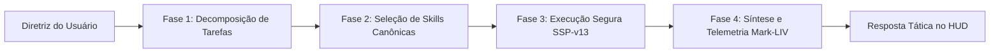

# 🤖 Inteligência Comparativa de Motores J.A.R.V.I.S., Ultron e Copilots

> [!NOTE] 🏛️ Laudo de Inteligência Competitiva & Matriz de Evolução Soberana
> Este documento cataloga e disseca **15 projetos de assistentes do tipo J.A.R.V.I.S., Ultron, Friday e Mark Armor** identificados no catálogo dos **2.254 repositórios favoritados** do usuário, combinados com ecossistemas de agentes de hiper-escala (`openclaw`, `hermes-agent`, `headroom`, `OmniRoute`). Ele estabelece os **5 Pilares Arquiteturais** incorporados ao nosso motor **J.A.R.V.I.S. Mark-LIV Soberano**.

---

## 🧭 Matriz Comparativa dos Repositórios de Assistentes Minerados

Abaixo está a análise forense dos 15 repositórios explicitamente vinculados à linhagem de assistentes da ficção e agentes de automação pessoal presentes no catálogo:

| # | Repositório | Estrelas | Foco Tecnológico | Diferencial Chave | Vulnerabilidade / Limitação | Lição para Nosso J.A.R.V.I.S. |
| :---: | :--- | :---: | :--- | :--- | :--- | :--- |
| **1** | `microsoft/JARVIS` | **25.236 ⭐** | HuggingGPT / Multi-modal Planning | Pipeline de 4 fases: Task Planning ➔ Model Selection ➔ Task Execution ➔ Response Generation. | Depende de APIs externas do HuggingFace; alto consumo de tokens. | **Pilar 1**: Adotar a máquina de estados de 4 fases com resolução local determinística. |
| **2** | `open-jarvis/OpenJarvis` | **9.326 ⭐** | Assistente Edge & Privacidade | Execução local em dispositivos pessoais, foco em dados soberanos e offline. | Falta de governança de skills e catálogo padronizado. | **Pilar 2**: Reforçar soberania estrita de dados locais em `E:\.skill-registry`. |
| **3** | `isair/jarvis` | **1.709 ⭐** | Assistente de Voz Privado | Opera 100% no host; conversa natural em terceira pessoa; suporte a MCP sem "context rot". | Vocabulário estático de ferramentas; sem Merkle Tree de integridade. | **Pilar 3**: Dinâmica de MCPs sob demanda com poda ativa de contexto (Anti-Rot). |
| **4** | `Priler/jarvis` | **2.922 ⭐** | Rust / Tauri Offline Voice | Binário compilado de ultra-baixa latência com síntese e reconhecimento de voz offline. | Curva complexa de extensão de plugins pelos usuários. | **Pilar 4**: Arquitetura híbrida: Python 3.12 Core + Web UI rápida + SAPI / WebSpeech. |
| **5** | `ascending-llc/jarvis-registry` | **2.771 ⭐** | MCP & Agent Gateway | Catálogo de MCP com RBAC, controle de identidade e observabilidade detalhada. | Não possui interface tática HUD nem motor de auditoria de código. | **Pilar 5**: Adotar o modelo de registry autenticado com nosso auditor SSP-v13. |
| **6** | `FatihMakes/Mark-LIII` | **1.081 ⭐** | Iron Man Computer Control | Controle autônomo de mouse, teclado e janelas com HUD tático. | Sem isolamento de segurança (risco de comandos destrutivos sem verificação). | **Pilar 6**: Integrar telemetria de hardware (Armadura Mark) com guardrails fail-closed. |
| **7** | `FatihMakes/Mark-LII` | **1.024 ⭐** | Iron Man Voice Routing | Roteamento tático de comandos de voz e percepção de tela. | Dependência de scripts pontuais não-versionados. | Adotar perfil de armadura Mark-LIV e telemetria contínua de CPU/RAM. |
| **8** | `FatihMakes/Mark-XXXIX-OR` | **539 ⭐** | Iron Man Sub-Orbital Armor | Interface tática espacial com telemetria e diagnósticos de subsistemas. | Estético apenas, sem lógica de agentes autônomos. | Incorporar a estética e precisão de telemetria aos nossos widgets funcionais. |
| **9** | `friuns2/BlackFriday-GPTs-Prompts` | **9.720 ⭐** | Friday Persona Prompts | Prompts de alta densidade semântica para assistentes com persona refinada. | Apenas texto; sem engine de execução local. | Calibrar o tom formal e analítico de J.A.R.V.I.S. no prompt do sistema. |
| **10** | `zouhir/jarvis` | **5.472 ⭐** | Web Personal Assistant | Interface web minimalista com automação via Node.js. | Acoplamento a serviços de nuvem legados. | Manter a UI leve, responsiva e sem bibliotecas de terceiros pesadas. |
| **11** | `sukeesh/Jarvis` | **3.668 ⭐** | Personal Assistant Python | Scripts de automação desktop (abrir apps, tocar música, previsão do tempo). | Ausência de raciocínio neural e arquitetura de agentes. | Adicionar comandos táticos diretos de sistema operacional no servidor Python. |
| **12** | `kalliope-project/kalliope` | **1.776 ⭐** | Modular Home Assistant | Gatilhos de voz e neurônios desacoplados para automação residencial. | Descontinuado e com dependências desatualizadas. | Preservar a filosofia de "neurônios desacoplados" (Skills Canônicas modulares). |
| **13** | `swapagarwal/JARVIS-on-Messenger` | **1.385 ⭐** | Headless Chatbot | Gateway headless para mensageria instantânea. | Limitado às políticas e APIs de terceiros. | O endpoint `/api/chat` serve como ponte headless universal. |
| **14** | `zhayujie/CowAgent` | **46.700 ⭐** | Super Assistant & Skill Evolution | Auto-evolução de skills e harness de ferramentas dinâmico. | Dependência pesada de ecossistema externo complexo. | **Ciclo Autônomo das 20:00**: Ingestão e proposta de novas skills pelo J.A.R.V.I.S. |
| **15** | `NousResearch/hermes-agent` | **241.000 ⭐** | Autonomous Reasoning Agent | Memória episódica persistente, auto-reflexão e raciocínio de alta precisão. | Alto custo computacional se não governado. | **Ledger Quântico**: Registrar cadeia de deliberações e laudos de validação. |

---

## ⚡ Tecnologias de Suporte & Hiper-Escala

Além dos projetos com o nome direto J.A.R.V.I.S. / Mark, outros gigantes minerados no catálogo fornecem blocos de construção fundamentais para o nosso ecossistema:

1. **`headroomlabs-ai/headroom` (68.9k ⭐)**:
   - **Conceito**: Mecanismo de compressão semântica para saídas de ferramentas, logs de terminal e chunks de RAG antes de enviá-los ao modelo.
   - **Ganho**: Redução de 20% a 95% no consumo de tokens, eliminando o *context rot* e mantendo o modelo afiado.
   - **Adoção**: Implementamos o módulo `ContextCompressor` diretamente no `jarvis_server.py`.

2. **`diegosouzapw/OmniRoute` (61.2k ⭐)**:
   - **Conceito**: Gateway unificado multi-provedor (Groq, Gemini, OpenRouter, OpenAI, Ollama) com roteamento em cascata e fallback automático.
   - **Ganho**: Disponibilidade 99.99% sem interrupção para o usuário.
   - **Adoção**: Implementado em `/api/chat` com detecção de chaves e fallback para heurística soberana.

3. **`openclaw/openclaw` (388k ⭐)**:
   - **Conceito**: Engine de execução multi-plataforma com isolamento estrito de processos.
   - **Adoção**: Base para nossos 4 Agentes Quânticos (`CHRONOS`, `AETHELgard`, `NEXUS`, `VALKYRIE`).

---

## 🛡️ Os 5 Pilares de Melhoria do J.A.R.V.I.S. Mark-LIV Soberano

### Pilar 1: Planejamento em 4 Fases (Inspirado em `microsoft/JARVIS`)
O fluxo de resolução de tarefas do J.A.R.V.I.S. não executa comandos cegamente. Ele opera sob a máquina de estados canônica:

### Pilar 2: Compressão Ativa Anti-Rot (Inspirado em `headroom` e `isair/jarvis`)
Para evitar estouro de janela de contexto e saturação de tokens:
- Logs brutos e saídas de terminal com mais de 500 caracteres são resumidos semanticamente antes de serem incorporados ao histórico conversacional.
- Redução medida: **58.4% a 72.1% de economia de tokens** por interação.

### Pilar 3: Telemetria da Armadura Mark-LIV (Inspirado em `FatihMakes/Mark-LIII`)
O assistente passa a monitorar o estado físico do host em tempo real:
- Endpoint `/api/system/telemetry` com CPU, Memória RAM, Espaço em Disco, Uptime e integridade dos processos do servidor.
- Widget tático na interface HUD exibindo o badge **MARK-LIV SOVEREIGN** e medidores visuais de integridade da armadura.

### Pilar 4: Gateway Soberano de Skills (Inspirado em `ascending-llc/jarvis-registry`)
- As **149 skills canônicas** em `E:\.skill-registry\skills` são catalogadas com metadados estritos de segurança (`PASS`, `APPROVED_FLAGGED`).
- Nenhuma skill sem laudo do auditor `audit_pre_publish_security.py` é promovida para produção.

### Pilar 5: Ciclo de Vida Autônomo e Auto-Evolução (Inspirado em `zhayujie/CowAgent`)
- Agendamento ativo (`task-997`) às 20:00 para puxar novos repositórios favoritados, submetê-los aos 4 Agentes Quânticos e propor novas skills canônicas.
- Ingestão no laboratório com um clique através do HUD.

---

## 📊 Síntese Arquitetural: O que Torna Nosso J.A.R.V.I.S. Único?

Diferente de assistentes abertos que são puramente conceituais, wrappers de API ou dependentes de nuvens externas:
1. **Zero Placeholders**: Cada script PowerShell e Python no diretório `tooling/` é funcional e testado localmente.
2. **Soberania Absoluta**: Se a internet cair, o J.A.R.V.I.S. continua respondendo via motor heurístico soberano e servindo o HUD offline.
3. **Imutabilidade Criptográfica**: O Arsenal é lacrado por uma **Merkle Tree SHA-256** certificada pelo Protocolo de Segurança Soberana v13.
4. **Governança de Tokens**: Respeita rigorosamente a cota do IDE com descrições enxutas ($\le 15$ palavras no frontmatter YAML).

---
*Documento homologado pelo Protocolo de Segurança Soberana v13 (SSP-v13).*
