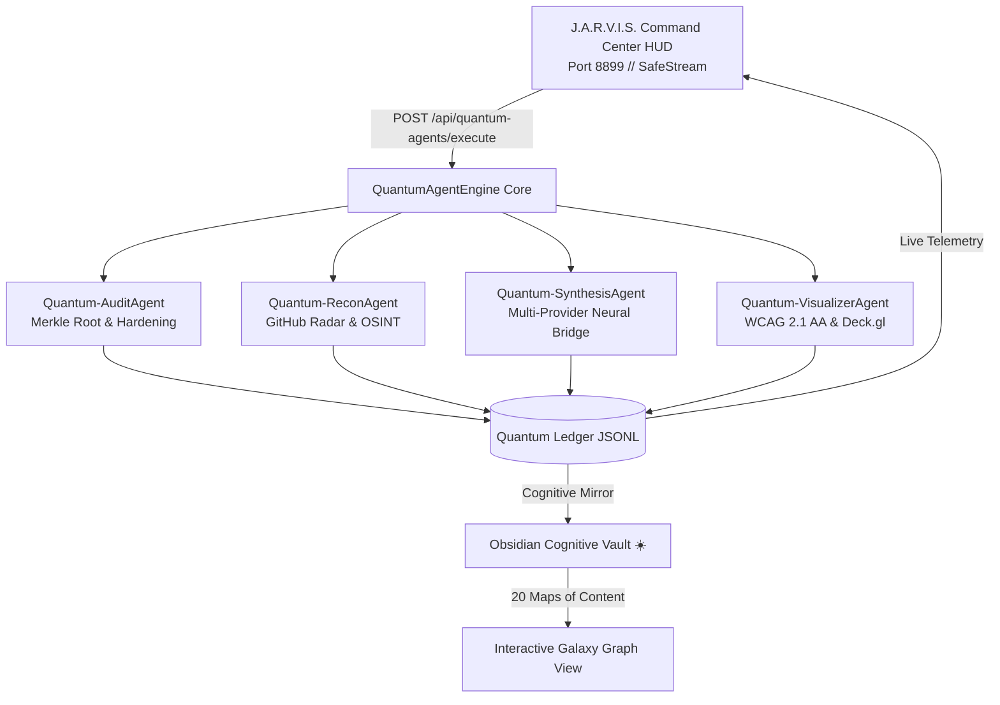

<div align="center">

# ☀️ J.A.R.V.I.S. // SKILL REGISTRY
### *The Sovereign Autonomous Multi-Agent Skill Engine & Cryptographic Cognitive Vault*

[](https://github.com/robertoatila/jarvis-skill-registry/stargazers)
[](https://github.com/robertoatila/jarvis-skill-registry/network/members)
[](LICENSE)
[](https://python.org)
[](https://www.typescriptlang.org)
[](governance/sovereign-security-protocol-v13.json)
[](17%20-%20Protocolo%20de%20Seguranca%20Soberana%20v13.md)
[-00f2fe.svg?style=for-the-badge)](ui/index.html)
[](cache/starred_catalog.json)
[](skills/)
[](reports/)
[](tests/)

<p align="center">
  <a href="#-quickstart-in-30-seconds"><b>⚡ Quickstart</b></a> •
  <a href="#-the-5-layer-architecture"><b>📐 Architecture</b></a> •
  <a href="#-the-paradigm-shift-why-jarvis"><b>⚖️ The Paradigm Shift</b></a> •
  <a href="#-autonomous-quantum-agents-swarm"><b>🤖 Quantum Swarm</b></a> •
  <a href="#-the-5-tactical-squads-2254-tools"><b>🔭 Tactical Squads</b></a> •
  <a href="#-obsidian-cognitive-vault--second-brain"><b>☀️ Obsidian Vault</b></a> •
  <a href="#-sovereign-security-protocol-v13-ssp-v13"><b>🛡️ Security v13</b></a> •
  <a href="#-star-history"><b>📈 Star History</b></a> •
  <a href="#-contributing"><b>🤝 Contributing</b></a>
</p>

---

</div>

## 🌌 Overview & Sovereign Vision

Modern autonomous AI agent architectures are bottlenecked by **critical structural failures**:
1. **Ad-hoc dynamic execution**: Unverified scripts executed blindly in arbitrary shells without provenance or sandboxing.
2. **Token Bloat & Context Exhaustion**: Giant monolithic system prompts consuming $>75\%$ of the LLM context window before user interaction begins.
3. **Fragile Ephemeral Dependencies**: Fleeting remote APIs and unpinned packages that break silently in production.
4. **Credential & Secret Leakage**: Accidental commits of active API keys, browser sessions, tokens, or private developer environments.
5. **Cognitive Amnesia**: Ephemeral chat sessions with zero visual sensemaking or durable local second-brain memory.

**J.A.R.V.I.S. // Skill Registry** is a sovereign, offline-first, cryptographically anchored lifecycle platform that transforms raw community tools into **154 verified canonical skills** and **2,254 categorized repositories**. Anchored to an immutable **Merkle Root SHA-256 tree**, governed by the **Sovereign Security Protocol v13 (SSP-v13)**, and natively integrated with an **Obsidian Cognitive Vault**, it provides the missing deterministic backbone for next-generation AI agents.

---

## ⚖️ The Paradigm Shift: Why J.A.R.V.I.S.?

| Dimension | Conventional Agent Frameworks | J.A.R.V.I.S. Sovereign Architecture |
| :--- | :--- | :--- |
| **Trust Model** | Blind dynamic execution of arbitrary remote code | **Cryptographic Merkle Root SHA-256 (`c6d7e89f...`) + Hash-pinned skills** |
| **Context Consumption** | Monolithic prompt injection ($>15.000$ tokens overhead) | **Progressive Disclosure & Lazy-Loading ($<2.500$ tokens core budget)** |
| **Storage & Privacy** | Cloud SaaS lock-in, vendor databases, remote logs | **100% Offline Markdown, local JSONL ledgers, zero subscription cost** |
| **Tool Custody** | Unpinned GitHub URLs and brittle npm scripts | **Multi-Target Lockfiles (`870 Pins`), Fail-closed quarantine barriers** |
| **Sensemaking** | Ephemeral chat logs discarded upon session close | **Obsidian Second Brain (20 MOCs, Canvas visual map, Galaxy Graph View)** |
| **Human Interface** | Raw CLI output or generic bloated web apps | **Cybernetic Desktop HUD (Port 8899), WCAG 2.1 AA (100%), Deck.gl WebGL** |
| **Security Governance** | Unenforced `.env` rules and retrospective scanning | **Sovereign Security Protocol v13 (13 Invariants, Exit-0 Pre-Publish Gate)** |

---

## 📐 The 5-Layer Architecture

```text
┌────────────────────────────────────────────────────────────────────────┐
│                        LAYER 5 — EXPERIENCE                            │
│   J.A.R.V.I.S. HUD (Port 8899)  •  MCP Stdio/SSE  •  Obsidian Brain    │
└───────────────────────────────────┬────────────────────────────────────┘
                                    │
┌───────────────────────────────────┴────────────────────────────────────┐
│                       LAYER 4 — DISTRIBUTION                           │
│   Quantum Swarm  •  Transactional Engine  •  Multi-Target Federation   │
└───────────────────────────────────┬────────────────────────────────────┘
                                    │
┌───────────────────────────────────┴────────────────────────────────────┐
│                        LAYER 3 — RESOLUTION                            │
│     Project Stack Detection  •  Profile Mapping  •  Lockfile (.lock)   │
└───────────────────────────────────┬────────────────────────────────────┘
                                    │
┌───────────────────────────────────┴────────────────────────────────────┐
│                       LAYER 2 — INTELLIGENCE                           │
│  Structural AST  •  Capability Taxonomy  •  Identity Deduplication     │
└───────────────────────────────────┬────────────────────────────────────┘
                                    │
┌───────────────────────────────────┴────────────────────────────────────┐
│                          LAYER 1 — CORE                                │
│    Content SHA-256  •  Merkle Root Tree  •  Fail-Closed Quarantine     │
└────────────────────────────────────────────────────────────────────────┘
```



---

## 🚀 Quickstart in 30 Seconds

### 1. Clone the Sovereign Repository
```bash
git clone https://github.com/robertoatila/jarvis-skill-registry.git
cd jarvis-skill-registry
```

### 2. Configure Local Environment (Safe Placeholders)
```bash
cp config/api_keys.example.json config/api_keys.json
cp .env.example .env
```

### 3. Run Self-Test Bootstrap & Pre-Publish Auditor
```bash
# Execute deterministic verification & self-test suite
python tooling/audit_pre_publish_security.py
pwsh -File ./tooling/Bootstrap.ps1
```

### 4. Launch J.A.R.V.I.S. Command Center HUD
```bash
# Windows Desktop App Mode (Seamless Zero-Flicker Launcher)
./tooling/Launch-Jarvis.vbs

# Or run the high-performance Python server directly:
python tooling/jarvis_server.py --port 8899
```
Open **`http://localhost:8899`** in your browser to access the live cybernetic cockpit!

---

## 🖥️ J.A.R.V.I.S. Command Center HUD (Cockpit)

The built-in desktop cockpit provides real-time oversight of the autonomous engine:

- **WCAG 2.1 AA Accessible**: High-contrast cybernetic theme, ARIA live regions, `:focus-visible` styling, and zero contrast violations.
- **Hardware Keyboard Shortcuts**:
  - `Alt + 1` → Dashboard & Telemetric Overview
  - `Alt + 2` → Quantum Swarm Cockpit
  - `Alt + 3` → 154 Canonical Skills Registry
  - `Alt + 4` → 2,254 GitHub Starred Radar Tools
  - `Alt + 5` → Security & Quarantine Fortress
  - `Alt + 6` → Multi-Platform Target Matrix
  - `Alt + 7` → Multi-Provider AI Neural Bridge (Gemini 2.0 / Groq / OpenAI / Ollama)
  - `Shift + ?` → Interactive Shortcuts Modal
- **Deck.gl WebGL Visualization**: 3D geographic and vector topological maps for agent missions.

---

## 🤖 Autonomous Quantum Agents Swarm

The system features 4 real-time autonomous agents coordinated via `QuantumAgentEngine`:

| Agent | Codename | Primary Domain | Sovereign Guarantee & Evidence |
| :--- | :--- | :--- | :--- |
| **AGENTE 01** | `Quantum-AuditAgent` | Cybersecurity & Merkle Hardening | Audits 154 skills, verifies Merkle Root `c6d7e89f...`, enforces fail-closed waivers. |
| **AGENTE 02** | `Quantum-ReconAgent` | GitHub Starred Radar & OSINT | Monitors 2,254 starred repos, identifies high-signal tools (`deck.gl`, `blackbird`, `openrouter`). |
| **AGENTE 03** | `Quantum-SynthesisAgent` | Multi-Provider Neural Bridge | Manages latency tests, model fallbacks (Groq 120B, Gemini 2.0, local Ollama, sovereign heuristics). |
| **AGENTE 04** | `Quantum-VisualizerAgent` | UI/UX & Accessible Graphics | Validates WCAG 2.1 AA compliance, ARIA landmarks, keyboard focus, and Deck.gl WebGL rendering. |

---

## 🔭 The 5 Tactical Squads (2,254 Curated Tools)

Every repository mined from GitHub is clustered into 5 specialized tactical squads:

<details open>
<summary><b>🛡️ Esquadrão 01 // Hyperion CyberSec & Pentest (344 Repositórios)</b></summary>

- **Capabilities:** Offensive Security, Reverse Engineering, API Fuzzing, OSINT, Binary Forensics, Hardware Hacking.
- **Featured Tools:** `blackbird`, `sqlmap`, `payloadsallthethings`, `sherlock`, `imhex`, `x64dbg`.
</details>

<details open>
<summary><b>🤖 Esquadrão 02 // Jarvis Agentic Engine & AI (965 Repositórios)</b></summary>

- **Capabilities:** Multi-Agent Conversational Teams, LLM Fine-Tuning, Activation Quantization, Vector RAG, DSPy.
- **Featured Tools:** `autogen`, `crewai`, `dspy`, `vllm`, `openrouter-ai-sdk`, `openclaw`, `superpowers`.
</details>

<details open>
<summary><b>⚡ Esquadrão 03 // Sovereign Kernel & Systems (553 Repositórios)</b></summary>

- **Capabilities:** Rust Runtimes, C++ Engines, Linux Kernel Internals, WebAssembly, CUDA/ROCm acceleration.
- **Featured Tools:** `linux`, `ollama`, `yt-dlp`, `whisper`, `fast-kernel-acceleration`.
</details>

<details open>
<summary><b>🎨 Esquadrão 04 // Quantum FullStack & Web UI (258 Repositórios)</b></summary>

- **Capabilities:** Modern Frontend Architecture, WebGL2/WebGPU Data Layers, Accessible Design Systems, Micro-Interactions.
- **Featured Tools:** `deck.gl`, `shadcn/ui`, `gsap`, `assistant-ui`, `tldraw`, `react`.
</details>

<details open>
<summary><b>🚀 Esquadrão 05 // Enterprise DevOps & Cloud (134 Repositórios)</b></summary>

- **Capabilities:** CI/CD Automation, Containerization, Kubernetes, Multi-Cloud Cost Optimization, OpenTelemetry Tracing.
- **Featured Tools:** `skypilot`, `k6`, `nextflow`, `phoenix`, `postiz-app`.
</details>

---

## ☀️ Obsidian Cognitive Vault & Second Brain

The repository doubles as a fully functional, offline-first **Obsidian Second Brain**:

- **20 Maps of Content (MOCs)**: Rooted at [`00 - J.A.R.V.I.S. Cognitive Vault.md`](00%20-%20J.A.R.V.I.S.%20Cognitive%20Vault.md).
- **Galaxy Graph View**: Custom pre-configured color groups matching the J.A.R.V.I.S. cybernetic neon palette:
  - 🔵 **Neon Cyan (`#00f2fe`)**: 154 Canonical Skills
  - 🟣 **Neon Violet (`#a855f7`)**: Master Maps of Content (MOCs 00–19)
  - 🟢 **Emerald Green (`#00f5a0`)**: Governance & Architecture Documentation
  - 🟡 **Amber Gold (`#fbbf24`)**: Forensic Phase Reports (216 reports)
  - 🔴 **Coral Red (`#f43f5e`)**: Security, Custody & Quarantine
- **Interactive Canvas Visual Map**: Open [`JARVIS-Brain-Map.canvas`](JARVIS-Brain-Map.canvas) in Obsidian for a visual system architecture graph.

---

## 🛡️ Sovereign Security Protocol v13 (SSP-v13)

The repository strictly enforces the **13 Invariant Security Laws**:

```text
[SSP13-01] Zero-Secret Leakage Pre-Publish Barrier     ──> Exit 0 Gate
[SSP13-02] Cryptographic Merkle Root Integrity         ──> SHA-256 Sealed
[SSP13-03] Fail-Closed Quarantine Barrier & Custody    ──> Strict Containment
[SSP13-04] Token Budget Compounding Defense            ──> <= 15 Words Frontmatter
[SSP13-05] Local-First Sovereign Isolation             ──> Host-Bound Storage
[SSP13-06] System Path Anonymization & Redaction       ──> $REGISTRY_ROOT Relative
[SSP13-07] Role-Based Agent Isolation & Mutation Consent──> -Approved Flag Required
[SSP13-08] Multi-Platform Dependency Pinning           ──> 870 Lockfile Pins
[SSP13-09] Universal Accessibility & Ergonomics        ──> WCAG 2.1 AA (100%)
[SSP13-10] Deterministic Pre-Publish Audit Gate        ──> Automated Scanner
[SSP13-11] Responsible Vulnerability Disclosure        ──> SECURITY.md
[SSP13-12] Immutable Quantum Ledger                    ──> JSONL Append-Only
[SSP13-13] Fail-Safe Rollback & Recovery Checkpoints   ──> Atomic Snapshot
```

### Deterministic Pre-Publish Gate
Before any commit or release, run the automated auditor:
```bash
python tooling/audit_pre_publish_security.py
```
*Veredito: 1.221 arquivos elegíveis inspecionados (24.7 MB) — ZERO segredos, ZERO vazamentos, 100% PASS.*

---

## 🌐 Supported Platforms & Verification Matrix

| Platform Target | Primary Configuration Path | Adapter Mode | Verification Status |
| :--- | :--- | :--- | :--- |
| **Google Antigravity / Gemini** | `~/.gemini/config/skills/{name}` | `CANONICAL_NATIVE` | `VERIFIED_EMPIRICAL` |
| **OpenAI Codex** | `~/.codex/skills/{name}` | `PASSTHROUGH` | `VERIFIED_DOCS` |
| **Claude Code** | `~/.claude/skills/{name}` | `PASSTHROUGH` | `VERIFIED_DOCS` |
| **ChatGPT** | `~/.chatgpt/skills/{name}` | `PASSTHROUGH` | `VERIFIED_DOCS` |
| **Cursor IDE** | `.cursor/skills/{name}` | `PASSTHROUGH` | `VERIFIED_DOCS` |
| **Generic Agent** | `.agents/skills/{name}` | `PASSTHROUGH` | `VERIFIED_DOCS` |

---

## 📈 Star History

[](https://star-history.com/#robertoatila/jarvis-skill-registry&Date)

---

## 🤝 Contributing

We welcome pull requests, new canonical skill proposals, and adapter contributions! Please read our [Contributing Guide](CONTRIBUTING.md) and [Code of Conduct](CODE_OF_CONDUCT.md) before submitting.

```bash
# Verify everything before pushing:
python tooling/audit_pre_publish_security.py
pwsh -File ./tooling/Bootstrap.ps1
```

---

## 📄 License

This project is licensed under the **Apache License 2.0** — see the [LICENSE](LICENSE) file for details.  
All canonical skills maintain their respective upstream permissive licenses.

<div align="center">

*Built with cryptographic precision, sovereign autonomy, and cybernetic craftsmanship.*  
**Created by [Roberto Átila](https://github.com/robertoatila)**

</div>
