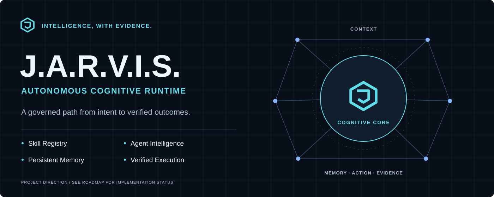
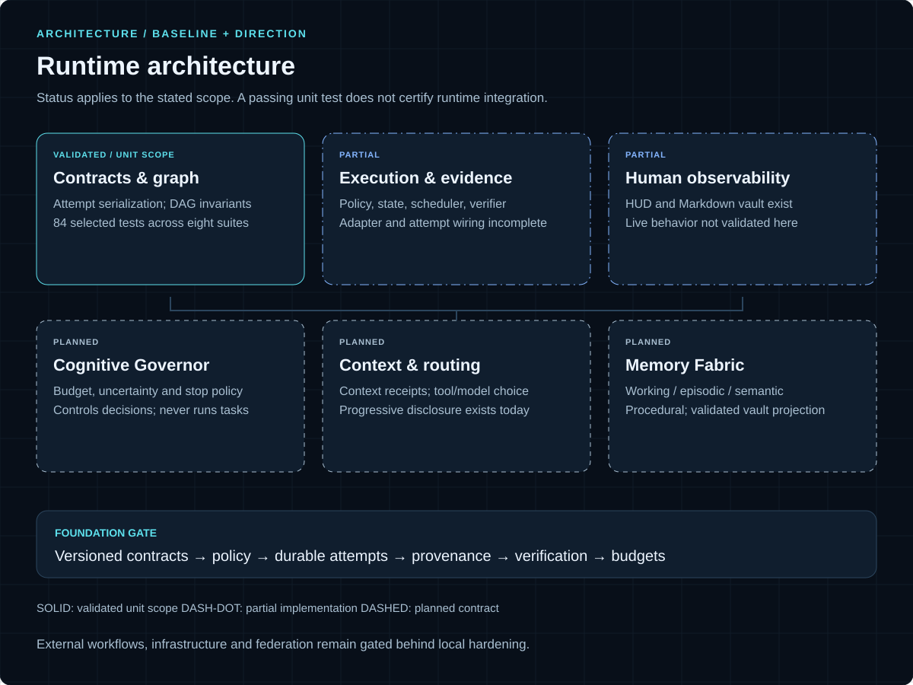
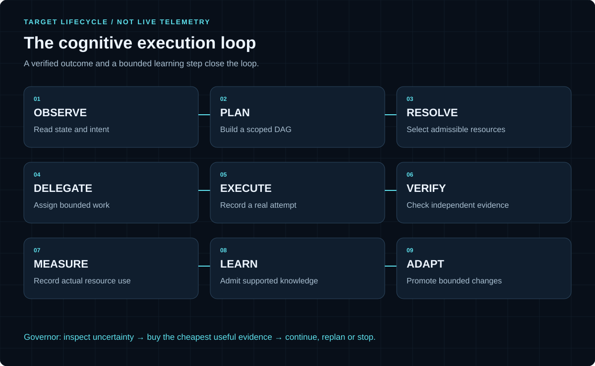
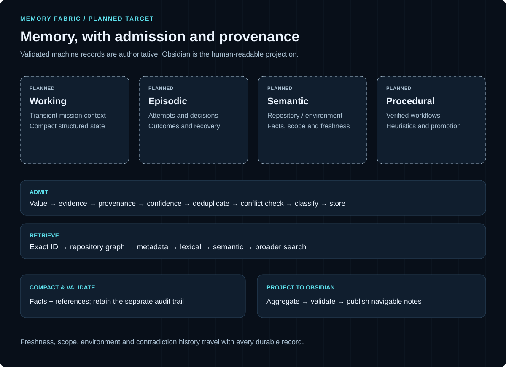
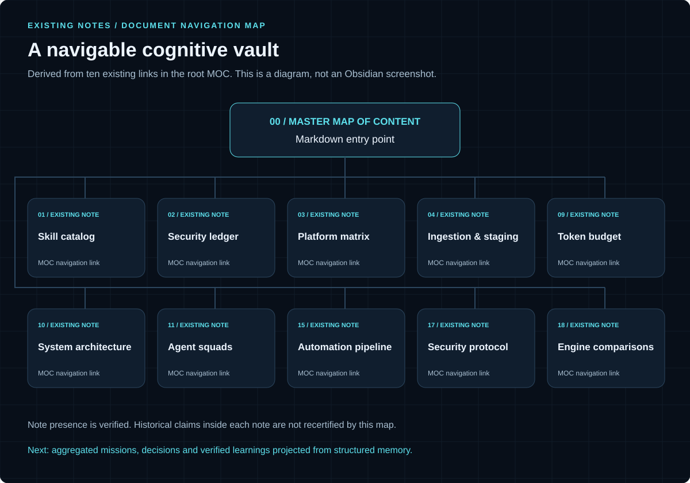

<p align="center">
  
</p>

# J.A.R.V.I.S. Skill Registry

A governed skill registry evolving toward an **Autonomous Cognitive Runtime**. The repository contains skill discovery and governance tooling, Python execution components, a local HUD and a Markdown cognitive vault.

The goal is a runtime that decides whether and how to act, what information it needs, which resources are worth spending, how to verify the result, and what should be learned afterward.

**Development status:** the foundation is partially implemented. Milestone Zero recovered the current source, validated selected unit behavior and established the next roadmap. End-to-end autonomous execution is not certified. [Read the validation report](reports/MILESTONE_ZERO.md) or the [canonical roadmap](docs/roadmap/JARVIS_AUTONOMOUS_INTELLIGENCE_PLAN.md).

## What exists today

| Area | Present in the repository | Validation boundary |
| --- | --- | --- |
| Skill registry | Catalog, governance and distribution tooling | Existing system; M0 does not re-audit every catalog entry |
| Execution foundation | Mission/task/attempt models, DAG, policy, state, profiles and scheduler | Selected contract and unit behavior validated; integration gaps remain |
| Verification | Source inspection, verification requirements and evidence structures | Partial; syntax checks alone do not prove functional success |
| Runtime intelligence | Planning, disclosure, repository intelligence, budgets and learning modules | Partial; actual attempt wiring and measured usage need hardening |
| Human interfaces | Local HUD, Markdown notes and Obsidian canvas | Existing; live behavior not validated in M0 |
| Cognitive direction | Context Governor, Cognitive Governor, tool/model routing and Memory Fabric | Planned contracts and dependencies in the roadmap |

At source baseline `97ddce6`, the selected check set passed **84 tests in eight suites** on Python 3.12.10. Results are recorded in [tests.json](reports/milestone-zero/20260911/tests.json). These results cover named unit/fixture behaviors; they are not a full-system or security certificate.

Known P0 gaps include permissive unknown-risk parsing, completion without a demonstrated adapter call, fixed token usage, incomplete attempt integration, and policy/approval boundary enforcement. The [current-reality assessment](docs/roadmap/JARVIS_AUTONOMOUS_INTELLIGENCE_PLAN.md#2-current-reality) explains the source evidence and next gates.

## Inspect and validate locally

The selected checks use Python's standard library. The recorded environment is Windows with Python 3.12.10; legacy registry commands also use PowerShell. Run from the repository root after obtaining a checkout:

```powershell
python -B -m unittest discover -s tests -p test_agentic_contracts.py -v
python -B -m unittest discover -s tests -p test_agentic_dag.py -v
```

These two commands exercise attempt contracts and DAG invariants. The [recorded check manifest](reports/milestone-zero/20260911/tests.json) lists the other six suites and their exact commands. The foundation suite uses temporary fixtures. Full-system, external provider and live UI checks have a broader operational scope and are not part of this quick start.

Some runtime modules still default to a checkout-specific filesystem root. Review [configuration](tooling/agentic/config.py), scope and adapter behavior before invoking the runtime. The next milestone includes completing root injection and separating execution from verification.

## Architecture



The trusted foundation owns contracts, authority, durable attempts, artifacts, verification and budgets. Cognitive execution builds on that foundation. The planned efficiency layer decides which context, tools and models are worth using within those limits.

The **Cognitive Governor** controls budgets, escalation and stopping; it does not execute tasks. The **Context Governor** expands information only when needed. The **Memory Fabric** admits and retrieves knowledge with provenance, freshness and conflict handling.

## Target execution loop



An executed task is not automatically verified, and a completed command is not automatically a useful outcome. Independent evidence must support the result. Retries, reconciliation and compensation need declared side effects and idempotency semantics.

## Memory and the cognitive vault



The planned memory architecture separates transient working context from durable episodes, verified facts and supported procedures. Structured machine records remain authoritative; Obsidian presents aggregated, navigable knowledge to people.

[Open the existing vault MOC](00%20-%20J.A.R.V.I.S.%20Cognitive%20Vault.md). The map below derives from existing note links. It is a documentation diagram, not a screenshot or a certification of the historical claims inside those notes.



The existing HUD source is available in [ui/](ui/) and [jarvis_server.py](tooling/jarvis_server.py). M0 does not include a verified live HUD capture; no conceptual artwork is presented as a product screenshot.

## Next milestone

**M1: harden the execution and trust foundation.** Priorities are strict schema/migration behavior, unknown-risk refusal, scoped authorization, real adapter attempts, persisted independent state axes, actual resource accounting, and enforced retry/reconciliation/compensation contracts.

The roadmap sequences local execution, context/routing, memory, learning and observability before expanded external workflows, infrastructure or federation. Visual identity work runs alongside the foundation. Milestone Zero stops at documentation and validation; it does not implement the entire roadmap.

The optimization goal is **verified usefulness per resource unit**, with cost, tokens, latency, compute and risk measured separately. Historical fixture benchmarks are not general performance promises.

## Repository guide

| Path | Purpose |
| --- | --- |
| [tooling/agentic/](tooling/agentic/) | Runtime components and contracts |
| [tooling/skillctl.ps1](tooling/skillctl.ps1) | Registry command entry point |
| [tests/](tests/) | Automated checks; inspect scope before running broader suites |
| [docs/roadmap/](docs/roadmap/) | Canonical forward implementation plan |
| [reports/MILESTONE_ZERO.md](reports/MILESTONE_ZERO.md) | Recovery, findings and validation evidence |
| [docs/assets/](docs/assets/) | Architecture visuals, provenance and asset manifest |
| [tooling/design/](tooling/design/) | Reproducible original artwork sources |
| [examples/](examples/) | Existing examples; inspect their effects before execution |

## Visual identity and contributing

The identity uses graphite, navy, restrained cyan/blue and an original geometric mark. Editable SVG and PNG exports include the hero, social preview, monochrome mark and documentation diagrams. [Asset provenance and reproduction](docs/assets/ASSET_PROVENANCE.md) records sources, dimensions and usage. The social preview is prepared locally; repository hosting settings have not been changed.

See [Contributing](CONTRIBUTING.md), the [Code of Conduct](CODE_OF_CONDUCT.md) and [Security policy](SECURITY.md). Project licensing is documented in [LICENSE](LICENSE). Catalogued third-party repositories and skills retain their own licenses and provenance requirements; inclusion in a catalog is not a blanket permission to execute or redistribute them.
