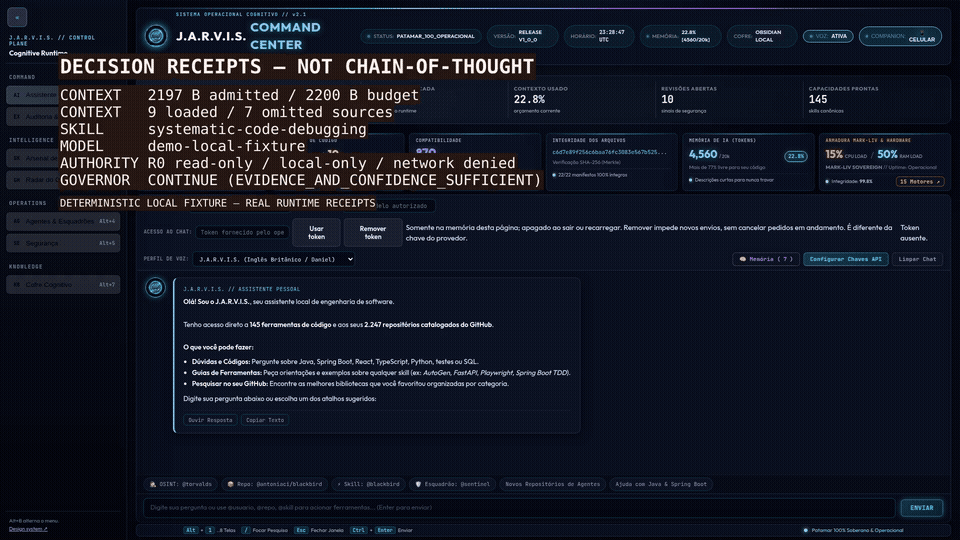

<p align="center">
  
</p>

<h1 align="center">J.A.R.V.I.S. Skill Registry</h1>

<p align="center"><strong>A local-first cognitive runtime for AI agents: persistent memory, dynamic skills, bounded context, tool/model routing and verified execution.</strong></p>

<p align="center">
  <a href="https://github.com/robertoatila/jarvis-skill-registry/releases/tag/v0.1.0"></a>
  <a href="LICENSE"></a>
  <a href="https://github.com/robertoatila/jarvis-skill-registry/stargazers"></a>
</p>

<p align="center">
  <a href="https://jarvis-skill-registry.vercel.app"><strong>Live site</strong></a> ·
  <a href="https://github.com/robertoatila/jarvis-skill-registry/releases/tag/v0.1.0"><strong>Get v0.1.0</strong></a> ·
  <a href="QUICKSTART.md"><strong>Quickstart</strong></a> ·
  <a href="docs/README.md"><strong>Documentation</strong></a> ·
  <a href="https://github.com/robertoatila/jarvis-skill-registry/issues?q=is%3Aissue+is%3Aopen+label%3A%22good+first+issue%22"><strong>Good first issues</strong></a> ·
  <a href="docs/roadmap/JARVIS_AUTONOMOUS_INTELLIGENCE_PLAN.md"><strong>Roadmap</strong></a>
</p>

<p align="center">
  <a href="https://vercel.com/new/clone?repository-url=https%3A%2F%2Fgithub.com%2Frobertoatila%2Fjarvis-skill-registry%2Ftree%2Fmain%2Fsite&project-name=jarvis-skill-registry&repository-name=jarvis-skill-registry"></a>
</p>

Most agents can call tools. J.A.R.V.I.S. is being built to answer the harder questions around every call: **what context is worth loading, which capability should act, how much resource should be spent, what evidence proves success, and what should be remembered afterward?**

> The target is not maximum autonomy. It is **maximum verified usefulness per resource unit**.

## See the verified loop

<p align="center">
  <a href="docs/launch/DEMO_90S_EVIDENCE.md"></a>
</p>

<p align="center">
  <a href="docs/assets/jarvis-demo-90s.mp4"><strong>Watch the 82-second capture</strong></a> ·
  <a href="docs/launch/DEMO_90S_EVIDENCE.md"><strong>Inspect the exact commit and receipts</strong></a>
</p>

The loop is generated from captured local runtime evidence: bounded context admission, catalog-backed skill resolution, local model routing, execution receipts and independent verification receipts. The inference sequence uses a clearly labeled deterministic local fixture backend; it does **not** claim live-provider execution, hidden reasoning, or estimated token/cost savings.

## Run it in three commands

J.A.R.V.I.S. uses a zero-dependency Python launcher for the local HUD:

```bash
git clone https://github.com/robertoatila/jarvis-skill-registry.git
cd jarvis-skill-registry
python jarvis.py
```

The launcher validates the checkout, starts the local server on `http://127.0.0.1:8899` and opens the HUD. Provider-backed inference still requires explicit local provider configuration and authorization; the launcher does not silently invent credentials or bypass runtime policy.

Useful validation commands:

```bash
python jarvis.py --doctor     # prerequisites only; no network calls
python jarvis.py --test       # server self-test
python jarvis.py --full-test  # portable Python master battery
```

See [QUICKSTART.md](QUICKSTART.md) for configuration and troubleshooting.

## v0.1.0 is public — with evidence attached

The first public milestone, **Cognitive Runtime Foundation**, is available as an immutable tagged release: [**J.A.R.V.I.S. v0.1.0**](https://github.com/robertoatila/jarvis-skill-registry/releases/tag/v0.1.0).

The release workflow re-validates the exact tagged commit before publication and attaches machine-readable evidence. Current public baseline:

| Evidence | Result |
| --- | --- |
| Portable Python master battery | **281/281** tests across 42 suites |
| Portable runtime matrix | **Windows + Ubuntu + macOS** |
| Legacy PowerShell governance | **145/145** tests |
| Public launcher | `--doctor` PASS · `--test` PASS |
| Context-budget fixture | **7,428 B naive → 1,673 B admitted** under a 1,800 B budget |
| Release assets | `context-budget.json`, `phase-29-release-oci.json`, `RELEASE_EVIDENCE.md` |

The context benchmark measures **serialized UTF-8 bytes only**. It does not claim provider-token savings, dollar savings, lower latency, answer-quality improvement or end-to-end agent superiority. Those require separate empirical measurement.

## Why J.A.R.V.I.S. exists

Long-lived agents fail in predictable ways: context grows without discipline, model/tool choices are hard-coded, retries lose provenance, execution is confused with success, and memory becomes an unverified dump.

J.A.R.V.I.S. separates those concerns into explicit control planes:

| Problem | J.A.R.V.I.S. direction |
| --- | --- |
| Context rot and token waste | Context Governor expands information only when justified |
| One-model-fits-all routing | Capability/policy-aware model and tool selection |
| “Command exited 0” treated as success | Independent execution, verification, recovery and outcome states |
| Agent forgets what happened | Persistent episodic/semantic/procedural memory with provenance |
| Tool calls mutate blindly | Attempts, side effects, authorization and evidence are first-class records |
| Skills are scattered across ecosystems | Governed skill registry with target adapters and distribution tooling |

## What works today

This repository is **active development**, not a claim that the full autonomous target is already complete.

- **Skill registry:** catalog, governance, distribution and target-adapter tooling.
- **Execution foundation:** mission/task/attempt contracts, DAG execution, policy, persistence and scheduler components.
- **Bounded inference:** registered backends, capability/policy filtering, bounded context, confidence-controlled fallback and scoped cache/memory.
- **Verification primitives:** explicit requirements, evidence structures and independent state axes.
- **Human interfaces:** local HUD plus a Markdown/Obsidian cognitive vault.
- **Cognitive control plane:** current v0.2 development integrates Context/Cognitive governors, provenance-gated memory, fail-closed skill resolution and evidence-aware routing. Broader external autonomy and release-level evidence remain hardening work until the v0.2 gates are complete.

Current v0.2 development includes Node entry points for chat-session, runtime-observability and operational-cockpit contracts, plus a pinned Playwright/Chromium HUD smoke. These are current-development evidence surfaces and do **not** retroactively change the immutable v0.1.0 release evidence. See the [v0.1.0 release evidence](docs/launch/RELEASE_v0.1.0.md) and the [published release](https://github.com/robertoatila/jarvis-skill-registry/releases/tag/v0.1.0).

## The execution model


```text
observe
  ↓
plan
  ↓
resolve context / skill / tool / model
  ↓
execute
  ↓
verify with independent evidence
  ↓
measure cost / latency / risk
  ↓
learn what is safe and useful to retain
```

A task that ran is not automatically verified. A command that returned zero is not automatically useful. J.A.R.V.I.S. keeps execution state, verification state, recovery state and mission outcome separate so later decisions can reason from evidence instead of optimistic status flags.

## Architecture


The trusted foundation owns contracts, authority, durable attempts, artifacts, verification and budgets. Cognitive execution builds above it. The efficiency layer decides which context, tools and models are worth spending within those limits.

### Legacy five-layer distribution contract

The newer cognitive-runtime view sits above, rather than erasing, the repository's original five-layer distribution architecture. The canonical historical description remains in [docs/ARCHITECTURE_5_LAYERS.md](docs/ARCHITECTURE_5_LAYERS.md); **LAYER 5** is the experience/integration surface.

The legacy distribution matrix models six targets, including **Cursor IDE** and **Google Antigravity**, alongside Codex, Claude, ChatGPT and generic targets. Those compatibility records are part of the registry/distribution subsystem; they are not evidence that every cognitive-runtime feature is empirically validated on every target.

### Memory Fabric


The memory direction separates transient working context from durable episodes, verified facts and supported procedures. Structured records remain authoritative; the Obsidian vault is a human projection, not the source of truth.

[Open the Cognitive Vault MOC](00%20-%20J.A.R.V.I.S.%20Cognitive%20Vault.md).

### Remote Second Brain — v0.2 development

The current v0.2 development branch connects the governed memory plane to a restart-safe Obsidian watcher and a thin Remote Companion without creating a second JARVIS runtime.

Implemented contracts include:

- hash/checkpoint-based observation of Markdown and Canvas without requiring Obsidian to be open;
- provenance-gated admission through the existing `MemoryFabric`, with high-authority note text rejected as execution authority;
- projection receipts that suppress JARVIS-authored managed regions from being re-ingested;
- an external capability catalog plus managed `20 - External Capability Matrix.md` projection;
- explicit ChatGPT browser capability manifests that can record `KNOWN`/`UNVERIFIED` inventory but cannot grant executable capability;
- per-device one-time pairing, durable sessions, cursor replay and selective revocation;
- approval-bound PC command execution: a remote command is persisted as pending, bound to an exact SHA-256 action digest, and executes only after explicit approval from the paired device;
- natural-language remote tasks: the PC performs a bounded two-pass planning flow (path-only file selection, then exact JSON plan), persists the resulting write/command plan, binds it to one SHA-256 digest and executes nothing until the paired device approves that exact plan;
- autonomous task writes are full-file replacements through the existing concurrency-aware `LocalActionAdapter`; overwrites are permitted only for files inspected in the same plan and bound to their observed SHA-256;
- autonomous task commands are stricter than manual commands: read-only Git inspection, bounded Python/Node/PowerShell repository scripts and npm test/run are allowed while destructive Git, npx, publishing/deployment and inline interpreter execution fail closed;
- command/task receipts include bounded execution evidence and completed actions/plans are idempotent across repeated approvals;
- Windows per-user autostart through `jarvis.py service ...`, using an ONLOGON Scheduled Task and a generated `.pyw` launcher without requesting administrator elevation;
- local/LAN transport, the original direct Tailscale adapter, and a preferred Tailscale Serve HTTPS mode that keeps the JARVIS backend on loopback while exposing only the Remote Companion inside the tailnet;
- a browser Remote Companion that reaches the same PC-side runtime, memory, repository checkout and provider configuration.

Start the resident host locally:

```bash
python -m tooling.remote_host --port 8899
```

On Windows, validate the PC, provision the HTTPS proxy once, then register the host to start automatically at user logon:

```powershell
python jarvis.py remote-doctor
# If status is SETUP_REQUIRED, run the next command once from a Windows Admin terminal:
python jarvis.py remote-serve provision

python jarvis.py remote-serve status
python jarvis.py service install --transport tailscale-serve
python jarvis.py service start
python jarvis.py service status
python jarvis.py remote-pair --label "Galaxy"
```

Tailscale Serve provisioning is deliberately separated from the resident service. The per-user Scheduled Task remains limited and only adopts/verifies the pre-provisioned HTTPS mapping; it never tries to elevate privileges or reconfigure Serve. The task runs the same checkout through `pythonw` when available, so ChatGPT Desktop or Codex does not need to remain open. If Tailscale is still starting when Windows logs in, the resident context retries the adopt-only transport until it becomes available.

or, with an already-running Tailscale node and Serve/HTTPS enabled:

```bash
python -m tooling.remote_host --port 8899 --transport tailscale-serve
```

The legacy direct-tailnet mode remains available as `--transport tailscale`.

Provider API keys and chat authorization remain on the home PC. The remote browser does not need or persist them. Natural-language task planning uses the already configured PC-side inference boundary; `python jarvis.py remote-doctor` reports planner readiness without exposing tokens or provider keys. Selected source files (maximum 8 / bounded total context) are sent to that configured inference provider for planning, while `.env`, `config/`, `state/`, backups, private-key paths and similar protected surfaces are excluded.

The Remote Companion exposes three separate modes: ordinary chat (inference only), manual command execution (one exact command digest), and autonomous task planning (one exact multi-action plan digest). Approval is never inferred from chat text.

Current limitations are explicit: Windows per-user autostart is implemented, while Linux systemd-user and macOS LaunchAgent registration are still pending; live command stdout is receipt-based rather than streamed; and a remembered phone keeps its revocable device credential in browser persistent storage, while session-only pairing remains available.

See [the Remote Second Brain runbook](docs/REMOTE_SECOND_BRAIN.md) and [the ChatGPT capability bridge contract](docs/CHATGPT_CAPABILITY_BRIDGE.md).

## Experience system and visual contract

The local HUD now has a canonical visual contract in [`DESIGN.md`](DESIGN.md) and a reusable library in [`design-system/`](design-system/). The existing runtime remains vanilla HTML/CSS/JavaScript served by the zero-dependency Python server; this layer does not introduce Tailwind, shadcn/ui or a frontend build dependency.

When the HUD is running, the browsable showcase is available at `http://127.0.0.1:8899/assets/design-system/index.html`. It demonstrates the canonical tokens, component states, dark/light themes, retractable navigation patterns and the professional operational-progression model used by J.A.R.V.I.S.

New visual work should consume the `--jv-*` tokens and primitives instead of adding hard-coded colors, typography, spacing or radii. Agent-facing rules are summarized in [`AGENTS.md`](AGENTS.md).

## Try the local HUD

```bash
python jarvis.py
```

Then use the HUD to inspect the current registry/runtime. For provider-backed chat, configure a supported provider using the example configuration files first. If authorization or provider configuration is missing, the runtime should report the operation as blocked/unverified rather than pretending it succeeded.

The server source is [tooling/jarvis_server.py](tooling/jarvis_server.py) and the HUD source is in [ui/](ui/).

## Evidence before claims

Architecture direction and validated behavior are deliberately separated. The machine-readable current status is [`evidence/current.json`](evidence/current.json); it remains `INCOMPLETE` until the required direct evidence gates have fresh PASS reports. Start with the [documentation map](docs/README.md), then use the evidence source appropriate to the claim:

- [Current machine evidence manifest](evidence/current.json)
- [v0.1.0 release](https://github.com/robertoatila/jarvis-skill-registry/releases/tag/v0.1.0)
- [Milestone Zero report](reports/MILESTONE_ZERO.md)
- [Autonomous Intelligence Plan](docs/roadmap/JARVIS_AUTONOMOUS_INTELLIGENCE_PLAN.md)
- [Server inference boundary](docs/architecture/SERVER_INFERENCE_BOUNDARY.md)
- [v0.2 Plan 2 execution status](docs/superpowers/plans/2026-09-15-v0.2.0-plan2-execution-status.md)
- [Cognitive software upgrade record](docs/plans/2026-09-13-cognitive-software-upgrade.md)

Current gaps and validated changes are tracked in active plans/status ledgers rather than duplicated here. Historical material remains useful context, but it is not current validation evidence by itself.

## Repository map

| Path | Purpose |
| --- | --- |
| [jarvis.py](jarvis.py) | Public zero-dependency launcher and validation entry point |
| [tooling/agentic/](tooling/agentic/) | Runtime contracts, routing, execution and cognitive components |
| [tooling/jarvis_server.py](tooling/jarvis_server.py) | Local HTTP server / HUD boundary |
| [tooling/remote_host.py](tooling/remote_host.py) | Resident Remote Companion host, transport selection and PC-side runtime bridge |
| [skills/](skills/) | Canonical skills |
| [tests/](tests/) | Automated Python, Node and browser contracts; the master Python battery discovers `test_agentic_*.py` |
| [evidence/current.json](evidence/current.json) | Machine-readable current v0.2 evidence/claim status |
| [docs/](docs/) | Documentation root; start at [docs/README.md](docs/README.md) for canonical vs historical classification |
| [docs/REMOTE_SECOND_BRAIN.md](docs/REMOTE_SECOND_BRAIN.md) | Operational runbook for Obsidian memory, capability catalog, pairing and remote transport |
| [docs/roadmap/](docs/roadmap/) | Long-horizon implementation direction |
| [docs/superpowers/](docs/superpowers/) | Approved v0.2 specs, implementation plans and execution-status records |
| [docs/launch/](docs/launch/) | Demo, release and public launch material |
| [docs/assets/](docs/assets/) | Architecture and identity assets |
| [site/](site/) | Static public landing page deployed at [jarvis-skill-registry.vercel.app](https://jarvis-skill-registry.vercel.app) |
| [00 - J.A.R.V.I.S. Cognitive Vault.md](00%20-%20J.A.R.V.I.S.%20Cognitive%20Vault.md) | Human-facing cognitive-vault map; preserved at its public root path |
| [20 - External Capability Matrix.md](20%20-%20External%20Capability%20Matrix.md) | Managed, evidence-bound projection of external capability state |

## Contribute without learning the whole runtime

The easiest useful contributions are intentionally small:

1. Run `python jarvis.py --doctor` and `python jarvis.py --full-test`.
2. Pick a [`good first issue`](https://github.com/robertoatila/jarvis-skill-registry/issues?q=is%3Aissue+is%3Aopen+label%3A%22good+first+issue%22) or [`help wanted`](https://github.com/robertoatila/jarvis-skill-registry/issues?q=is%3Aissue+is%3Aopen+label%3A%22help+wanted%22) task.
3. Add one skill, adapter, test, provider integration or reproducible bug case.
4. Open a PR with the evidence used to validate the change.

See [CONTRIBUTING.md](CONTRIBUTING.md), [CODE_OF_CONDUCT.md](CODE_OF_CONDUCT.md) and [SECURITY.md](SECURITY.md).

If the architecture is useful, **star the repository** so other agent-runtime builders can find it. If an assumption is wrong, a reproducible counterexample or focused issue is more valuable than a star.

## Project status

**v0.1.0 — Cognitive Runtime Foundation** is released and remains the immutable public baseline. **v0.2.0 is still a release-candidate program, not a final release:** the implementation includes the direct validation architecture, repository-scale benchmark, receipt-driven HUD/browser smoke harness and claim audit, while full fresh gate execution is still required before promotion. Machine status lives in [`evidence/current.json`](evidence/current.json); implementation plans and gate definitions live in [`docs/superpowers/`](docs/superpowers/).

See [docs/launch/LAUNCH_PLAN.md](docs/launch/LAUNCH_PLAN.md), [docs/launch/DEMO_90S.md](docs/launch/DEMO_90S.md) and the [roadmap](docs/roadmap/JARVIS_AUTONOMOUS_INTELLIGENCE_PLAN.md).

## License

The repository is licensed under the Apache License 2.0; see [LICENSE](LICENSE). Catalogued third-party repositories and skills retain their own licenses and provenance requirements; inclusion in the registry is not blanket permission to execute or redistribute upstream material.
