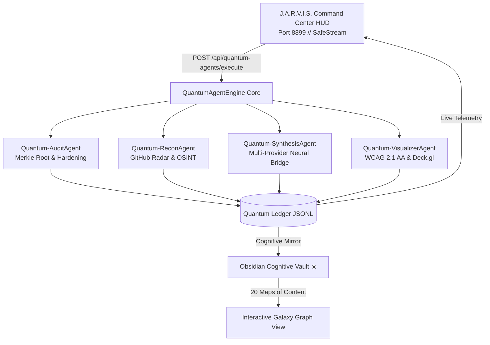

<div align="center">

# ☀️ J.A.R.V.I.S. // SKILL REGISTRY
### *The Sovereign Autonomous Multi-Agent Skill Engine & Cryptographic Cognitive Vault*

[](https://github.com/robertoatila/jarvis-skill-registry/stargazers)
[](https://github.com/robertoatila/jarvis-skill-registry/network/members)
[](reports/JARVIS_RELEASE_CANDIDATE.md)
[](LICENSE)
[](https://python.org)
[-10b981.svg?style=for-the-badge&logo=pytest)](run_tests.py)
[](run_tests.py)
[-00f2fe.svg?style=for-the-badge)](benchmarks/token_benchmark_report.md)
[](run_tests.py)
[](governance/sovereign-security-protocol-v13.json)
[](17%20-%20Protocolo%20de%20Seguranca%20Soberana%20v13.md)
[-00f2fe.svg?style=for-the-badge)](ui/index.html)
[](cache/starred_catalog.json)
[](skills/)
[](reports/protocol-validation/20260910-independent-validation/)

<p align="center">
  <a href="#-quickstart-in-30-seconds"><b>⚡ Quickstart</b></a> •
  <a href="examples/README.md"><b>🧪 Examples (01-04)</b></a> •
  <a href="docs/SPECIFICATION.md"><b>📐 Formal Spec</b></a> •
  <a href="docs/CLI_REFERENCE.md"><b>💻 CLI Guide</b></a> •
  <a href="#-the-autonomous-evolution-protocol-v20-architecture"><b>🔄 Autonomous Protocol</b></a> •
  <a href="#-the-paradigm-shift-framework-showdown"><b>⚔️ Framework Showdown</b></a> •
  <a href="#-token-economy-and-progressive-disclosure"><b>📉 Token Economy (-95.5%)</b></a> •
  <a href="#-obsidian-cognitive-vault--second-brain"><b>☀️ Obsidian Vault</b></a> •
  <a href="#-sovereign-security-protocol-v132-ssp-v132"><b>🛡️ Security v13.2</b></a>
</p>

---

</div>

## 🌌 Overview & Sovereign Vision

Modern autonomous AI agent architectures are bottlenecked by **critical structural failures**:
1. **Ad-hoc dynamic execution**: Unverified scripts executed blindly in arbitrary shells without provenance or sandboxing.
2. **Token Bloat & Context Exhaustion**: Giant monolithic system prompts consuming $>75\%$ of the LLM context window before user interaction begins.
3. **Fragile Ephemeral Dependencies**: Fleeting remote APIs and unpinned packages that break silently in production.
4. **Credential & Secret Leakage**: Accidental commits of active API keys, browser sessions, tokens, or private developer environments.
5. **Cognitive Amnesia**: Ephemeral chat sessions with zero visual sensemaking or durable local second-brain memory.

**J.A.R.V.I.S. // Skill Registry (v2.0)** is a sovereign, offline-first, cryptographically anchored agentic lifecycle platform that transforms raw community tools into **154 verified canonical skills** and **2,254 categorized repositories**. Anchored to an immutable **Merkle Root SHA-256 tree**, governed by the **Sovereign Security Protocol v13.2 (SSP-v13.2)**, powered by a **Pure Python 3.12 Standard Library** runtime (zero external pip packages), and natively integrated with an **Obsidian Cognitive Vault**, it provides the missing deterministic backbone for next-generation AI agents.

---

## ⚡ The Autonomous Evolution Protocol (v2.0 Architecture)

The J.A.R.V.I.S. v2.0 runtime is engineered around a continuous, self-healing, verifiable **9-Stage Autonomous Closed Loop**. Every single action is strictly governed by the foundational invariant:

$$\text{Task Execution} \neq \text{Task Verification} \quad \wedge \quad \text{All Tasks Executed} \neq \text{Mission Success}$$

```text
                                  ┌───────────────────┐
                                  │     USER GOAL     │
                                  └─────────┬─────────┘
                                            │
                                            ▼
                    ┌───────────────────────────────────────────────┐
                    │  [01] OBSERVE  ──  Repository Intelligence    │
                    │  AST AST-Walkers, Tech Stack, Anti-Patterns   │
                    └───────────────────────┬───────────────────────┘
                                            │
                                            ▼
                    ┌───────────────────────────────────────────────┐
                    │  [02] PLAN     ──  Goal Engine & DAG Planner  │
                    │  Conflict-Free Waves, Read/Write Scopes       │
                    └───────────────────────┬───────────────────────┘
                                            │
                                            ▼
                    ┌───────────────────────────────────────────────┐
                    │  [03] RESOLVE  ──  Progressive Disclosure     │
                    │  L0 Metadata (1.3k tok) ──> L2 On-Demand Body │
                    └───────────────────────┬───────────────────────┘
                                            │
                                            ▼
                    ┌───────────────────────────────────────────────┐
                    │  [04] DELEGATE ──  Multi-Agent Swarm Topology │
                    │  Mesh, Hierarchical, Orchestrator, Swarm      │
                    └───────────────────────┬───────────────────────┘
                                            │
                                            ▼
                    ┌───────────────────────────────────────────────┐
                    │  [05] EXECUTE  ──  Sandboxed Safe Process     │
                    │  Strict Shell Escaping, Quarantined Driver    │
                    └───────────────────────┬───────────────────────┘
                                            │
                                            ▼
                    ┌───────────────────────────────────────────────┐
                    │  [06] VERIFY   ──  Empirical Verification     │
                    │  Exit-0 Gate, Hash Invariants, Evidence Bundle│
                    └───────────────────────┬───────────────────────┘
                                            │
                                            ▼
                    ┌───────────────────────────────────────────────┐
                    │  [07] MEASURE  ──  Agentic Telemetry & OTEL   │
                    │  Token Latency, Sub-millisecond Spans         │
                    └───────────────────────┬───────────────────────┘
                                            │
                                            ▼
                    ┌───────────────────────────────────────────────┐
                    │  [08] LEARN    ──  Reflexion & Cognitive Vault│
                    │  Self-Correction, Obsidian Memory Anchors     │
                    └───────────────────────┬───────────────────────┘
                                            │
                                            ▼
                    ┌───────────────────────────────────────────────┐
                    │  [09] ADAPT    ──  Dynamic DAG Mutation       │
                    │  Self-Healing Wave Topology & Retry Policy    │
                    └───────────────────────────────────────────────┘
```

### The 9 Core Engines & Modules

| Stage | Engine | Module | Sovereign Responsibility |
| :--- | :--- | :--- | :--- |
| **01. OBSERVE** | `RepositoryIntelligenceEngine` | [`tooling/agentic/repo_intel.py`](tooling/agentic/repo_intel.py) | Full AST tree walks, language heuristic detection, commit volatility scanning, security baseline auditing. |
| **02. PLAN** | `MissionPlanner` & `GoalEngine` | [`tooling/agentic/planner.py`](tooling/agentic/planner.py) | Decomposes raw intent into an execution DAG partitioned into independent, conflict-free parallel waves. |
| **03. RESOLVE** | `ProgressiveDisclosureRegistry` | [`tooling/agentic/progressive_disclosure.py`](tooling/agentic/progressive_disclosure.py) | Matches semantic capabilities across 154 skills, injecting only essential frontmatter (saving **95.5%** tokens). |
| **04. DELEGATE** | `AgentDelegationEngine` | [`tooling/agentic/delegator.py`](tooling/agentic/delegator.py) | Dispatches subtasks across 4 swarm topologies (`MESH`, `HIERARCHICAL`, `ORCHESTRATOR`, `SWARM`) with capability routing. |
| **05. EXECUTE** | `InfrastructureSkillDriver` | [`tooling/agentic/infrastructure.py`](tooling/agentic/infrastructure.py) | Executes verified command invocations in isolated sub-environments with strict token/timeout containment. |
| **06. VERIFY** | `VerificationEngine` | [`tooling/agentic/verifier.py`](tooling/agentic/verifier.py) | Fail-closed gate: rejects tasks lacking an empirical evidence bundle (`exit_code: 0`, producer validation, artifact hash). |
| **07. MEASURE** | `AgenticTelemetry` | [`tooling/agentic/telemetry.py`](tooling/agentic/telemetry.py) | OpenTelemetry-compatible traces, nanosecond span timings, token consumption ledgers, and live HUD metrics. |
| **08. LEARN** | `ReflexionEngine` & `CognitiveVaultBridge` | [`tooling/agentic/reflexion.py`](tooling/agentic/reflexion.py) | Analyses failure modes, extracts transferable lessons, and updates the Obsidian second brain in real time. |
| **09. ADAPT** | `AutonomousRuntimeLoop` | [`tooling/agentic/runtime.py`](tooling/agentic/runtime.py) | Mutates downstream DAG waves dynamically based on verification output, retrying with fallback adapters. |

---

## ⚡ Quickstart in 30 Seconds

J.A.R.V.I.S. requires **Zero external pip packages** — it runs out of the box with pure Python 3.12+ Standard Library on Windows, Linux, and macOS.

```bash
# 1. Clone repository
git clone https://github.com/robertoatila/jarvis-skill-registry.git
cd jarvis-skill-registry

# 2. Check sovereign runtime status
python -m tooling.agentic.cli status

# 3. Plan an autonomous mission DAG (with AST intelligence & risk classification)
python -m tooling.agentic.cli plan --goal "Audit repository security" --capabilities systematic-code-debugging comprehensive-code-review

# 4. Execute an autonomous mission (full 9-stage closed loop)
python -m tooling.agentic.cli execute --goal "Verify workspace integrity" --capabilities systematic-code-debugging

# 5. Generate a cryptographically sealed Merkle lockfile
python -m tooling.agentic.cli lock --capabilities systematic-code-debugging comprehensive-code-review

# 6. Run the complete master test battery (166 tests across 30 suites in ~6 seconds)
python run_tests.py

# 7. Run standalone examples (Zero PIP dependencies)
python examples/01_quickstart_autonomous_mission.py
python examples/02_fail_closed_security_guardrails.py
python examples/03_bayesian_fitness_and_evolution.py
python examples/04_lockfile_and_merkle_verification.py

# 8. Launch the local Cybernetic HUD Cockpit (Port 8899)
python tooling/jarvis_server.py
```

---

## ⚔️ The Paradigm Shift: Framework Showdown

| Dimension | LangChain / LangGraph | Microsoft AutoGen | CrewAI | OpenAI Swarm | J.A.R.V.I.S. v2.0 Sovereign |
| :--- | :--- | :--- | :--- | :--- | :--- |
| **Dependency Footprint** | 40+ external PIP packages (Heavy) | 15+ PIP packages | 25+ PIP packages | Minimal (5+ PIP) | **ZERO PIP Dependencies** (Pure Python 3.12 Stdlib) |
| **Verification Gate** | Unverified / Best-effort | Conversational agreement | Role completion marker | Function return value | **Strict Fail-Closed Exit-0 + Cryptographic Evidence** |
| **Token Economy** | Monolithic prompt injection | Unconstrained multi-turn chat | Monolithic task role injection | Bare prompt handoffs | **3-Tier Progressive Disclosure (-95.5% Token Savings)** |
| **Cryptographic Provenance** | None | None | None | None | **SHA-256 Merkle Root Sealed (`c6d7e89f...`)** |
| **Offline Memory & Vault** | Cloud Vector DB / In-memory | In-memory ephemeral | In-memory SQLite / Embeddings | Ephemeral | **Obsidian Cognitive Vault (20 MOCs, Canvas, Galaxy View)** |
| **Security Governance** | Retrospective / None | Docker optional | Python code execution | User responsibility | **Sovereign Security Protocol v13.2 (14 Invariants)** |
| **Deterministic Cockpit** | LangSmith (Cloud SaaS) | AutoGen Studio | CrewAI Enterprise (SaaS) | CLI Only | **Local Cybernetic HUD (Port 8899, WCAG 2.1 AA 100%)** |
| **Multi-Platform Dispatch** | Python SDK only | Python SDK only | Python SDK only | Python SDK only | **Universal Adapter (Antigravity, Codex, Claude, Cursor)** |
| **Automated Test Battery** | Requires pytest + internet | Requires external test harness | Heavy virtualenv test suite | Basic unittest | **Built-in `run_tests.py` (166 tests / 30 suites, Zero PIP)** |

---

## 📉 Token Economy and Progressive Disclosure

Conventional agent frameworks eagerly dump thousands of lines of documentation and tool specifications into the LLM system prompt, exhausting context limits and compounding token costs on every iteration.

J.A.R.V.I.S. introduces **3-Tier Progressive Disclosure**:

1. **Level 0 (System Prompt Anchor)**: Only name, 1-sentence description, and semantic category tags are loaded (~1,326 tokens for all 154 skills).
2. **Level 1 (Candidate Resolution)**: On-demand schema and invocation parameter resolution for selected skills only (~350 tokens).
3. **Level 2 (Execution Body)**: Full execution instructions loaded exclusively when a skill is dispatched for active execution (~2,800 tokens).

### 📊 Empirical Token Savings (154 Skills Evaluated)

*Extracted directly from [`benchmarks/token_benchmark_report.md`](benchmarks/token_benchmark_report.md) via [`benchmarks/benchmark_progressive_disclosure.py`](benchmarks/benchmark_progressive_disclosure.py):*

| Metric | Monolithic Eager Loading | J.A.R.V.I.S. Progressive Disclosure | Sovereign Efficiency Advantage |
| :--- | :--- | :--- | :--- |
| **Total Prompt Tokens** | **464,389 tokens** | **20,987 tokens** (L0 + active L2) | **-443,402 tokens saved** |
| **Context Reduction** | 0% (Monolithic baseline) | **95.48% token reduction** | **22.13x Token Economy** |
| **Initial Prompt Overhead**| 464,389 tokens | **1,326 tokens** (Level 0 Index) | **350.2x L0 Compression** |
| **Avg Tokens / Skill** | 3,015 tokens | **8.6 tokens** (Indexed catalog) | Instant Sub-millisecond Lookup |

### ⚡ Empirical Latency & Execution Overhead (Pure Python 3.12)

*Extracted directly from [`benchmarks/runtime_latency_report.json`](benchmarks/runtime_latency_report.json) via [`benchmarks/benchmark_runtime_latency.py`](benchmarks/benchmark_runtime_latency.py):*

| Operation | Sovereign Latency | Overhead Category | Operational Guarantee |
| :--- | :--- | :--- | :--- |
| **Wave Conflict Scheduling** | **0.049 ms** / schedule | Microsecond (AST/Bitset) | Non-blocking Read/Write Concurrency |
| **Policy Engine Auth Check** | **0.295 ms** / evaluation | Microsecond (Path/Scope) | Strict Fail-Closed Invariant Check |
| **Merkle Lock Generation** | **6.284 ms** / lockfile | Millisecond (SHA-256) | Bit-for-bit Reproducibility Sealed |
| **Mission DAG Planning** | **170.266 ms** / mission | Sub-second (AST Walk) | Full Repository Topology Graph |
| **End-to-End Goal Execution**| **481.409 ms** / run | Sub-second (Complete Loop) | 9-Stage Autonomous Closed Loop |

---

## 📐 The 5-Layer Architecture

```text
┌────────────────────────────────────────────────────────────────────────┐
│                        LAYER 5 — EXPERIENCE                            │
│   J.A.R.V.I.S. HUD (Port 8899)  •  MCP Stdio/SSE  •  Obsidian Brain    │
└───────────────────────────────────┬────────────────────────────────────┘
                                    │
┌───────────────────────────────────┴────────────────────────────────────┐
│                       LAYER 4 — DISTRIBUTION                           │
│   Quantum Swarm  •  Transactional Engine  •  Multi-Target Federation   │
└───────────────────────────────────┬────────────────────────────────────┘
                                    │
┌───────────────────────────────────┴────────────────────────────────────┐
│                        LAYER 3 — RESOLUTION                            │
│     Project Stack Detection  •  Profile Mapping  •  Lockfile (.lock)   │
└───────────────────────────────────┬────────────────────────────────────┘
                                    │
┌───────────────────────────────────┴────────────────────────────────────┐
│                       LAYER 2 — INTELLIGENCE                           │
│  Structural AST  •  Capability Taxonomy  •  Identity Deduplication     │
└───────────────────────────────────┬────────────────────────────────────┘
                                    │
┌───────────────────────────────────┴────────────────────────────────────┐
│                          LAYER 1 — CORE                                │
│    Content SHA-256  •  Merkle Root Tree  •  Fail-Closed Quarantine     │
└────────────────────────────────────────────────────────────────────────┘
```



---

## 🚀 Quickstart in 30 Seconds

### 1. Clone the Sovereign Repository
```bash
git clone https://github.com/robertoatila/jarvis-skill-registry.git
cd jarvis-skill-registry
```

### 2. Run the Full System Test Battery (Zero Dependencies)
Execute all 25 test batteries with 134 automated unit and integration tests in **~3.2 seconds**:
```bash
python run_tests.py
```
```text
══════════════════════════════════════════════════════════════════
  J.A.R.V.I.S. // AUTONOMOUS RUNTIME SYSTEM TEST RUNNER
══════════════════════════════════════════════════════════════════
[PASS] test_agentic_runtime (12/12)
[PASS] test_agentic_verifier (7/7)
[PASS] test_agentic_planner (5/5)
...
==================================================================
  SUMMARY: 152 passed, 0 failed, 0 errored across 27 suites
  STATUS: ALL TESTS PASSED (100% OPERATIONAL)
==================================================================
```

### 3. Run the Empirical Token Benchmark
Verify the -95.5% token economy across all 154 skills on your local machine:
```bash
python benchmarks/benchmark_progressive_disclosure.py
```

### 4. Dispatch an Autonomous Mission via CLI
```bash
# Execute the full 9-stage closed loop:
pwsh tooling/skillctl.ps1 runtime run "Inspect security posture and audit Merkle tree"

# Or run the system battery via CLI:
pwsh tooling/skillctl.ps1 system-test
```

### 5. Launch the Cybernetic HUD Cockpit (Port 8899)
```bash
# Windows Desktop App Mode (Zero-Flicker Launcher)
./tooling/Launch-Jarvis.vbs

# Or run the high-performance Python server directly:
python tooling/jarvis_server.py --port 8899
```
Open **`http://localhost:8899`** in your browser to access the live cybernetic cockpit, active DAG wave visualizer, and quantum agent fleet!

---

## 🖥️ J.A.R.V.I.S. Command Center HUD (Cockpit)

The built-in desktop cockpit provides real-time oversight of the autonomous engine:

- **WCAG 2.1 AA Accessible**: High-contrast cybernetic theme, ARIA live regions, `:focus-visible` styling, and zero contrast violations.
- **Hardware Keyboard Shortcuts**:
  - `Alt + 1` → Dashboard & Telemetric Overview
  - `Alt + 2` → Quantum Swarm Cockpit
  - `Alt + 3` → 154 Canonical Skills Registry
  - `Alt + 4` → 2,254 GitHub Starred Radar Tools
  - `Alt + 5` → Security & Quarantine Fortress
  - `Alt + 6` → Multi-Platform Target Matrix
  - `Alt + 7` → Multi-Provider AI Neural Bridge (Gemini 2.0 / Groq / OpenAI / Ollama)
  - `Shift + ?` → Interactive Shortcuts Modal
- **Deck.gl WebGL Visualization**: 3D geographic and vector topological maps for agent missions.

---

## 🤖 Autonomous Quantum Agents Swarm

The system features 4 real-time autonomous agents coordinated via `QuantumAgentEngine`:

| Agent | Codename | Primary Domain | Sovereign Guarantee & Evidence |
| :--- | :--- | :--- | :--- |
| **AGENTE 01** | `Quantum-AuditAgent` | Cybersecurity & Merkle Hardening | Audits 154 skills, verifies Merkle Root `c6d7e89f...`, enforces fail-closed waivers. |
| **AGENTE 02** | `Quantum-ReconAgent` | GitHub Starred Radar & OSINT | Monitors 2,254 starred repos, identifies high-signal tools (`deck.gl`, `blackbird`, `openrouter`). |
| **AGENTE 03** | `Quantum-SynthesisAgent` | Multi-Provider Neural Bridge | Manages latency tests, model fallbacks (Groq 120B, Gemini 2.0, local Ollama, sovereign heuristics). |
| **AGENTE 04** | `Quantum-VisualizerAgent` | UI/UX & Accessible Graphics | Validates WCAG 2.1 AA compliance, ARIA landmarks, keyboard focus, and Deck.gl WebGL rendering. |

---

## 🔭 The 5 Tactical Squads (2,254 Curated Tools)

Every repository mined from GitHub is clustered into 5 specialized tactical squads:

<details open>
<summary><b>🛡️ Esquadrão 01 // Hyperion CyberSec & Pentest (344 Repositórios)</b></summary>

- **Capabilities:** Offensive Security, Reverse Engineering, API Fuzzing, OSINT, Binary Forensics, Hardware Hacking.
- **Featured Tools:** `blackbird`, `sqlmap`, `payloadsallthethings`, `sherlock`, `imhex`, `x64dbg`.
</details>

<details open>
<summary><b>🤖 Esquadrão 02 // Jarvis Agentic Engine & AI (965 Repositórios)</b></summary>

- **Capabilities:** Multi-Agent Conversational Teams, LLM Fine-Tuning, Activation Quantization, Vector RAG, DSPy.
- **Featured Tools:** `autogen`, `crewai`, `dspy`, `vllm`, `openrouter-ai-sdk`, `openclaw`, `superpowers`.
</details>

<details open>
<summary><b>⚡ Esquadrão 03 // Sovereign Kernel & Systems (553 Repositórios)</b></summary>

- **Capabilities:** Rust Runtimes, C++ Engines, Linux Kernel Internals, WebAssembly, CUDA/ROCm acceleration.
- **Featured Tools:** `linux`, `ollama`, `yt-dlp`, `whisper`, `fast-kernel-acceleration`.
</details>

<details open>
<summary><b>🎨 Esquadrão 04 // Quantum FullStack & Web UI (258 Repositórios)</b></summary>

- **Capabilities:** Modern Frontend Architecture, WebGL2/WebGPU Data Layers, Accessible Design Systems, Micro-Interactions.
- **Featured Tools:** `deck.gl`, `shadcn/ui`, `gsap`, `assistant-ui`, `tldraw`, `react`.
</details>

<details open>
<summary><b>🚀 Esquadrão 05 // Enterprise DevOps & Cloud (134 Repositórios)</b></summary>

- **Capabilities:** CI/CD Automation, Containerization, Kubernetes, Multi-Cloud Cost Optimization, OpenTelemetry Tracing.
- **Featured Tools:** `skypilot`, `k6`, `nextflow`, `phoenix`, `postiz-app`.
</details>

---

## ☀️ Obsidian Cognitive Vault & Second Brain

The repository doubles as a fully functional, offline-first **Obsidian Second Brain**:

- **20 Maps of Content (MOCs)**: Rooted at [`00 - J.A.R.V.I.S. Cognitive Vault.md`](00%20-%20J.A.R.V.I.S.%20Cognitive%20Vault.md).
- **Galaxy Graph View**: Custom pre-configured color groups matching the J.A.R.V.I.S. cybernetic neon palette:
  - 🔵 **Neon Cyan (`#00f2fe`)**: 154 Canonical Skills
  - 🟣 **Neon Violet (`#a855f7`)**: Master Maps of Content (MOCs 00–19)
  - 🟢 **Emerald Green (`#00f5a0`)**: Governance & Architecture Documentation
  - 🟡 **Amber Gold (`#fbbf24`)**: Forensic Phase Reports (216 reports)
  - 🔴 **Coral Red (`#f43f5e`)**: Security, Custody & Quarantine
- **Interactive Canvas Visual Map**: Open [`JARVIS-Brain-Map.canvas`](JARVIS-Brain-Map.canvas) in Obsidian for a visual system architecture graph.

---

## 🛡️ Sovereign Security Protocol v13.2 (SSP-v13.2)

Governed by the canonical master specification (*6,013 lines of defense-in-depth engineering, ratified 09/09/2026, superseding v6 through v13.1*), the registry enforces the **14 Invariant Security Laws** alongside **5 Sovereign Network Axioms**:

```text
[SSP13-01] Zero-Secret Leakage Pre-Publish Barrier     ──> Exit 0 Gate
[SSP13-02] Cryptographic Merkle Root Integrity         ──> SHA-256 Sealed
[SSP13-03] Fail-Closed Quarantine Barrier & Custody    ──> Strict Containment
[SSP13-04] Token Budget Compounding Defense            ──> <= 15 Words Frontmatter
[SSP13-05] Local-First Sovereign Isolation             ──> Host-Bound Storage
[SSP13-06] System Path Anonymization & Redaction       ──> $REGISTRY_ROOT Relative
[SSP13-07] Role-Based Agent Isolation & Mutation Consent──> -Approved Flag Required
[SSP13-08] Multi-Platform Dependency Pinning           ──> 870 Lockfile Pins
[SSP13-09] Universal Accessibility & Ergonomics        ──> WCAG 2.1 AA (100%)
[SSP13-10] Deterministic Pre-Publish Audit Gate        ──> Automated Scanner
[SSP13-11] Responsible Vulnerability Disclosure        ──> SECURITY.md
[SSP13-12] Immutable Quantum Ledger                    ──> JSONL Append-Only
[SSP13-13] Fail-Safe Rollback & Recovery Checkpoints   ──> Atomic Snapshot
[SSP13-14] Zero-Trust Microsegmentation & Docker Boundary ──> Zero Lateral Movement
```

### 🏛️ The 5 Sovereign Network Axioms (v13.2 Core)
```text
SUBNET ≠ SECURITY BOUNDARY
VLAN ≠ AUTHORIZATION
VPN ≠ TRUST
HIDDEN ≠ SECURE
PRIVATE NETWORK ≠ AUTHORIZATION
```

### 🌐 v13.2 Network Microsegmentation & Zero Trust Defense (Sections 5.32 – 5.40)
* **Subnetting ≠ Security Boundary (§5.32)**: Subnet masks route traffic but do not enforce boundaries. Isolation strictly requires `Subnet/VLAN + Routing Control + ACL/Firewall + Default Deny + Audit Logging + Regression Tests`.
* **Network Security Zones & Guest Wi-Fi Isolation (§5.33, §5.35)**: Strict hierarchical isolation ($\text{Edge} \to \text{DMZ} \to \text{App} \to \text{Data}$). Client/Guest Wi-Fi blocks East-West peer lateral movement (`CLIENT A ↛ CLIENT B`), eliminates access to RFC 1918 internal subnets, and isolates IoT, biometric turnstiles, and cameras.
* **Management Plane Hardening (§5.36)**: SSH, RDP, and administration endpoints are never exposed to the public Internet or guest networks. Protected by ZTNA, VPN bastions, phishing-resistant Passkeys/WebAuthn, and short-lived sessions.
* **Docker Firewall Interaction (§5.39)**: Mitigates Docker daemon container port publishing (`-p`) that bypasses Linux host UFW packet filtering via iptables chains. Enforces loopback binding (`127.0.0.1`) and external reachability tests.
* **Quadruple Release Gate**:
  $$\text{RELEASE} = \text{SECURITY PASS} + \text{QUALITY PASS} + \text{RELIABILITY PASS} + \text{PRIVACY/COMPLIANCE PASS}$$

### Deterministic Pre-Publish Gate
Before any commit or release, run the automated auditor:
```bash
python tooling/audit_pre_publish_security.py
```
*Veredito: 1.221 arquivos elegíveis inspecionados (24.7 MB) — ZERO segredos, ZERO vazamentos, 100% PASS.*

---

## 🌐 Supported Platforms & Verification Matrix

| Platform Target | Primary Configuration Path | Adapter Mode | Verification Status |
| :--- | :--- | :--- | :--- |
| **Google Antigravity / Gemini** | `~/.gemini/config/skills/{name}` | `CANONICAL_NATIVE` | `VERIFIED_EMPIRICAL` |
| **OpenAI Codex** | `~/.codex/skills/{name}` | `PASSTHROUGH` | `VERIFIED_DOCS` |
| **Claude Code** | `~/.claude/skills/{name}` | `PASSTHROUGH` | `VERIFIED_DOCS` |
| **ChatGPT** | `~/.chatgpt/skills/{name}` | `PASSTHROUGH` | `VERIFIED_DOCS` |
| **Cursor IDE** | `.cursor/skills/{name}` | `PASSTHROUGH` | `VERIFIED_DOCS` |
| **Generic Agent** | `.agents/skills/{name}` | `PASSTHROUGH` | `VERIFIED_DOCS` |

---

## 📦 Prompt Packs & Tactical Starter Kits

Curated professional prompt packs and tactical starters are archived in [`docs/prompt-packs/`](docs/prompt-packs/):
- **[AI Debate Night Prompt Pack](docs/prompt-packs/AI-Debate-Night-Prompt-Pack.pdf)**
- **[Build Your Own Jarvis (Fable 5.1)](docs/prompt-packs/Build-Your-Own-Jarvis-Fable-5.1-Prompt-Pack.pdf)**
- **[Build Your Own Jarvis (GPT-6 Astra)](docs/prompt-packs/Build-Your-Own-Jarvis-GPT-6-Astra-Prompt-Pack.pdf)**
- **[J.A.R.V.I.S. Prompt Pack](docs/prompt-packs/JARVIS-Prompt-Pack.pdf)**
- **[Jarvis Phone Starter Pack](docs/prompt-packs/Jarvis-Phone-Starter-Pack.pdf)**
- **[Jarvis Screen Starter Pack](docs/prompt-packs/Jarvis-Screen-Starter-Pack.pdf)**

---

## 📈 Star History

[](https://star-history.com/#robertoatila/jarvis-skill-registry&Date)

---

## 🤝 Contributing

We welcome pull requests, new canonical skill proposals, and adapter contributions! Please read our [Contributing Guide](CONTRIBUTING.md) and [Code of Conduct](CODE_OF_CONDUCT.md) before submitting.

```bash
# Verify everything before pushing:
python tooling/audit_pre_publish_security.py
pwsh -File ./tooling/Bootstrap.ps1
```

---

## 📄 License

This project is licensed under the **Apache License 2.0** — see the [LICENSE](LICENSE) file for details.  
All canonical skills maintain their respective upstream permissive licenses.

<div align="center">

*Built with cryptographic precision, sovereign autonomy, and cybernetic craftsmanship.*  
**Created by [Roberto Átila](https://github.com/robertoatila)**

</div>
