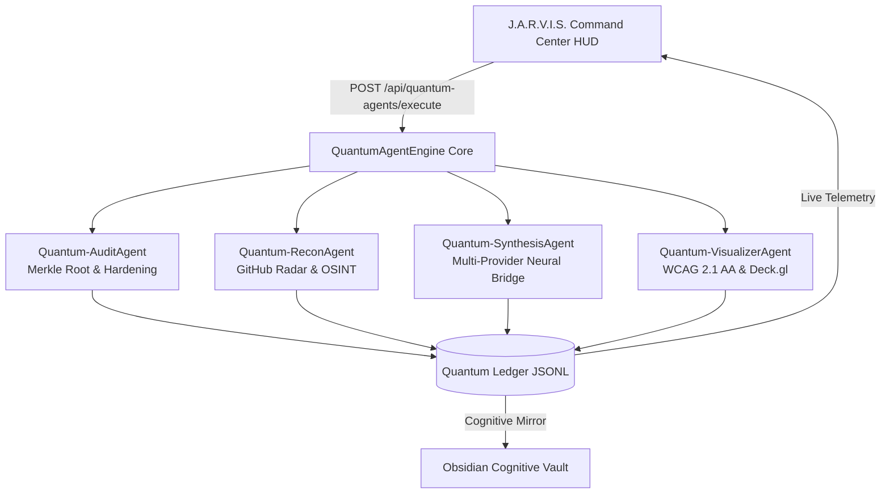

<div align="center">

# 🪐 J.A.R.V.I.S. // SKILL REGISTRY
### *The Sovereign Autonomous Multi-Agent Skill Engine & Cryptographic Cognitive Vault*

[](LICENSE)
[](https://python.org)
[](https://www.typescriptlang.org)
[](governance/sovereign-security-protocol-v13.json)
[](17%20-%20Protocolo%20de%20Seguranca%20Soberana%20v13.md)
[-00f2fe.svg?style=for-the-badge)](ui/index.html)
[](cache/starred_catalog.json)
[](skills/)

<p align="center">
  <a href="#-quickstart-in-30-seconds"><b>⚡ Quickstart</b></a> •
  <a href="#-the-5-layer-architecture"><b>📐 Architecture</b></a> •
  <a href="#-autonomous-quantum-agents-swarm"><b>🤖 Quantum Swarm</b></a> •
  <a href="#-the-5-tactical-squads-2254-tools"><b>🔭 Tactical Squads</b></a> •
  <a href="#-obsidian-cognitive-vault--second-brain"><b>🪐 Obsidian Vault</b></a> •
  <a href="#-sovereign-security-protocol-v13-ssp-v13"><b>🛡️ Security v13</b></a> •
  <a href="#-contributing"><b>🤝 Contributing</b></a>
</p>

---

</div>

## 🌌 Overview & Sovereign Vision

Most autonomous AI agent architectures suffer from **five critical failure modes**:
1. **Ad-hoc dynamic execution**: Unverified scripts executed blindly via arbitrary shells.
2. **Context & Token Bloat**: Giant system prompts and bloated tool headers consuming $>70\%$ of the agent's context window.
3. **Fragile Dependencies**: Fleeting remote APIs and unpinned packages that break in production.
4. **Secret Leakage**: Inadvertently committing active API keys, session tokens, or private developer environments.
5. **Amnesia & Lack of Visual Sensemaking**: Ephemeral chat windows with zero structured second-brain memory.

**J.A.R.V.I.S. // Skill Registry** is a sovereign, offline-first, cryptographically anchored lifecycle platform that transforms raw tools into **149 verified canonical skills** and **2,254 categorized repositories**. Anchored to an immutable **Merkle Root SHA-256 tree**, governed by the **Sovereign Security Protocol v13 (SSP-v13)**, and deeply integrated with an **Obsidian Cognitive Vault**, it provides the missing deterministic backbone for next-generation AI agents.

---

## ⚡ Key Capabilities at a Glance

| Capability | What It Delivers | Sovereign Guarantee |
| :--- | :--- | :--- |
| 🪐 **Obsidian Cognitive Vault** | 17 interconnected Maps of Content (MOCs), interactive graph galaxy with custom neon color clustering, and Canvas visual map. | **100% Offline Markdown** |
| 🖥️ **J.A.R.V.I.S. Command Center HUD** | Real-time cybernetic dashboard with live telemetric terminal, WCAG 2.1 AA accessibility, keyboard shortcuts (`Alt+1..7`), and Deck.gl support. | **Port 8899 // SafeStream** |
| 🤖 **Autonomous Quantum Swarm** | 4 deterministic agents (`AuditAgent`, `ReconAgent`, `SynthesisAgent`, `VisualizerAgent`) recording millisecond missions to an immutable ledger. | **Quantum Ledger (JSONL)** |
| 🔭 **GitHub Starred Radar** | 2,254 starred tools clustered into 5 Tactical Squads with real-time discovery of emerging AI, CyberSec, and Systems tools. | **Zero Placeholders** |
| 🛡️ **Sovereign Security Protocol v13** | 13 Invariant Security Laws, Fail-closed quarantine barrier, and deterministic pre-publish secret scrubber (`Exit 0` gate). | **Zero Secret Leakage** |
| 🌐 **6-Platform Adapter Engine** | Transactional distribution and lockfile resolution across Gemini/Antigravity, Claude, Codex, ChatGPT, Cursor, and Generic Agents. | **870 Verified Pins** |

---

## 📐 The 5-Layer Architecture

```text
┌────────────────────────────────────────────────────────────────────────┐
│                        LAYER 5 — EXPERIENCE                            │
│   J.A.R.V.I.S. HUD (Port 8899)  •  MCP Stdio/SSE  •  Obsidian Brain    │
└───────────────────────────────────┬────────────────────────────────────┘
                                    │
┌───────────────────────────────────┴────────────────────────────────────┐
│                       LAYER 4 — DISTRIBUTION                           │
│   Quantum Swarm  •  Transactional Engine  •  Multi-Target Federation   │
└───────────────────────────────────┬────────────────────────────────────┘
                                    │
┌───────────────────────────────────┴────────────────────────────────────┐
│                        LAYER 3 — RESOLUTION                            │
│     Project Stack Detection  •  Profile Mapping  •  Lockfile (.lock)   │
└───────────────────────────────────┬────────────────────────────────────┘
                                    │
┌───────────────────────────────────┴────────────────────────────────────┐
│                       LAYER 2 — INTELLIGENCE                           │
│  Structural AST  •  Capability Taxonomy  •  Identity Deduplication     │
└───────────────────────────────────┬────────────────────────────────────┘
                                    │
┌───────────────────────────────────┴────────────────────────────────────┐
│                          LAYER 1 — CORE                                │
│    Content SHA-256  •  Merkle Root Tree  •  Fail-Closed Quarantine     │
└────────────────────────────────────────────────────────────────────────┘
```



---

## 🚀 Quickstart in 30 Seconds

### 1. Clone & Setup
```bash
git clone https://github.com/your-username/skill-registry.git
cd skill-registry

# Configure local template (safe placeholders)
cp config/api_keys.example.json config/api_keys.json
cp .env.example .env
```

### 2. Run Self-Test Bootstrap
```bash
pwsh -File ./tooling/Bootstrap.ps1
```

### 3. Launch J.A.R.V.I.S. Command Center HUD
```bash
# Windows (Seamless One-Click)
./tooling/Launch-Jarvis.vbs

# Or direct Python
python tooling/jarvis_server.py --port 8899
```
Open **`http://localhost:8899`** in your browser to access the full cockpit!

---

## 🤖 Autonomous Quantum Agents Swarm

The system features 4 real-time autonomous agents operating under `QuantumAgentEngine`:

| Agent | Codename | Primary Domain | Evidence & Output |
| :--- | :--- | :--- | :--- |
| **AGENTE 01** | `Quantum-AuditAgent` | Cybersecurity & Merkle Root Hardening | Audits 149 skills, verifies Merkle Root `c6d7e89f...`, enforces fail-closed waivers. |
| **AGENTE 02** | `Quantum-ReconAgent` | GitHub Starred Radar & OSINT | Monitors 2,254 starred repos, identifies high-signal tools (`deck.gl`, `blackbird`, `openrouter`). |
| **AGENTE 03** | `Quantum-SynthesisAgent` | Multi-Provider Neural Bridge | Manages latency tests, model fallbacks (Groq 120B, Gemini 3.8, local Ollama, sovereign heuristics). |
| **AGENTE 04** | `Quantum-VisualizerAgent` | UI/UX & Accessible Graphics | Validates WCAG 2.1 AA compliance, ARIA landmarks, `:focus-visible`, and Deck.gl WebGL rendering. |

---

## 🔭 The 5 Tactical Squads (2,254 Tools)

Every tool mined from the GitHub Starred ecosystem is classified into 5 specialized tactical squads:

1. 🛡️ **Esquadrão 01 // Hyperion CyberSec & Pentest** (344 Repositórios):
   - OffSec, Reverse Engineering, API Fuzzing, OSINT, Forensics, and Hardware Hacking (`blackbird`, `sqlmap`, `payloadsallthethings`).
2. 🤖 **Esquadrão 02 // Jarvis Agentic Engine & AI** (965 Repositórios):
   - Multi-Agent Orchestration, LLM Fine-Tuning, Quantization, Vector RAG, DSPy (`autogen`, `crewai`, `dspy`, `vllm`, `openrouter-ai-sdk`).
3. ⚡ **Esquadrão 03 // Sovereign Kernel & Systems** (553 Repositórios):
   - Rust, C++, Linux Kernel, WebAssembly, High-Performance Networking, CUDA/ROCm optimization.
4. 🎨 **Esquadrão 04 // Quantum FullStack & Web UI** (258 Repositórios):
   - Modern Frontend, WebGL2/WebGPU Data Visualization, Responsive Shells, Design Systems (`deck.gl`, `shadcn`, `gsap`).
5. 🚀 **Esquadrão 05 // Enterprise DevOps & Cloud** (134 Repositórios):
   - CI/CD, Containerization, Kubernetes, Multi-Cloud Orchestration, OpenTelemetry observability (`skypilot`, `k6`, `nextflow`).

---

## 🪐 Obsidian Cognitive Vault & Second Brain

The repository doubles as a fully functional, offline-first **Obsidian Second Brain**:

- **17 Maps of Content (MOCs)**: Rooted at [`00 - J.A.R.V.I.S. Cognitive Vault.md`](00%20-%20J.A.R.V.I.S.%20Cognitive%20Vault.md).
- **Galaxy Graph View**: Custom pre-configured color groups matching the J.A.R.V.I.S. cybernetic palette:
  - 🔵 **Neon Cyan (`#00f2fe`)**: 149 Canonical Skills
  - 🟣 **Neon Violet (`#a855f7`)**: Master Maps of Content (MOCs 00–17)
  - 🟢 **Emerald Green (`#00f5a0`)**: Governance & Architecture Documentation
  - 🟡 **Amber Gold (`#fbbf24`)**: Forensic Phase Reports
  - 🔴 **Coral Red (`#f43f5e`)**: Security, Custody & Quarantine
- **Interactive Canvas**: Open [`JARVIS-Brain-Map.canvas`](JARVIS-Brain-Map.canvas) in Obsidian for an interactive architecture schematic.

---

## 🛡️ Sovereign Security Protocol v13 (SSP-v13)

The repository enforces the **13 Invariant Security Laws**:

```text
[SSP13-01] Zero-Secret Leakage Pre-Publish Barrier     ──> Exit 0 Gate
[SSP13-02] Cryptographic Merkle Root Integrity         ──> SHA-256 Sealed
[SSP13-03] Fail-Closed Quarantine Barrier & Custody    ──> Strict Containment
[SSP13-04] Token Budget Compounding Defense            ──> <= 15 Words
[SSP13-05] Local-First Sovereign Isolation             ──> Host-Bound
[SSP13-06] System Path Anonymization & Redaction       ──> $REGISTRY_ROOT
[SSP13-07] Role-Based Agent Isolation & Mutation Consent──> -Approved Flag
[SSP13-08] Multi-Platform Dependency Pinning           ──> 870 Lockfile Pins
[SSP13-09] Universal Accessibility & Ergonomics        ──> WCAG 2.1 AA
[SSP13-10] Deterministic Pre-Publish Audit Gate        ──> Automated Scanner
[SSP13-11] Responsible Vulnerability Disclosure        ──> SECURITY.md
[SSP13-12] Immutable Quantum Ledger                    ──> JSONL Append-Only
[SSP13-13] Fail-Safe Rollback & Recovery Checkpoints   ──> Atomic Snapshot
```

### Pre-Publish Verification Command
Every contributor and release pipeline must run the deterministic auditor:
```bash
python tooling/audit_pre_publish_security.py
```

---

## 🌐 Supported Platforms & Verification Matrix

| Platform Target | Primary Configuration Path | Adapter Mode | Verification Status |
| :--- | :--- | :--- | :--- |
| **Google Antigravity / Gemini** | `~/.gemini/config/skills/{name}` | `CANONICAL_NATIVE` | `VERIFIED_EMPIRICAL` |
| **OpenAI Codex** | `~/.codex/skills/{name}` | `PASSTHROUGH` | `VERIFIED_DOCS` |
| **Claude Code** | `~/.claude/skills/{name}` | `PASSTHROUGH` | `VERIFIED_DOCS` |
| **ChatGPT** | `~/.chatgpt/skills/{name}` | `PASSTHROUGH` | `VERIFIED_DOCS` |
| **Cursor IDE** | `.cursor/skills/{name}` | `PASSTHROUGH` | `VERIFIED_DOCS` |
| **Generic Agent** | `.agents/skills/{name}` | `PASSTHROUGH` | `VERIFIED_DOCS` |

---

## 🤝 Contributing

We welcome pull requests, new canonical skill proposals, and adapter contributions! Please read our [Contributing Guide](CONTRIBUTING.md) and [Code of Conduct](CODE_OF_CONDUCT.md) before submitting.

```bash
# Verify everything before pushing:
python tooling/audit_pre_publish_security.py
pwsh -File ./tooling/Bootstrap.ps1
```

---

## 📄 License

This project is licensed under the **Apache License 2.0** — see the [LICENSE](LICENSE) file for details.
All canonical skills maintain their respective upstream permissive licenses.

<div align="center">

*Built with precision, cryptographic integrity, and sovereign autonomy by the J.A.R.V.I.S. Core Engineering Team.*

</div>
