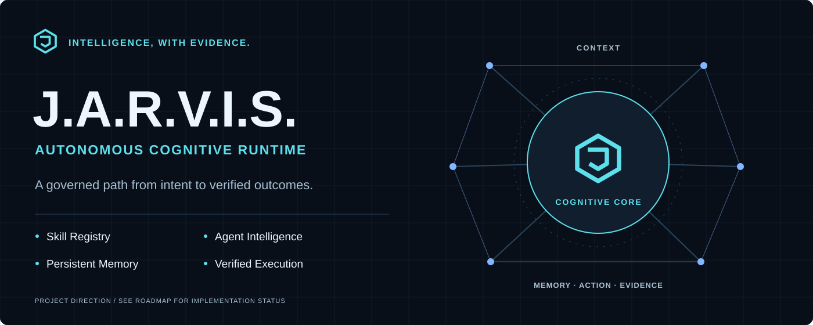
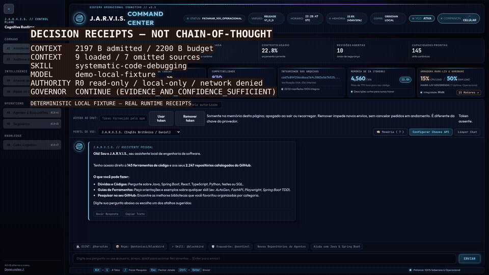
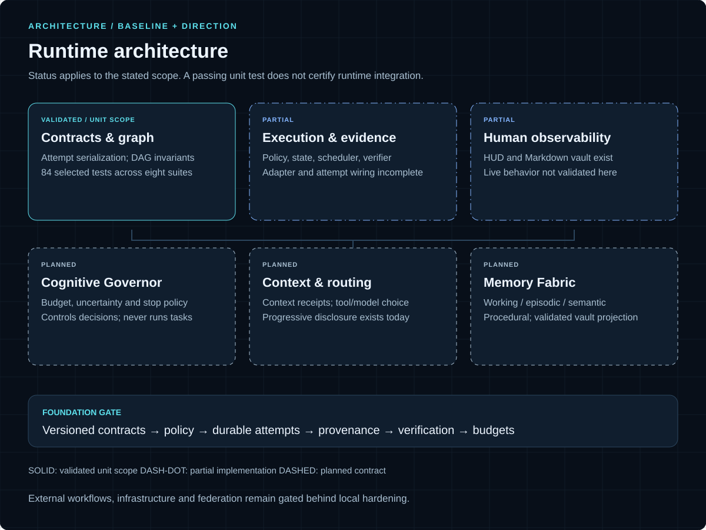

# J.A.R.V.I.S. Skill Registry

<p align="center">
  
</p>

<p align="center"><strong>A local-first cognitive runtime for AI agents, built around governed skills, bounded context, persistent memory and evidence-aware execution.</strong></p>

<p align="center">
  <a href="https://github.com/robertoatila/jarvis-skill-registry/releases/tag/v0.1.0"></a>
  <a href="LICENSE"></a>
  <a href="https://github.com/robertoatila/jarvis-skill-registry/stargazers"></a>
</p>

<p align="center">
  <a href="https://jarvis-skill-registry.vercel.app"><strong>Project site</strong></a> ·
  <a href="QUICKSTART.md"><strong>Quickstart</strong></a> ·
  <a href="docs/README.md"><strong>Documentation</strong></a> ·
  <a href="https://github.com/robertoatila/jarvis-skill-registry/issues"><strong>Issues</strong></a> ·
  <a href="docs/roadmap/JARVIS_AUTONOMOUS_INTELLIGENCE_PLAN.md"><strong>Roadmap</strong></a>
</p>

J.A.R.V.I.S. is an open-source runtime for building AI agents whose tools, context, execution and memory can be governed and inspected. The project focuses on a practical question: **what evidence should be required before an agent action is trusted?**

The repository is active development. Its public `v0.1.0` release is the immutable baseline; the broader `v0.2.0` program remains incomplete until its fresh, direct validation gates pass. See [`evidence/current.json`](evidence/current.json) for the current machine-readable status.

## See it in action

The short demo shows a local decision-to-verification flow using real runtime receipts and a deterministic fixture backend. It is not a live provider run or evidence about production inference.

<p align="center">
  <a href="docs/launch/DEMO_90S_EVIDENCE.md"></a>
</p>

<p align="center">
  <a href="docs/assets/jarvis-demo-90s.mp4"><strong>Watch the 82-second demo</strong></a> ·
  <a href="docs/launch/DEMO_90S_EVIDENCE.md"><strong>Read its evidence and limits</strong></a>
</p>

The Obsidian Cognitive Vault has a separate native Graph View capture. Click the poster to watch it grow from an empty canvas to the full 23,897-node view.

<p align="center">
  <a href="docs/assets/cognitive-vault-graph-animation.mp4"></a>
</p>

<p align="center">
  <a href="docs/assets/cognitive-vault-graph-animation.mp4"><strong>Watch the 8-minute graph animation</strong></a> ·
  <a href="docs/vault/COGNITIVE_ATLAS.md"><strong>Explore the Cognitive Atlas</strong></a>
</p>

## What it provides

- **Governed skills and adapters** for discovering and distributing capabilities across supported targets.
- **Bounded context and policy-aware routing** so the runtime can choose eligible skills, tools and model backends within explicit limits.
- **Execution and verification contracts** that keep attempts, evidence, recovery and task outcomes distinct.
- **Persistent memory foundations** with provenance and freshness, plus a human-readable Markdown/Obsidian projection.
- **A local HUD and tooling** for inspecting the registry and runtime state.

These are implementation areas, not a blanket production-readiness claim. Component status and release eligibility are tracked separately in [`evidence/current.json`](evidence/current.json) and the linked execution plans.

## Quick start

**Requirements:** Git, Python 3.10 or newer (3.12 recommended) and a modern browser. The launcher uses only the Python standard library.

```bash
git clone https://github.com/robertoatila/jarvis-skill-registry.git
cd jarvis-skill-registry
python jarvis.py --doctor
python jarvis.py
```

The doctor checks local prerequisites without provider calls. The launcher starts the local HUD at `http://127.0.0.1:8899` and attempts to open it in your browser. For another port or a headless start, use `python jarvis.py --port 9000 --no-browser`.

The HUD can start without provider credentials. Provider-backed inference is optional and requires explicit local configuration and authorization; start with [QUICKSTART.md](QUICKSTART.md) and the [server/provider boundary](docs/architecture/SERVER_INFERENCE_BOUNDARY.md). Never commit real credentials.

## Local memory and public Vault data

Personal memory is written to `state/jarvis_memory.local.json`, which Git ignores. The tracked `state/jarvis_memory.json` is an empty compatibility template; older local checkouts can read it as a fallback, but new writes go to the ignored file. Public Note 19 contains operating instructions only, and governed runtime-memory projections are kept under ignored `state/memory/`. Review `.gitignore` and `git status` before publishing local Vault changes. See [ADR-024](docs/adr/ADR-024-export-oci-sealing.md) for the data/export trust boundaries.

Run the local checks with:

```bash
python jarvis.py --doctor
python jarvis.py --test
python jarvis.py --full-test
```

A passing launcher or test command proves only the scope it exercises. Cross-platform, browser, Windows legacy-governance and release claims require the direct evidence described in the corresponding gate documentation.

## How the runtime is organized



The design separates policy and durable execution records from cognitive routing and user interfaces. The intended lifecycle is **observe → plan → resolve → execute → verify → measure → learn**. It is a model for the system, not proof that every stage is complete in every integration.

For the implementation contracts, begin with [`docs/README.md`](docs/README.md), then follow the relevant architecture or plan. The [Cognitive Atlas](docs/vault/COGNITIVE_ATLAS.md) explains the Obsidian vault; the [Remote Second Brain runbook](docs/REMOTE_SECOND_BRAIN.md) documents memory and companion boundaries.

## Project status and evidence

- **Published baseline:** [`v0.1.0 — Cognitive Runtime Foundation`](https://github.com/robertoatila/jarvis-skill-registry/releases/tag/v0.1.0), with exact-tag evidence in [`docs/launch/RELEASE_v0.1.0.md`](docs/launch/RELEASE_v0.1.0.md).
- **Current development:** `v0.2.0` remains `DIRECT_VALIDATION_REQUIRED` / `INCOMPLETE`. The current evidence manifest identifies which gates and platforms still need fresh direct reports.
- **Claim rule:** a design, feature flag, passing unit test, screenshot, workflow status or historical report cannot substitute for current evidence at the scope being claimed.
- **Benchmark rule:** context-budget figures are serialized UTF-8 byte counts. They do not measure model tokens, money spent, latency, answer quality or end-to-end outcomes.

The repository does not use GitHub Actions as a validation gate. Follow the direct validation policy in [`AGENTS.md`](AGENTS.md) and [`CONTRIBUTING.md`](CONTRIBUTING.md).

## Documentation

| Start here | Use it for |
| --- | --- |
| [Quickstart](QUICKSTART.md) | Prerequisites, first launch, configuration and troubleshooting |
| [Documentation map](docs/README.md) | Canonical docs, active plans and historical material |
| [Runtime execution contract](docs/architecture/RUNTIME_EXECUTION_CONTRACT.md) | Authority, execution, verification and recovery semantics |
| [Server inference boundary](docs/architecture/SERVER_INFERENCE_BOUNDARY.md) | Provider configuration and trust boundaries |
| [Cognitive Atlas](docs/vault/COGNITIVE_ATLAS.md) | Obsidian hubs, graph profiles, preservation and animation |
| [Remote Second Brain](docs/REMOTE_SECOND_BRAIN.md) | Vault synchronization and Remote Companion operations |
| [J.A.R.V.I.S. evolution prompts](docs/governance/multi-repository/JARVIS_EVOLUTION_PROMPTS.md) | Evidence-led prompts for source freshness, databases, Obsidian, tools, repositories, and publication |
| [Public-source system reassessment](reports/reanalysis/2026-10-01-public-system-audit.md) | Measured repository inventory, confirmed trust/privacy findings, and what remains unverified |
| [Current evidence](evidence/current.json) | Machine-readable v0.2 status and evidence freshness |
| [Roadmap](docs/roadmap/JARVIS_AUTONOMOUS_INTELLIGENCE_PLAN.md) | Long-term direction; distinguish targets from implemented behavior |

## Contributing

Small, reproducible contributions are easiest to review: a focused skill or adapter, a bug with a failing test, a bounded documentation fix, or one independently verifiable improvement. Start with [`CONTRIBUTING.md`](CONTRIBUTING.md), review [`AGENTS.md`](AGENTS.md), and include the exact commands and evidence relevant to your change in the pull request.

To report a bug, include your OS and Python version, the command you ran, expected and actual behavior, and minimal logs with credentials removed. For security issues, follow [`SECURITY.md`](SECURITY.md) rather than posting sensitive details publicly. Community participation follows the [Code of Conduct](CODE_OF_CONDUCT.md).

## License

J.A.R.V.I.S. is licensed under the [Apache License 2.0](LICENSE). Catalogued third-party projects and skills retain their own licenses and provenance; inclusion in the registry is not blanket permission to execute or redistribute upstream material.
