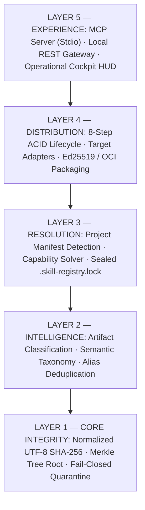
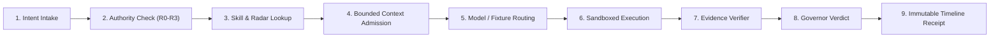
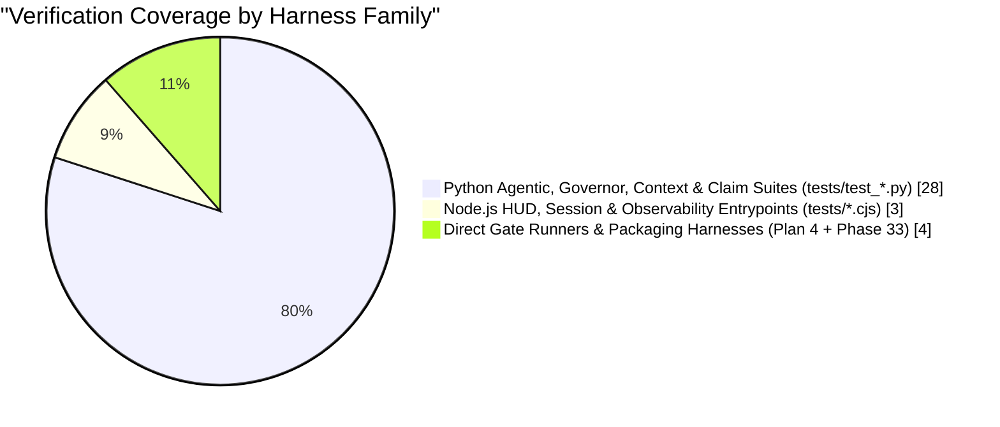

<p align="center">
  
</p>

<h1 align="center">J.A.R.V.I.S.</h1>

<p align="center">
  <strong>Local-First Autonomous Cognitive Runtime, Sovereign Skill Registry &amp; Evidence-Governed MCP Plane</strong>
</p>

<p align="center">
  <a href="QUICKSTART.md"></a>
  <a href="tooling/jarvis_mcp_server.py"></a>
  <a href="docs/ARCHITECTURE_5_LAYERS.md"></a>
  <a href="evidence/current.json"></a>
  <a href="LICENSE"></a>
</p>

<p align="center">
  <a href="#why-jarvis">Why J.A.R.V.I.S.</a> ·
  <a href="#30-second-quickstart">Quickstart</a> ·
  <a href="#architecture">Architecture</a> ·
  <a href="#sovereign-mcp-gateway">MCP Gateway</a> ·
  <a href="#platform-adapters">Adapters</a> ·
  <a href="#benchmarks--verification">Benchmarks</a> ·
  <a href="#direct-evidence-governance">Governance</a> ·
  <a href="#documentation">Docs</a>
</p>

---

**J.A.R.V.I.S.** turns ad-hoc AI coding prompts, scattered `SKILL.md` files, and unverified tool calls into a **deterministic, local-first engineering runtime**. Built around cryptographic integrity (SHA-256 + Merkle anchoring), bounded UTF-8 context admission, explicit authority rings (`R0`–`R3`), and structured execution receipts, it bridges a canonical skill arsenal directly into **Google Antigravity**, **Cursor IDE**, **Claude Code**, **OpenAI Codex CLI**, **Windsurf**, and **GitHub Copilot**.

> [!IMPORTANT]
> **Status & Evidence Contract:** The repository is active development on the `v0.2.0` runtime track (`DIRECT_VALIDATION_REQUIRED` in [`evidence/current.json`](evidence/current.json)). J.A.R.V.I.S. **does not use GitHub Actions as a validation gate** — every subsystem claim is governed by reproducible local/direct JSON receipts and audited by [`tooling/audit_documentation_claims.py`](tooling/audit_documentation_claims.py).

---

## Why J.A.R.V.I.S.

Most agentic frameworks optimize for fast demos while leaving context bloat, silent tool drift, and unverified success claims unchecked. J.A.R.V.I.S. enforces systems-engineering invariants at every boundary:

| Dimension | Conventional Agent Wrappers | J.A.R.V.I.S. Runtime & Registry |
| :--- | :--- | :--- |
| **Context Window Control** | Unbounded prompt concatenation until truncation | Deterministic `compile_context()` budget in `serialized_utf8_bytes` with explicit loaded/omitted receipts |
| **Tool & Skill Integrity** | Unpinned markdown snippets copied across repos | Canonical SHA-256 digests, Merkle root anchoring (`urn:skill-registry:merkle-tree:v1`), and `.skill-registry.lock` |
| **Execution Authority** | Implicit shell/network access on every turn | Ringed capability gates (`R0` Read-Only → `R3` Sovereign Mutation) + fail-closed quarantine barrier |
| **Completion Semantics** | LLM self-reported *"Done!"* without proof | `EvidenceVerifier` separates `PASS`, `FAIL`, `PARTIAL`, and `UNKNOWN` backed by machine receipts |
| **Runtime Dependencies** | Heavy third-party orchestration stacks | Zero-dependency Python 3.10+ standard-library launcher (`python jarvis.py`) + local HUD cockpit |
| **Multi-IDE Interoperability** | Locked into a single editor's proprietary format | 6 cross-platform adapters + a unified 8-tool **MCP JSON-RPC 2.0** server over `stdio` |

---

## 30-Second Quickstart

The core launcher uses **only the Python 3.10+ standard library** — no virtual environment or API key is required to inspect the runtime, run diagnostics, or launch the local HUD.

```bash
# 1. Clone the repository
git clone https://github.com/robertoatila/jarvis-skill-registry.git
cd jarvis-skill-registry

# 2. Verify local prerequisites (offline, zero network calls)
python jarvis.py --doctor

# 3. Launch the local Operational Cockpit HUD on http://127.0.0.1:8899
python jarvis.py
```

Run headless or run the portable verification battery at any time:

```bash
# Start on a custom port without opening a browser
python jarvis.py --port 9000 --no-browser

# Fast server & contract self-test
python jarvis.py --test

# Full portable Python verification suite + documentation claim audit
python jarvis.py --full-test
python tooling/audit_documentation_claims.py
```

> Provider-backed chat is strictly opt-in. Copy `config/api_keys.example.json` to `config/api_keys.json` only after reviewing [`docs/architecture/SERVER_INFERENCE_BOUNDARY.md`](docs/architecture/SERVER_INFERENCE_BOUNDARY.md).

---

## Architecture

J.A.R.V.I.S. combines a **5-layer sovereign registry stack** ([`docs/ARCHITECTURE_5_LAYERS.md`](docs/ARCHITECTURE_5_LAYERS.md)) with a **9-stage governed runtime loop** ([`docs/architecture/RUNTIME_EXECUTION_CONTRACT.md`](docs/architecture/RUNTIME_EXECUTION_CONTRACT.md)).

### 1. The 5-Layer Sovereign Registry Stack


```mermaid
flowchart TB
    L5["LAYER 5 — EXPERIENCE: MCP Server (Stdio) · Local REST Gateway · Operational Cockpit HUD"]
    L4["LAYER 4 — DISTRIBUTION: 8-Step ACID Lifecycle · Target Adapters · Ed25519 / OCI Packaging"]
    L3["LAYER 3 — RESOLUTION: Project Manifest Detection · Capability Solver · Sealed .skill-registry.lock"]
    L2["LAYER 2 — INTELLIGENCE: Artifact Classification · Semantic Taxonomy · Alias Deduplication"]
    L1["LAYER 1 — CORE INTEGRITY: Normalized UTF-8 SHA-256 · Merkle Tree Root · Fail-Closed Quarantine"]

    L5 --> L4 --> L3 --> L2 --> L1
```

### 2. The 9-Stage Governed Turn Lifecycle

Every turn produces structured decision receipts rather than opaque chain-of-thought claims:


```mermaid
flowchart LR
    S1["1. Intent Intake"] --> S2["2. Authority Check (R0-R3)"]
    S2 --> S3["3. Skill & Radar Lookup"]
    S3 --> S4["4. Bounded Context Admission"]
    S4 --> S5["5. Model / Fixture Routing"]
    S5 --> S6["6. Sandboxed Execution"]
    S6 --> S7["7. Evidence Verifier"]
    S7 --> S8["8. Governor Verdict"]
    S8 --> S9["9. Immutable Timeline Receipt"]
```

### Core Runtime Subsystems

| Subsystem | Canonical Module | Responsibility |
| :--- | :--- | :--- |
| **Runtime Launcher & HUD** | [`jarvis.py`](jarvis.py) · [`tooling/jarvis_server.py`](tooling/jarvis_server.py) | Local HTTP boundary, `/chat-session.js` cockpit loader, diagnostics (`--doctor`), and offline-safe runtime controls |
| **Context Governor** | [`tooling/agentic/context_governor.py`](tooling/agentic/context_governor.py) | Prioritizes mandatory governance sources first, enforces byte budgets, drops stale/irrelevant inputs, and emits admission receipts |
| **Cognitive Governor** | [`tooling/agentic/cognitive_governor.py`](tooling/agentic/cognitive_governor.py) | Evaluates confidence, authority boundaries, retry ceilings, and halt/continue verdicts (`EVIDENCE_AND_CONFIDENCE_SUFFICIENT`) |
| **Memory & Vault Plane** | [`tooling/agentic/memory.py`](tooling/agentic/memory.py) · [`tooling/agentic/vault.py`](tooling/agentic/vault.py) | Separates ephemeral working state, versioned project memory, and curated Obsidian Cognitive Vault MOCs |
| **Verification & Receipts** | [`tooling/agentic/verification.py`](tooling/agentic/verification.py) · [`tooling/agentic/execution_receipt.py`](tooling/agentic/execution_receipt.py) | Validates exit codes, schema invariants, and artifact hashes before allowing any task state to transition to `PASS` |
| **Design System** | [`design-system/`](design-system/) · [`DESIGN.md`](DESIGN.md) | Canonical CSS token architecture (`tokens.css`, `components.css`, `patterns.css`) projected identically into [`ui/assets/design-system/`](ui/assets/design-system/) |

---

## Sovereign MCP Gateway

Connect any MCP-compatible host (**Google Antigravity**, **Cursor IDE**, **Claude Desktop**, **Claude Code**, **Windsurf**) directly to [`tooling/jarvis_mcp_server.py`](tooling/jarvis_mcp_server.py):

```json
{
  "mcpServers": {
    "jarvis-sovereign-gateway": {
      "command": "python",
      "args": ["/absolute/path/to/jarvis-skill-registry/tooling/jarvis_mcp_server.py"]
    }
  }
}
```

### Exposed MCP Tools (8 Deterministic Endpoints)

| Tool Name | Ring | Capability |
| :--- | :---: | :--- |
| `jarvis_system_status` | `R0` | Returns live registry health, quarantine state, Merkle integrity status, and active runtime counters |
| `jarvis_query_arsenal` | `R0` | Searches indexed engineering skills by capability, domain, stack, or tactical squadron |
| `jarvis_get_skill` | `R0` | Progressively discloses a specific `SKILL.md` payload on demand without flooding global context |
| `jarvis_radar_search` | `R0` | Queries the curated GitHub intelligence radar (`06 - GitHub Starred Repositories.md` & domain MOCs) |
| `jarvis_consult_protocol` | `R0` | Retrieves normative architectural, security, or execution protocols from governance memory |
| `jarvis_verify_integrity` | `R1` | Runs cryptographic hash verification and schema contract checks across target artifacts |
| `jarvis_execute_mission` | `R2` | Dispatches a bounded, receipt-tracked multi-step mission under explicit governor supervision |
| `jarvis_weaponize_tool` | `R3` | Packages, hashes, and registers a validated workflow or script into the canonical skill arsenal |

---

## Platform Adapters & Tactical Squadrons

### Cross-IDE Adapter Matrix

Adapters follow the formal schema in [`docs/ADAPTER_DEVELOPMENT_GUIDE.md`](docs/ADAPTER_DEVELOPMENT_GUIDE.md) (`adapters/<platform>/adapter.json`), distinguishing `VERIFIED_EMPIRICAL` from `VERIFIED_DOCS` capabilities in [`schemas/platform-capabilities.json`](schemas/platform-capabilities.json):

- **Google Antigravity** (`.agents/skills`, native MCP & customization routing)
- **Cursor IDE** (`.cursor/rules` & MCP stdio integration)
- **Claude Code** (`CLAUDE.md`, slash skills & MCP server bindings)
- **OpenAI Codex CLI** (`AGENTS.md` & progressive skill disclosure)
- **Windsurf** & **GitHub Copilot** (workspace instruction & capability projection)

### The 5 Tactical Squadrons & Cognitive Vault

Alongside executable Python/Node/PowerShell tooling, the repository maintains a structured knowledge graph rooted at [`00 - J.A.R.V.I.S. Cognitive Vault.md`](00%20-%20J.A.R.V.I.S.%20Cognitive%20Vault.md), organizing capabilities into five operational squadrons:

1. **Command & Orchestration** — Autonomous execution loops, DAG task planning, context governance, and adversarial review.
2. **Backend, Data & Infrastructure** — Distributed systems, API contracts, SQL/migrations, containers, and observability.
3. **Frontend, UI & Motion Engineering** — Accessible interfaces, design tokens, state architecture, and CWV performance.
4. **Security & Red/Blue Verification** — Pre-push hygiene, OWASP/BOLA/XSS auditing, SAST/SCA gates, and fail-closed quarantine.
5. **AI Systems & Knowledge Radar** — Multi-model routing, structured outputs, MCP servers, and curated open-source intelligence.

---

## Benchmarks & Verification

### Deterministic Context Admission Benchmark

[`benchmarks/repository_context_benchmark.py`](benchmarks/repository_context_benchmark.py) measures exact UTF-8 byte admission across a 12-source repository task fixture (`required`, `relevant`, `duplicate`, `stale`, and `irrelevant` roles):

```bash
python benchmarks/repository_context_benchmark.py
```

| Metric (`repository-context-admission-v1`) | Measured Value | Invariant |
| :--- | :---: | :--- |
| **Measurement Unit** | `serialized_utf8_bytes` | Exact UTF-8 payload accounting |
| **Naive Unbounded Payload** | `2,816 B` (12 sources) | Includes stale & irrelevant context |
| **Declared Context Budget** | `1,800 B` | Strict upper bound enforced by `compile_context()` |
| **Admitted Governed Payload** | **`1,638 B`** (7 sources) | **100%** of `required` sources preserved; `1,178 B` omitted |
| **Stale & Irrelevant Filtering** | `5` sources omitted | `stale-note.txt` + `irrelevant-*` deterministically excluded |

> **Measurement Boundary:** This benchmark reports `serialized_utf8_bytes` and deterministic source admission only; it does not claim provider token savings, latency gains, or dollar cost reductions.

### Multi-Runtime Test Architecture

J.A.R.V.I.S. ships verification suites across Python, Node.js, Browser UI, and PowerShell packaging contracts:


```mermaid
pie showData
    title "Verification Coverage by Harness Family"
    "Python Agentic, Governor, Context & Claim Suites (tests/test_*.py)" : 28
    "Node.js HUD, Session & Observability Entrypoints (tests/*.cjs)" : 3
    "Direct Gate Runners & Packaging Harnesses (Plan 4 + Phase 33)" : 4
```

- **Python Runtime & Governance Suites:** `python -m unittest` across `tests/test_agentic_*.py` (context governor, cognitive governor, memory plane, server observability, design-system parity, information architecture, and claim auditor).
- **Node.js Cockpit & Session Entrypoints:** `tests/test_chat_session.cjs`, `tests/test_runtime_observability.cjs`, and `tests/test_operational_cockpit.cjs`.
- **Chromium Browser Smoke Harness:** `npm run test:browser` (`reports/v020-plan4-browser-ui-linux.json`).
- **Open-Source Packaging & Quarantine Suite:** `pwsh -File tests/Invoke-PackagingTests.ps1` (Apache-2.0 license, secret hygiene, `{USER_HOME}` schema portability, and Merkle/quarantine anchors).

---

## Direct-Evidence Governance

J.A.R.V.I.S. treats documentation accuracy as an executable test gate:

1. **No CI Theatre:** This repository **does not use GitHub Actions as a validation gate**. Hosted workflow badges never substitute for artifact-backed execution evidence.
2. **Machine-Readable Release Truth:** Current `v0.2.0` gate state lives in [`evidence/current.json`](evidence/current.json). Until fresh direct reports are recorded for the active `HEAD` across all required targets (`windows`, `linux`, `macos` for `portable-runtime`, plus `windows` for `legacy-governance`), release readiness remains `DIRECT_VALIDATION_REQUIRED` (`evidence_status: INCOMPLETE`) and the whole system is not certified as production-ready.
3. **Automated Claim Auditor:** Run [`tooling/audit_documentation_claims.py`](tooling/audit_documentation_claims.py) before every pull request to verify zero unverified performance, cost, or readiness claims across governed docs.
4. **Public Snapshot vs. Sovereign Workstation Scope:** The public GitHub repository distributes the portable runtime, schemas, adapters, design system, benchmarks, and curated vault indexes cleanly, while local workstation-only mounts (such as full offline `E:\.skill-registry` archives and private credentials) remain isolated outside Git.

---

## Repository Layout & Documentation

```text
jarvis-skill-registry/
├── jarvis.py                         # Zero-dependency Python 3.10+ CLI & HUD launcher
├── tooling/
│   ├── jarvis_server.py              # Local HTTP runtime & HUD asset server
│   ├── jarvis_mcp_server.py          # 8-tool MCP JSON-RPC 2.0 server (stdio)
│   ├── audit_documentation_claims.py # Deterministic documentation claim auditor
│   ├── validate_v020_plan4.py        # Direct cross-platform evidence gate runner
│   └── agentic/                      # Context governor, cognitive governor, memory, verifier
├── adapters/                         # Platform adapters (Antigravity, Cursor IDE, Claude, Codex...)
├── schemas/                          # JSON-Schema contracts & platform capability matrices
├── design-system/                    # Canonical UI tokens, states & component CSS
├── benchmarks/                       # Reproducible repository_context_benchmark.py
├── governance/                       # Fail-closed quarantine-link.json & policy anchors
├── evidence/current.json             # Canonical machine-readable release & gate manifest
└── docs/README.md                    # Complete documentation index
```

Start exploring from [`docs/README.md`](docs/README.md):

- **Quickstart & Local Setup:** [`QUICKSTART.md`](QUICKSTART.md)
- **System Architecture & Merkle Core:** [`docs/ARCHITECTURE.md`](docs/ARCHITECTURE.md) · [`docs/ARCHITECTURE_5_LAYERS.md`](docs/ARCHITECTURE_5_LAYERS.md)
- **Runtime & Provider Security Boundary:** [`docs/architecture/RUNTIME_EXECUTION_CONTRACT.md`](docs/architecture/RUNTIME_EXECUTION_CONTRACT.md) · [`docs/architecture/SERVER_INFERENCE_BOUNDARY.md`](docs/architecture/SERVER_INFERENCE_BOUNDARY.md)
- **Adapter Authoring & Contributions:** [`docs/ADAPTER_DEVELOPMENT_GUIDE.md`](docs/ADAPTER_DEVELOPMENT_GUIDE.md) · [`CONTRIBUTING.md`](CONTRIBUTING.md)
- **Security & Fail-Closed Quarantine Policy:** [`SECURITY.md`](SECURITY.md)

---

## License

Licensed under the **Apache License, Version 2.0** — see [`LICENSE`](LICENSE) for full terms.
