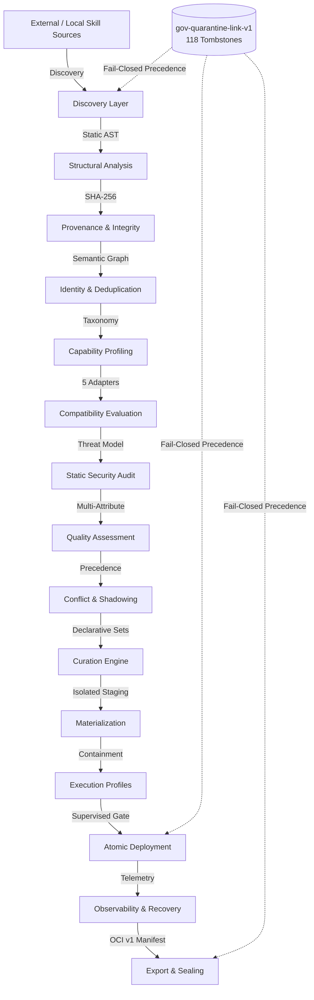
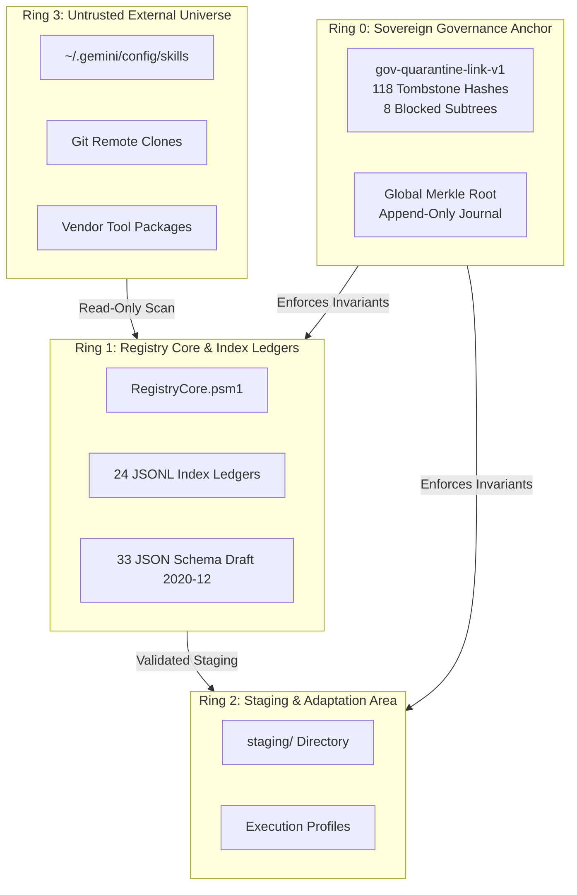
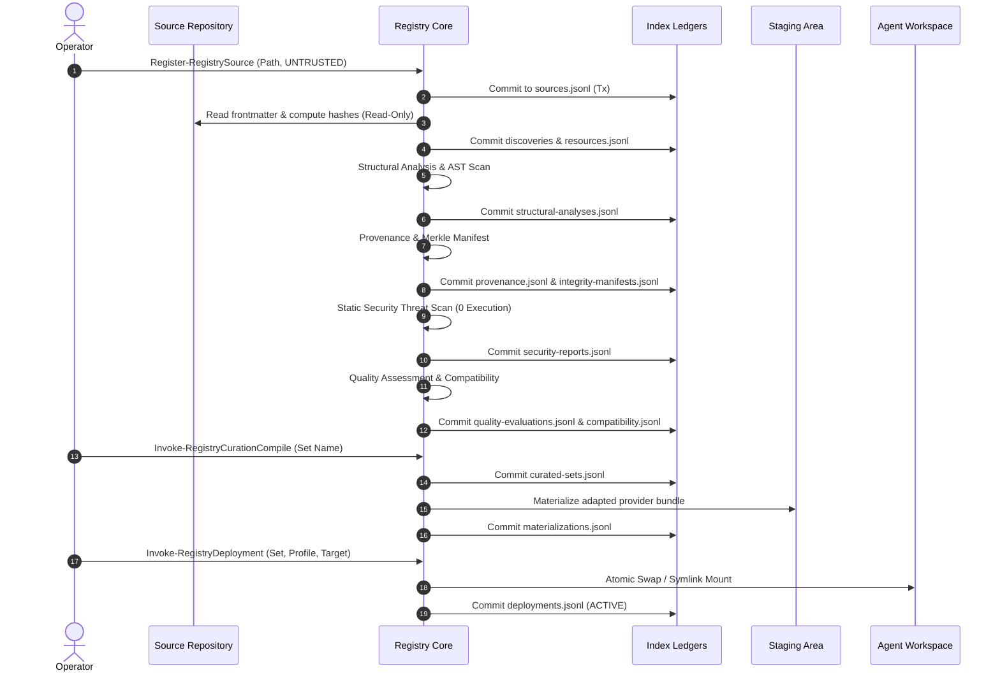

# Skill Registry — Architecture Handbook

**Version:** 1.0.0 (Phase 24 / Gate 24 Edition)  
**Status:** Canonical Reference Manual  
**Repository Root:** `E:\.skill-registry`  
**Security Governance Anchor:** `gov-quarantine-link-v1` (118 Tombstones, Fail-Closed)

---

## 1. Mission & Architectural Vision

The **Skill Registry** is an enterprise-grade, metadata-first lifecycle management and security governance platform for AI Agent Skills, Prompt Templates, and Executable Tool Packages across heterogeneous AI providers (Google Gemini, Anthropic Claude, OpenAI Codex, and Generic Agent runtimes).

### Core Pillars

1. **Metadata-First & Zero Dynamic Execution during Inspection**: Skills are discovered, classified, structurally analyzed, and audited exclusively via static AST inspection, content hashing, and schema validation without executing untrusted code.
2. **Sovereign Quarantine & Fail-Closed Precedence**: Known vulnerable, malicious, or malformed artifacts are blocked at the cryptographic root. If any validation fails, the system halts safely.
3. **Zero Unattended Promotion**: Background discovery, indexing, updates, and drift monitoring never promote skills into active production workspaces without explicit human operator authorization.
4. **Append-Only ACID Ledgers**: All state mutations are transacted via journaled, append-only JSONL ledgers with deterministic Merkle root sealing.

---

## 2. Architectural Truth Matrix

To ensure absolute engineering integrity, every capability of the Skill Registry is classified according to its verified operational state:

| Subsystem / Capability | Implementation Status | Validation Tier | Supported Evidence |
| :--- | :--- | :--- | :--- |
| **Fail-Closed Governance & Quarantine** | `IMPLEMENTED` | `REAL_ARSENAL` | 118 tombstones, 8 blocked subtrees enforced fail-closed across 168 real skills |
| **Source Registry & Trust Isolation** | `IMPLEMENTED` | `REAL_ARSENAL` | 11 registered sources, immutable `UNTRUSTED` default tier |
| **Frontmatter & Discovery Engine** | `IMPLEMENTED` | `REAL_ARSENAL` | 183 catalog resources discovered (168 real + 15 fixtures) |
| **Structural Analysis & Risk Tiering** | `IMPLEMENTED` | `REAL_ARSENAL` | 183 structural analyses generated with layout types & risk levels |
| **Provenance & Merkle Integrity Manifests** | `IMPLEMENTED` | `REAL_ARSENAL` | 72 provenance chains, 173 file-level Merkle manifests |
| **Identity Deduplication Clustering** | `IMPLEMENTED` | `REAL_ARSENAL` | 183 identity clusters with canonical leader resolution |
| **Capability Taxonomy & Profiling** | `IMPLEMENTED` | `REAL_ARSENAL` | 25 canonical taxonomy terms, 346 capability profiles |
| **5-Adapter Provider Compatibility** | `IMPLEMENTED` | `SYNTHETIC_MATRIX` | 915 evaluations across GEMINI, CLAUDE, CODEX, OPENAI, GENERIC |
| **Static Security Audit Engine** | `IMPLEMENTED` | `REAL_ARSENAL` | 493 security reports, 0 dynamic executions, regex/AST threat modeling |
| **Quality Assessment Engine** | `IMPLEMENTED` | `REAL_ARSENAL` | 5-dimensional scoring across completeness, maintainability, docs, tokens |
| **Conflict & Shadowing Precedence** | `IMPLEMENTED` | `REAL_ARSENAL` | Namespace collision detection, trust-based precedence rules |
| **Curated Set Compilation** | `IMPLEMENTED` | `SYNTHETIC_TESTED` | Declarative bundle compilation with token budget constraints |
| **Provider Materialization Pipeline** | `IMPLEMENTED` | `SYNTHETIC_TESTED` | Isolated staging transforms for Gemini, Claude, Codex targets |
| **Execution Profiles & Sandbox Contracts** | `IMPLEMENTED` | `SYNTHETIC_TESTED` | 4 profile specifications (`STRICT_SANDBOX`, `OFFLINE_DEVELOPER`, etc.) |
| **Atomic Deployment & Safe Wiring** | `IMPLEMENTED` | `SYNTHETIC_TESTED` | Atomic symlink/copy mounting, post-mount probes, rollback |
| **Upstream Drift Monitoring** | `IMPLEMENTED` | `SYNTHETIC_TESTED` | Content & metadata drift detection into staged update ledger |
| **Update Orchestration & Promotion** | `IMPLEMENTED` | `SYNTHETIC_TESTED` | Dependency-aware update queues, supervised promotion gates |
| **Scheduled Reconciliation Engine** | `IMPLEMENTED` | `SYNTHETIC_TESTED` | Declarative schedules, periodic health and drift polling |
| **Operational Observability & Metrics** | `IMPLEMENTED` | `REAL_ARSENAL` | Subsystem telemetry, timeline inspection, Merkle consistency proofs |
| **Crash Recovery & Lock Management** | `IMPLEMENTED` | `REAL_ARSENAL` | Journal replay, lock clearing, sub-second atomic reconciliation |
| **Ledger Compaction & Archive Retention** | `IMPLEMENTED` | `SYNTHETIC_TESTED` | Historical record compaction into compressed tarballs |
| **Unified CLI Front-End (`skillctl`)** | `IMPLEMENTED` | `REAL_ARSENAL` | 23 functional domains, ANSI console & machine-readable JSON |
| **OCI Image Manifest Bundling & Sealing** | `IMPLEMENTED` | `REAL_ARSENAL` | OCI v1 manifests, standalone tarballs, global Merkle root sealing |
| **Remote OCI Registry Push / Pull** | `PLANNED` | `UNVERIFIED` | Future Phase 25 distribution infrastructure |
| **Live Multi-Agent Federation (MCP/REST)** | `PLANNED` | `UNVERIFIED` | Future Phase 26 federation gateway |

---

## 3. Trust Boundaries & Threat Model

The Skill Registry establishes four distinct security rings:

### Trust Tier Definitions

- `UNTRUSTED`: All newly discovered external or user sources. Cannot be mounted without full pipeline pass.
- `COMMUNITY_VERIFIED`: Sources passing static security and quality evaluation with low risk tier.
- `ORGANIZATION_INTERNAL`: Vetted internal repositories with cryptographic author signatures.
- `SYSTEM_CORE`: The Registry Core itself, signed and anchored in Ring 0.

---

## 4. End-to-End Data Flow

The lifecycle of a skill flows through 15 sequential gates before reaching deployment:

---

## 5. Storage Architecture & Append-Only Index Ledgers

The registry stores all state in text-based, append-only JSON Lines (`.jsonl`) files in `index/`. Every line is an immutable, schema-validated record accompanied by a transaction ID and timestamp.

### 24 Active Index Ledgers

1. `index/sources.jsonl` — Registered source locations and policies.
2. `index/resources.jsonl` — Canonical catalog of discovered skills.
3. `index/discoveries.jsonl` — Historical discovery sessions and candidate counts.
4. `index/structural-analyses.jsonl` — File layouts, packaging types, and risk levels.
5. `index/provenance.jsonl` — Origin lineage, commit SHAs, and acquisition chains.
6. `index/integrity-manifests.jsonl` — SHA-256 Merkle trees of all skill files.
7. `index/identity-clusters.jsonl` — Deduplication clusters and canonical leaders.
8. `index/capabilities.jsonl` — Canonical capability taxonomy terms.
9. `index/capability-profiles.jsonl` — Declared and inferred semantic capability maps.
10. `index/providers.jsonl` — Supported target provider configurations.
11. `index/compatibility.jsonl` — 5-adapter provider compatibility matrices.
12. `index/security-reports.jsonl` — Static AST / regex threat modeling audit reports.
13. `index/quality-evaluations.jsonl` — 5-dimensional quality and utility scorecards.
14. `index/conflicts.jsonl` — Namespace clashes, capability competition, shadowing records.
15. `index/curated-sets.jsonl` — Declarative skill bundles and token budgets.
16. `index/materializations.jsonl` — Staged provider adaptation manifests and hashes.
17. `index/execution-profiles.jsonl` — Sandboxing contracts and resource constraints.
18. `index/deployments.jsonl` — Active and retired agent workspace mounts.
19. `index/updates.jsonl` — Detected upstream content and metadata drifts.
20. `index/update-queues.jsonl` — Sequenced update batches awaiting promotion.
21. `index/schedules.jsonl` — Background reconciliation cron schedules.
22. `index/observability-snapshots.jsonl` — Subsystem telemetry and Merkle checkpoints.
23. `index/archives.jsonl` — Compacted historical ledger archives.
24. `index/exports.jsonl` — OCI image and tarball bundle export manifests.

---

## 6. Concurrency, Locks & Crash Recovery

To prevent corruption during concurrent operations:

1. **Lock Directory (`state/locks/`)**: Operations acquire exclusive filesystem locks (`.lock` files containing PID and expiration timestamp).
2. **Journaling (`transactions/journal.jsonl`)**: State mutations log `STARTED`, `COMMITTED`, or `FAILED` transactions with rollback snapshots.
3. **Crash Recovery (`Invoke-RegistryCrashRecovery`)**: On startup or doctor check, any orphaned locks are cleared and uncommitted transactions are reconciled in sub-second time.

---

## 7. Cryptographic Sealing & Merkle Roots

The registry computes a deterministic global Merkle root across:

- All 24 index ledger file digests.
- The 118 quarantine tombstone hashes.
- Active system configuration files.

Formula:
$$\text{MerkleRoot} = \text{SHA256}(\text{Sort}(\text{SHA256}(L_1) \parallel \dots \parallel \text{SHA256}(L_{24}) \parallel \text{QuarantineAnchor}))$$

Current Global Merkle Root:
`596552cf11583365510fb13503394efd59e9769e01ab53da96342f0ce807f958`
