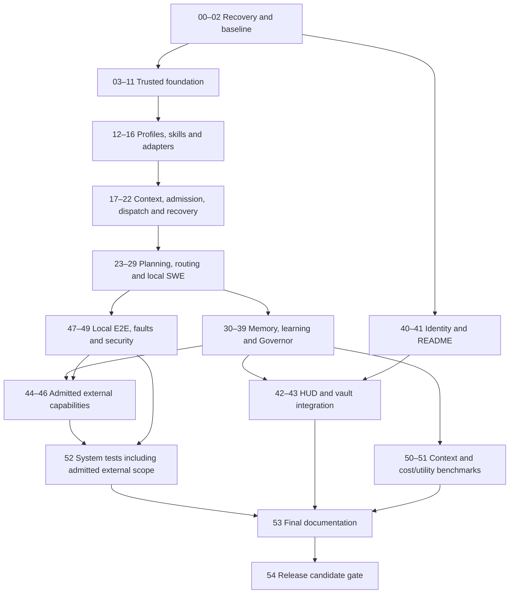

# J.A.R.V.I.S. Autonomous Intelligence Plan

<<<<<<< HEAD
Canonical forward roadmap · Reassessed 2026-09-13
Source baseline: `91909f69bed720274a148a4411090f90d4511889` plus the reviewed local corrections.

The previous claim that all 55 phases were fully certified was contradicted by reproduced failures. Modules for M0–M6 exist; their presence does not certify complete autonomy. The [completion review](../../reports/reanalysis/20260913/REVIEW.md) records the current tested scope, corrections and operating boundaries. Historical milestone reports and phase labels below are component evidence, not a release certificate.
=======
Canonical forward roadmap · Reality-aligned after M6 review · 2026-09-12

Latest foundational audit baseline: local commit `23612c9` (2026-09-12). Earlier M0 evidence below refers to `91909f69bed720274a148a4411090f90d4511889` and is historical, not current enforcement proof.

Release status: **not certified**. Historical `v2.0.0-rc2` evidence is retained but superseded pending reproducible contract-closure validation.

This plan outlines the architecture from baseline reassessment through release readiness. Historical M0–M6 reports record work performed, but their whole-system certification language is not current evidence. Component presence, unit validation, integration validation and product certification are tracked separately.
>>>>>>> 8f65117c4561b012121269e1afabe49cfe04c3a4

Status vocabulary: **EXISTING** = source or artifact located; **PARTIAL** = some behavior exists, integration or evidence missing; **PLANNED** = target contract not implemented; **BLOCKED** = prerequisites prevent admission; **VALIDATED** = stated, bounded behavior passed a recorded check. Never infer whole-system readiness from a component status. Priorities: P0 foundation/correctness; P1 next local capability; P2 later optimization/observability; P3 gated external expansion. `UNKNOWN` is an honest measurement value, not zero or success.

## Foundational audit update — 2026-09-12

Server transport continuation 2026-09-13: /api/chat uses a bounded single-provider adapter with server-side cloud opt-in, bearer grant and provider allowlist. Responses remain UNVERIFIED absent independent evidence. Local tests: 283 / 42 suites. HUD client grants now have six Node tests (memory-only token, explicit provider/model, BLOCKED/UNVERIFIED display); browser/live-provider validation and authorization of other HTTP endpoints remain open; see [compatibility and gates](../architecture/SERVER_INFERENCE_BOUNDARY.md).

Software upgrade 2026-09-13: the user-added [executable prompt](../../PROMPT-JARVIS-COGNITIVE-RUNTIME-SOFTWARE-UPGRADE.md) now has a [discovery/execution record](../plans/2026-09-13-cognitive-software-upgrade.md). Existing routing, context, governor and memory modules support a bounded explicit execute_inference path with registered backends, policy-first selection, controlled fallback, independent evidence verification and scoped cache/memory. Local runner: 271 tests / 41 suites. Legacy server migration, actual provider usage/deadlines and effectful tool binding remain unvalidated; affected phases remain PARTIAL, not whole-system certification.

Fitness continuation 2026-09-13: phase 33 remains PARTIAL. Explicit SKILL attribution is now required for failed samples; missing/conflicting/non-skill attributions are excluded from all dimensions and counts, without empty-filter fallback. Runtime spans preserve their attempt's attribution. Four new tests and expanded execution/resume assertions passed; local runner: 250 tests across 40 suites. No dependency renumbering: authenticated attribution, freshness/environment and independently verified sample admission are still prerequisites.

Continuation 2026-09-13: phases 09/21 remain PARTIAL, with a bounded recorded-effect recovery gate now enforced in ReplayEngine, CheckpointManager and both runtime mission entry points. Pending reconciliation/compensation cannot be converted into a retry by those paths. Six new tests cover the guards; the local runner passed 246 tests across 40 suites. Missing effect records, durable idempotency, verified reconciliation and compensation ownership remain release blockers. No new scheduler, learning, federation or infrastructure feature was implemented.

**Status:** PARTIAL · **Priority:** P0 · **Requires:** source and consumer audit · **Unlocks:** bounded contract corrections · **Risk:** documented intent mistaken for runtime enforcement · **Evidence Required:** negative contract tests plus consumer integration proof.

Authoritative current findings: [Execution Contract](../architecture/RUNTIME_EXECUTION_CONTRACT.md), [Failure Semantics](../architecture/FAILURE_SEMANTICS.md), [Trust Boundaries](../security/TRUST_BOUNDARIES.md). These supersede conflicting historical “VALIDATED” or “certified” claims. Unreviewed phase labels below retain historical unit scope only; they are not deployment approval.

Existing QuantumAgentEngine is located in tooling/jarvis_server.py. Task/attempt history, governors, routers, memory, scheduler and learning modules already exist; no parallel replacement subsystems are proposed. The loop skill's required reference files are missing and need verified-source restoration before that workflow is executable.

This audit implements only TaskNode attempt-lineage/duplicate-ID validation and four focused tests. Baseline: 41 focused tests passed; after change: 45 passed. Remaining P0 gaps include verification used as execution, counter-only recovery, unknown mutable outcomes, incomplete grants, fitness fallback, synthetic resume token accounting, and unauthenticated node envelopes. A green unit suite does not close them.

### Justified dependency changes (existing phase numbers retained)

| Phase | New explicit prerequisite | Architectural reason | Risk avoided |
| --- | --- | --- | --- |
| 16 Adapter contract | 09 must cover supported inspection/cancel/reconcile behavior, not just enums | Unsupported recovery capabilities must block admission | Silent unsafe fallback |
| 18 Admission | 03,09, plus 05,10–12,16; classify impossible binding and unknown mutable effects | Do not spend retries on structurally impossible work | Repeated unexecutable tasks / duplicate effects |
| 19 Scheduler | 07,09–11,18; cancellation/restart fixtures against existing dispatch | Persisted state and effect semantics precede broader scheduling | Retry after unobserved write; unbounded queues |
| 21 Recovery/replay | 05 explicitly joins existing 07,09,19–20 | Recovery is a new authorization decision, not permission inherited from telemetry | Replay-induced side effects / expired grants |
| 33 Fitness | 08 added to 10,20,32; fresh qualified sample gate | Attribute before scoring; no fallback to excluded spans | Node failures penalize skills |
| 36 Learning | 08,10 added to 31–35; distinct evidence/environment validation | Count thresholds are not verified knowledge | Unsupported promoted heuristics |
| 44 n8n / 45 Infrastructure | Existing 05,09,16 gates explicitly require authenticated full-envelope grants and owned-effect reconciliation | Optional HMAC and nonempty provenance are insufficient | Forged trigger / duplicate or unowned mutation |
| 46 Federation | Existing trust gates explicitly require proven identity, handshake, correlated result and leases | Digest and declared trust tier do not authenticate nodes | Forged result / split brain |

Do not add a new Goal Engine or scheduler to satisfy names. Repair existing contracts first. Optional external transcript ingestion, n8n operations and infrastructure skill ingestion remain future work. Missing skill references must be recovered from an authorized, integrity-checked source, not fabricated.

## 1. Vision

**Status:** PLANNED · **Priority:** P1 · **Requires:** trusted execution and evidence · **Unlocks:** useful bounded autonomy · **Risk:** attractive demonstrations conceal unverified work · **Evidence Required:** independently verified useful outcomes with actual resource receipts.

J.A.R.V.I.S. should decide whether and how to act, what information it needs, which resources are worth spending, how to verify the result, and what deserves to be learned. The skill registry is an existing foundation for this direction. The target is an Autonomous Cognitive Runtime that improves verified usefulness within explicit authority, privacy and resource limits.

The north star is **Verified Utility per Resource Unit**. Track cost, tokens, latency, compute and risk separately; any aggregate requires declared units, normalization and versioned weights. Do not divide outcomes by an arbitrary sum of heterogeneous measurements.

## 2. Current Reality — historical M0 baseline

The table and numbered findings in this section describe the M0 inspection, not the latest checkout. Use the dated audit update above for current runtime behavior. In particular, runtime now records attempts, the main path no longer charges fixed 200 tokens, and governors/routers/memory have implementations; resume still uses synthetic tokens.

**Status:** PARTIAL at product level; bounded local integration validated. **Priority:** P0. **Evidence:** [isolated suite](../../reports/reanalysis/20260913/full-suite.json).

| Area | Current behavior | Boundary |
| --- | --- | --- |
| Local execution | Explicit read/write adapters; durable intent before effects; independent file/hash checks | A capability plan requires explicit actions before it can execute |
| Authorization | Signed host-verifier envelope, task/action/scope binding, expiry, durable single-use consumption | Host identity verifier and autonomy ceiling must be configured; R5 remains denied |
| Recovery | Verified tasks preserved; interrupted reads can retry; ambiguous writes require reconciliation | No automatic repeat or compensation of unknown external effects |
| Memory | Conflicting values retained, bounded retrieval, confined snapshots, transactional restore | Provenance labels identify origin; they do not independently prove a fact true |
| Measurement | Local actions consume zero model tokens; model recommendations marked not invoked | Catalog prices/capability ratings are estimates, not provider measurements |
| Dashboard | Loopback, Host/Origin validation, strict JSON, confined assets, escaped external HTML fields | HTTP integration uses an isolated handler; no production provider or private vault validation |
| Registry and external integrations | Existing tools and schemas remain available | Quarantined payloads, third-party skill execution and remote deployment are excluded from local validation |

<<<<<<< HEAD
The fixture suite exercises real local file effects and adverse cases. It does not prove every natural-language goal can be turned into a correct program, authenticate other local processes, or provide an OS sandbox. Expanded infrastructure/federation autonomy remains gated by its own implementation and deployment requirements.
=======
Concrete findings to carry into the next milestone:

1. `RiskLevel.normalize` maps unrecognized values to R0; side-effect parsing also has permissive defaults. Unknown authority/effect data must fail closed rather than gain a harmless classification.
2. `ExecutionAttempt.from_dict` can synthesize legacy mission/task identifiers. Legacy records need an explicit migration provenance marker; invented identifiers must not masquerade as authentic lineage.
3. `runtime.py` does not call `record_attempt`. Its non-command branch creates completion text and an executed result without a demonstrated adapter invocation. Verification commands are also used as execution commands. Separate those responsibilities.
4. Runtime token usage is currently fixed at 150 prompt / 50 completion tokens. Replace it with provider or local accounting evidence; use UNKNOWN when unavailable.
5. The runtime uses precomputed `schedule` waves although the scheduler exposes current-state admission checks. Wire current verified prerequisites and capacity checks into actual dispatch.
6. Policy checks depend on action labels and a selected resource; write scope matching uses string prefixes. Require canonical paths, complete effect declarations and adapter enforcement. An approved task flag alone must not substitute for an authenticated, scoped, unexpired grant.
7. The contract tests for skill-penalty attribution and compensation provenance implement local helper functions. Passing them does not demonstrate enforcement in fitness or compensation services.
8. The reviewed baseline defaulted to an absolute Windows checkout. Contract-closure work replaces agentic and primary entry-point defaults with checkout-relative roots; remaining scripts and prose with legacy paths are platform-specific until migrated.
>>>>>>> 8f65117c4561b012121269e1afabe49cfe04c3a4

## 3. Architectural Principles

**Status:** PLANNED (target constraints) · **Priority:** P0 · **Requires:** current-reality findings · **Unlocks:** coherent contracts across layers · **Risk:** parallel implementations of the same authority · **Evidence Required:** contract tests plus integration tests at each boundary.

Preserve existing execution, trust, evidence, failure and authorization contracts. Extend versioned schemas with explicit migrations and compatibility fixtures. Keep execution state, verification state, recovery state and mission outcome independent. Execution completion is not verification; a timeout with unknown external effect is not proof of failure or safety to retry.

The plan uses six layers. A–C follow the requested grouping; D–F make memory, human projection and external operations explicit:

| Layer | Responsibility | Boundary |
| --- | --- | --- |
| A — Trusted Foundation | Contracts, schemas, state, policy, artifacts, failure, evidence, budgets | Mandatory before autonomous execution expansion |
| B — Cognitive Execution | Profiles, skills, adapters, admission, scheduler, planning, resolution, recovery | Executes only admitted, evidenced attempts |
| C — Cognitive Efficiency | Context Governor, tool/model routing, decision receipts, Cognitive Governor | Optimizes within authority; cannot bypass A |
| D — Memory and Learning | Memory Fabric, attribution, experiments, bounded promotion | Durable knowledge requires provenance and validation |
| E — Human Observability | Visual identity, README, HUD, Obsidian projection | Exposes truth; never becomes execution authority |
| F — Governed External Operations | External knowledge, n8n, infrastructure, federation | Admission and local hardening precede external effects |

Audit logs, authoritative machine state, derived projections and disposable caches have separate storage roles. Source references and immutable hashes support replay; replay must never repeat an unsafe external effect merely to reproduce a screen.

## 4. Trusted Foundation

**Status:** PARTIAL · **Priority:** P0 · **Requires:** recovery baseline · **Unlocks:** layers B–F · **Risk:** false success or unbounded side effects · **Evidence Required:** schema/migration negatives, policy bypass negatives, restart and idempotency tests.

Mission holds the goal, authorized scope, budgets, DAG and terminal outcome. Task describes an admitted unit of work and independent verification requirements. ExecutionAttempt is append-only history with mission/task/agent/skill/tool/node identifiers, trace and parent trace, timestamps, input/output references, environment fingerprint, idempotency key, consumed resources, artifacts, side effects, failure class/attribution and the four state axes.

Persist authoritative transitions atomically and verify restart behavior before releasing dependents. Admission requires valid schemas, policy, scoped authorization, resource estimates or an explicit unknown-cost policy, and a verification strategy. Missing provenance blocks automatic compensation. Retry requires declared idempotency semantics; ambiguous effects enter reconciliation. Compensation itself is a new policy-controlled, evidenced attempt.

Failure classification and attribution are separate. Distinguish transient, permanent, validation, policy, authorization, conflict, timeout, exhausted resources, dependencies, external services, malformed input, integrity, compatibility, cancellation and unknown. Attribute to planner, resolver, agent, skill, tool, node, environment, dependency, service or policy only with evidence. Node/policy failures must not automatically penalize a skill.

The next milestone must reject unknown enum values at trust boundaries, preserve legacy uncertainty explicitly, bind approvals to immutable action/scope/budget digests, validate every effect, and test expiry, revocation, restart, tampering and path aliases. Do not use unknown-risk defaults as execution authorization.

## 5. Cognitive Runtime

**Status:** PARTIAL · **Priority:** P1 · **Requires:** foundation admission gates · **Unlocks:** bounded mission execution · **Risk:** selecting a capable profile without an executable adapter · **Evidence Required:** real local fixture action → persisted attempt → independent verification → final outcome.

Build on existing profiles, composite skills, skill dependency graph, progressive disclosure, scheduler, planner/resolver, repository intelligence and recovery modules. Formalize a separate adapter contract: accepted inputs, capabilities, effects, scopes, environment, timeout, cancellation, idempotency, outputs, measured usage and verification hooks. Profile selection is not adapter execution.

Every dispatch must check current DAG state, locks, node/agent capacities, policy, budget and cancellation. Planner assumptions reference repository commit, file hashes and tool/skill compatibility. Replan only the affected DAG region when a file, dependency, tool, skill, node, budget, verification result or new evidence invalidates those assumptions. Preserve unaffected verified work and explain invalidation in the audit trail.

## 6. Cognitive Governor

**Status:** PLANNED · **Priority:** P1 · **Requires:** budgets, receipts, context policy, verified outcomes · **Unlocks:** controlled escalation and adaptive planning · **Risk:** optimizing away authority or evidence · **Evidence Required:** bounded decision traces and stop/escalation tests.

The Governor controls budget allocation, context strategy, memory policy, model/tool escalation, replanning and stop conditions. **It never executes tasks directly.** It requests admitted work through the runtime. For uncertainty: identify the missing fact → choose the cheapest useful information source → evaluate confidence → continue, expand, replan or stop.

Confidence must reference a method and evidence; no invented precision. Repeated cheap failures consume the same mission budget and must trigger escalation or stopping before their cumulative cost exceeds the configured alternative. Human intervention, cancellation, exhausted budget and violated authority always take precedence over goal pursuit.

## 7. Context Economy

**Status:** PARTIAL (disclosure exists; Governor/receipts planned) · **Priority:** P1 · **Requires:** source identity, budgets, retrieval evidence · **Unlocks:** economical planning and routing · **Risk:** aggressive compression removes a critical constraint · **Evidence Required:** same-outcome comparisons, freshness invalidation and exact-read exceptions.

Decision sequence: **goal → information need → cheapest useful evidence → confidence → expand only if needed**. Budgets exist at mission, task, agent, retrieval, tool-result and memory levels. Reserve capacity for verification and recovery rather than exhausting it during planning.

Progressive disclosure is **CATALOG → MANIFEST → TARGETED SOURCE → BROADER SOURCE**. Reuse current disclosure components; do not load entire repositories or skill bodies merely because they are available.

Planned `ContextReceipt`: mission/task IDs; sources considered and loaded; selection reason; content hash; bytes; estimated tokens and estimation method; cache hit; relevance; confidence; freshness; provenance; schema version. Measured and estimated values must be distinguishable. Unknown values remain UNKNOWN.

No-repeat reads use normalized path + content hash + scoped summary. Reuse an unchanged, sufficient summary, except when exact text is required for modification, quotation, security decisions, ambiguous semantics or stale assumptions. Hash drift invalidates the cache entry.

Compaction: raw execution → structured state → mission summary → verified facts → source references. Keep raw transcripts in the separate audit store. Preserve decisions, unresolved uncertainty, authority, side effects and pending verification through every compaction stage. Evaluate quality against verified outcomes, not only token reduction.

## 8. Tool Intelligence

**Status:** PLANNED · **Priority:** P1 · **Requires:** adapter contracts, policy, capability catalog, usage history · **Unlocks:** auditable tool choice · **Risk:** low apparent cost hides broad effects · **Evidence Required:** compatibility refusals and comparative, verified task outcomes.

`ToolRouter` input: task, required capabilities, environment, risk ceiling, budget, available tools and relevant history. Output: candidates, compatibility results, expected utility, cost, risk, selected tool and selection reason. Apply hard authority, privacy, scope and capability constraints before ranking. Missing tools produce an explicit blocked decision; do not invent capabilities.

## 9. Model Intelligence

**Status:** PLANNED · **Priority:** P1 · **Requires:** provider metadata, privacy rules, budgets, evaluation corpus · **Unlocks:** cost-aware escalation · **Risk:** cheapest model repeatedly fails or leaks data · **Evidence Required:** measured quality/cost/latency under fixed comparable tasks.

`ModelRouter` ranks expected quality minus declared token, monetary, latency, risk and context penalties. Hard constraints include policy, minimum capability, privacy, budget, availability and context capacity. Weights are configurable, observable, versioned and experimentable; this plan invents no universal constants or live model prices.

Start with the least costly strategy that has adequate evidence of suitability. If confidence is insufficient, first consider better context or tools, then a stronger model. Stop repeated low-cost failures according to the total mission budget. Provider failures and node failures are distinct from model quality failures.

Planned `DecisionReceipt` shared by agent/skill/tool/model/node/memory/context decisions: decision ID, mission/task IDs, decision type, candidates, rejected candidates and reasons, estimated cost/quality/risk with methods, selection, reason and confidence. UNKNOWN estimates remain explicit. Persist receipts before consequential dispatch and attach actual outcome/usage afterward without rewriting the original estimate.

## 10. Memory Fabric

**Status:** PLANNED (existing memory/vault support is narrower) · **Priority:** P1 · **Requires:** evidence, scoped identities and durable state · **Unlocks:** reliable reuse across missions · **Risk:** stale or untrusted knowledge becomes authority · **Evidence Required:** admission, conflict, scope, expiry and retrieval regression fixtures.

| Level | Contents | Lifetime and admission |
| --- | --- | --- |
| Working | Active mission context and structured intermediate state | Transient; compact within current authority |
| Episodic | Missions, attempts, decisions, outcomes, failures, recoveries | Durable evidence references with source scope |
| Semantic | Repository, architecture and environment facts/relationships | Verification, commit/environment identity and freshness |
| Procedural | Supported workflows, heuristics, tool/skill and recovery strategies | Verified experiments plus bounded promotion |

Admission: worth remembering? → evidence → provenance → confidence → duplicate detection → contradiction detection → classification → storage. Every durable record carries confidence, provenance, created/last-verified dates, freshness, environment, scope, contradictions, supersedes and superseded-by relationships.

Retrieval order: exact ID → repository graph → structured metadata → lexical → semantic → broader search. Add an external vector database only after a measured benefit exceeds operational cost. Resolve conflicts using commit, environment, freshness, provenance and verification strength; preserve competing claims when unresolved instead of silently blending them.

Decay lowers retrieval priority for stale, weak, superseded, unused or environment-specific knowledge. It does not immediately delete the audit record. Compaction keeps references to the original evidence and respects privacy and retention policy.

## 11. Repository Intelligence

**Status:** PARTIAL · **Priority:** P1 · **Requires:** trusted catalog and source hash cache · **Unlocks:** targeted planning/context and local replanning · **Risk:** stale graphs misidentify impact · **Evidence Required:** incremental invalidation and deterministic dependency/AST fixtures.

Reuse `repo_intel.py`; index paths, symbols, relationships, tests, ownership and relevant configuration within authorized scopes. Cache by repository identity, commit and content hash. Incremental changes invalidate the affected graph region. Exclude private state, credentials and quarantined payloads. Graph inference is a hypothesis until supported by source or tests.

## 12. Verification and Evidence

**Status:** PARTIAL · **Priority:** P0 · **Requires:** real execution artifacts and explicit requirements · **Unlocks:** mission success, fitness and learning · **Risk:** self-reported success substitutes for independent checks · **Evidence Required:** positive and adversarial fixtures with producer, command, exit code, timestamps and hashes.

Keep execution completion distinct from VERIFIED. Requirements may include syntax, schema, tests, behavior, invariants, output integrity and independent inspection. Missing checker or dependency produces UNVERIFIED/NOT_EXECUTED, never a pass. Separate the action adapter from its verifier. A hash proves content identity, not correctness or trusted authorship.

Each artifact references mission/task/attempt, producer, path or content ID, hash, timestamps, environment and verification state. Evidence is append-only; corrected conclusions supersede earlier records explicitly. Reconciliation checks observed effects before retries. Mission success depends on verified required outcomes and unresolved effects, not on all commands exiting zero.

## 13. Learning and Adaptation

**Status:** PARTIAL · **Priority:** P2 · **Requires:** actual outcomes, attribution, resource receipts and Memory Fabric · **Unlocks:** better bounded decisions · **Risk:** learning from synthetic success or confounded measurements · **Evidence Required:** baseline, hypothesis, experiment, evaluation and reversible promotion record.

Observation → hypothesis → experiment → evidence → evaluation → bounded promotion. Improve routing, ranking, context selection, retrieval, planning and retry strategies. Preserve a control strategy and rollback reference. Attribution prevents infrastructure/policy failures from corrupting skill fitness. No unverified heuristic promotion; confidence and environmental applicability travel with the promoted record.

## 14. Obsidian Cognitive Vault

**Status:** PARTIAL · **Priority:** P2 · **Requires:** structured memory and validated aggregation · **Unlocks:** human understanding and navigation · **Risk:** a note edit silently becomes runtime authority · **Evidence Required:** deterministic projection, stable links and explicit discrepancy reporting.

The repository already has a root MOC, topic notes and a canvas. Milestone Zero adds a truthful navigation entry point and a diagram derived from existing links. It does not import personal memory into public artwork or claim live synchronization.

Authoritative flow: **Runtime Memory → aggregation → validation → projection → Obsidian**. Human edits become proposed knowledge requiring admission. Introduce Home, Architecture, Missions, Agents, Skills, Tools, Decisions, Experiments, Learnings, Heuristics, Failures, Recovery, RepoIntelligence, Memory and MOCs gradually. Aggregate by mission/topic/time window; do not create a note for every event. Raw telemetry stays outside the vault's primary navigation.

## 15. HUD and Human Observability

**Status:** EXISTING (live behavior not validated here) · **Priority:** P2 · **Requires:** truthful telemetry and state projections · **Unlocks:** human supervision · **Risk:** attractive UI implies unsupported autonomy · **Evidence Required:** real captures tied to source/version, interaction and accessibility checks.

The HUD should expose authority, actual attempt state, independent verification, resource usage, uncertainty, receipts and pending approvals. Distinguish estimates, measurements, historical snapshots and UNKNOWN values. Capture real UI only after verifying it functions with representative local data. Milestone Zero changes documentation/identity only; diagrams are labeled as diagrams and no product screenshot is fabricated.

## 16. External Knowledge

**Status:** PARTIAL (catalog tooling exists; strengthened admission planned) · **Priority:** P2 · **Requires:** trust policy, provenance, context budgets · **Unlocks:** scoped external evidence · **Risk:** source instructions become execution authority · **Evidence Required:** rejection, stale-source and demand-materialization tests.

Admission sequence: **DISCOVER → SCORE → VALIDATE → INDEX → USE**. Collect source identity, license, provenance, trust, freshness, relevance, language/ecosystem, security and quality before influence. A lightweight catalog stores repository, description, topics, language, license, index date, trust, capabilities and relevance domains. Materialize only when justified by the current task; never clone all discovered repositories. External content is data, not higher-priority instruction.

## 17. Infrastructure

**Status:** BLOCKED for autonomy expansion · **Priority:** P3 · **Requires:** hardened local execution, grants, idempotency, compensation and secrets isolation · **Unlocks:** bounded infrastructure operations · **Risk:** irreversible effects and privilege escalation · **Evidence Required:** dry runs, isolated real adapters, rollback/reconciliation and human approval tests.

Existing infrastructure helpers are not blanket authority to install, deploy or alter services. Declare every effect and bind grants to exact scope, budget, expiration and operator identity. Keep secrets out of receipts and projected notes. No infrastructure operation is needed to finish Milestone Zero.

## 18. Federation

**Status:** BLOCKED for autonomy expansion · **Priority:** P3 · **Requires:** hardened local attempts, identity, trust and reconciliation · **Unlocks:** bounded multi-node dispatch · **Risk:** split-brain execution and repeated side effects · **Evidence Required:** node loss, lease expiry, duplicate delivery, network partition and untrusted result fixtures.

Reuse existing federation code only after adapter/node contracts are versioned and authenticated. Remote capacity is not authority. Preserve trace lineage, lease ownership, environment identity and verification evidence across nodes; treat an unavailable node's outcome as unknown until reconciled.

## 19. Security and Trust

**Status:** PARTIAL · **Priority:** P0 · **Requires:** explicit identities, scopes and effect contracts · **Unlocks:** admission at every autonomy level · **Risk:** action-label bypass, stale grants or untrusted evidence · **Evidence Required:** threat-driven negative integration tests.

Target autonomy levels are separate from existing R0–R5 **risk classes**:

| Autonomy | Permitted envelope after implementation and validation |
| --- | --- |
| A0 Observe | Gather authorized state; no task effects |
| A1 Recommend | Produce proposals with evidence and costs |
| A2 Read-only | Execute admitted read operations within scope |
| A3 Reversible local | Bounded local writes with provenance and recovery |
| A4 Bounded external | Explicit external authority, budgets, idempotency and reconciliation |
| A5 High-risk approval | Action-specific human approval and additional controls; not self-granted autonomy |

Do not equate A4 with R4 or weaken the current destructive-action denial. The mapping must be a policy decision over actual effects. Self-improvement may not disable policy, increase privileges, remove required approvals, hide telemetry, rewrite evidence, erase audit history, remove budgets or promote unverified changes.

## 20. Repository Visual Identity

**Status:** VALIDATED (Milestone Zero assets; see validation report) · **Priority:** P2 · **Requires:** factual product framing · **Unlocks:** readable documentation and consistent future UI · **Risk:** concept art presented as product evidence · **Evidence Required:** editable sources, provenance, renders, dimensions and local links.

The visual foundation uses near-black graphite, subtle navy, restrained cyan/blue, white text, fine grids and an original geometric mark. Solid, dash-dot and dashed boundaries communicate validated unit scope, partial implementation and planned components. Status words accompany color.

Hero, social preview, mark, architecture, cognitive loop, Memory Fabric and the existing-vault navigation map are tracked in [asset provenance](../assets/ASSET_PROVENANCE.md). SVG sources are editable and PNG exports are local. No protected character imagery, remote fonts, fake terminal output or fake HUD screenshot. This track runs early alongside foundation work and never gates execution correctness.

## 21. Milestones

**Status:** PLANNED beyond M0 · **Priority:** P0–P3 · **Requires:** the gates below · **Unlocks:** staged, reviewable delivery · **Risk:** phase numbers imply approval · **Evidence Required:** per-phase artifacts and unmet requirements recorded explicitly.

M0 = recovery, inspection, selected validation, canonical plan, visual identity and accurate documentation; STOP. M1 = foundation contract and policy hardening; M2 = bounded local cognitive execution; M3 = context/routing/Memory Fabric; M4 = evidence-based learning and human observability; M5 = explicitly admitted external operations; M6 = whole-system hardening and possible release candidate. Phases **00–54 contain 55 numbered entries**; numbering is a planning reference, not a count of completed features.

| Phase / item | Status | Priority | Requires | Unlocks | Risk | Evidence Required |
| --- | --- | --- | --- | --- | --- | --- |
| 00 Recover interrupted work | VALIDATED | P0 | checkout inspection | 01 | overwrite unrelated work | clean initial diff; commit inspection |
| 01 Recovered baseline | VALIDATED | P0 | 00 | 02–03 | stale evidence | hashes, backup, selected test logs |
| 02 Architecture reassessment | VALIDATED | P0 | 01 | 03,40 | source presence mistaken for behavior | scoped findings and canonical plan |
| 03 Execution contract | PARTIAL | P0 | 02 | 04–06 | false execution | adapter/attempt boundary and negative tests |
| 04 Schema and migration | PARTIAL | P0 | 03 | 06–08 | silent legacy coercion | version fixtures and rejection tests |
| 05 Policy/auth/risk | PARTIAL | P0 | 03–04 | 06,16,18 | bypassed authority | scoped expiring grants; unknown-risk denial |
| 06 Mission/task/attempt | PARTIAL | P0 | 03–05 | 07–11 | lost attempt history | runtime-persisted independent state axes |
| 07 Persistent state | PARTIAL | P0 | 04,06 | 08–10,21 | corrupt restart | atomicity, migration and recovery fixtures |
| 08 Artifact/provenance | PARTIAL | P0 | 06–07 | 09–10 | unrelated file marked produced | attempt-bound content/effect receipts |
| 09 Failure/retry/reconcile/compensate | PARTIAL | P0 | 05–08 | 10,21 | duplicate effects | unknown-effect reconciliation; no-provenance denial |
| 10 Verification/evidence | PARTIAL | P0 | 06–09 | 11,18,32 | unsupported PASS | independent outcome checks and missing-checker refusal |
| 11 Budgets | PARTIAL | P0 | 06–10 | 17–20 | synthetic usage | actual usage plus explicit unknown-cost handling |
| 12 Profiles | VALIDATED | P1 | 05–06 | 14,18,24 | capability mismatch | unit coverage + admitted dispatch integration |
| 13 Skill graph | VALIDATED | P1 | 04,08 | 14,25 | dependency drift | pinned graph and cycle/invalidation fixtures |
| 14 Composite skills | VALIDATED | P1 | 12–13 | 16,29 | scope expansion | effect/scoped expansion verification |
| 15 Disclosure | VALIDATED | P1 | 08,13 | 17,25 | oversized context | catalog/manifest/targeted-source receipts |
| 16 Adapter contract | PARTIAL | P0 | 03,05,08–10,14 | 18,26 | verifier used as executor | real isolated action and effect output |
| 17 Context Governor | PARTIAL | P1 | 11,15 | 23–28 | lost constraints | runtime information-need loop plus bounded receipt tests |
| 18 Admission | PARTIAL | P0 | 03,05,09–12,16 | 19 | unauthorized dispatch | all hard constraints checked before effects |
| 19 Scheduler | PARTIAL | P1 | 07,09–11,18 | 20–21,29 | stale precomputed waves | current-state dispatch and capacity integration |
| 20 Telemetry | PARTIAL | P1 | 08,11,19 | 28,32–34 | unknown usage reported as measured | provider/tool usage, privacy and trace lineage |
| 21 Recovery/replay | PARTIAL | P1 | 05,07,09,19–20 | 29,35 | duplicate irreversible effects | crash/restart/idempotency fixtures |
| 22 Repository intelligence | VALIDATED | P1 | 08,15 | 23 | stale dependency assumptions | incremental graph and source-hash invalidation |
| 23 Planner | PARTIAL | P1 | 17–19,22 | 24–29 | invalid whole-plan restart | affected-region replanning with evidence |
| 24 Agent resolver | VALIDATED | P1 | 12,18,23 | 28–29 | profile mistaken for execution | admissible candidates and decision receipts |
| 25 Skill resolver | VALIDATED | P1 | 13–15,23 | 28–29 | incompatibility | dependency/trust/scope filtering |
| 26 ToolRouter | PARTIAL | P1 | 16–18,20,23 | 28–29 | cheap unsafe tool | adapter binding plus constrained routing comparisons |
| 27 ModelRouter | PLANNED | P1 | 11,17,20,23 | 28–29 | repeated cheap failures | versioned catalog, real invocation and escalation receipts |
| 28 Decision receipts | PARTIAL | P1 | 20,24–27 | 29–31,39 | unexplained selection | causal binding, immutable estimates and measured outcomes |
| 29 SWE orchestration | VALIDATED | P1 | 10,16,19,21,28 | 30,35,47 | syntax treated as functional proof | real patch fixture + functional verification |
| 30 Memory Fabric | PARTIAL | P1 | 07–10,28 | 31–32 | false durable knowledge | authoritative persistence, four-level schema and scoped provenance |
| 31 Memory admission/retrieval | VALIDATED | P1 | 17,22,30 | 34–36,43 | contradictions silently merged | conflict, freshness, decay, ordered retrieval |
| 32 Failure attribution | PARTIAL | P1 | 09,20,28,30 | 33 | penalizing wrong component | integration with fitness and recovery |
| 33 Fitness | PARTIAL | P2 | 08,10,20,32 | 34,37 | synthetic outcomes bias rank | verified outcome-only updates |
| 34 Experiments | VALIDATED | P2 | 28,31,33 | 36–39 | confounded improvement | controlled comparisons and rollback |
| 35 Goal loop | VALIDATED | P1 | 11,21,29,31 | 36,39 | endless goal pursuit | stop/cancel/budget integration |
| 36 Learning | PARTIAL | P2 | 08,10,31–35 | 37,39,43 | unsupported heuristic | evidence admission and bounded promotion |
| 37 Lifecycle | VALIDATED | P2 | 33–36 | 38 | premature promotion | provenance, compatibility and deprecation tests |
| 38 Package management | VALIDATED | P2 | 05,08,13,37 | 44–46 | supply-chain execution | pinned, validated, scoped materialization |
| 39 Cognitive Governor/adaptation | PARTIAL | P1 | 11,17,28,31,34–36 | 44–46 | authority escalation | mission-scoped arbitration and hard stop/escalation tests |
| 40 Visual identity | VALIDATED | P2 | 02 | 41–43 | fictional product evidence | original sources, rendered assets and provenance |
| 41 README | VALIDATED | P2 | 01–02,40 | contributor onboarding | stale claims | current scope, working links and safe local checks |
| 42 HUD | VALIDATED | P2 | 20,28,40 | human oversight | fake live data | real capture and interaction checks |
| 43 Vault | VALIDATED | P2 | 30–31,36,40 | human memory navigation | projection becomes authority | validated aggregation and stable links |
| 44 n8n | BLOCKED | P3 | 05,09–11,16,21,38–39,47–49 | bounded external workflows | external duplicate effects | isolated adapter and approval/reconciliation tests |
| 45 Infrastructure | BLOCKED | P3 | 05,09–11,16,21,38–39,47–49 | bounded infrastructure | destructive mutation | dry run, real grant and recovery evidence |
| 46 Federation | BLOCKED | P3 | 05,07–11,16,19–21,38–39,47–49 | multi-node work | split brain | lease, identity, partition and duplicate tests |
| 47 End-to-end | PARTIAL | P0 | 10–11,16,19,21,28–29 | 44–46,52 | unit-only confidence | local verified outcome first; external cases later |
| 48 Fault injection | PARTIAL | P0 | 07,09,19,21,47 | 44–46,52 | state/effect ambiguity | crash, timeout, partial-write and restart corpus |
| 49 Security hardening | PARTIAL | P0 | 05,08–10,16,18,47 | 44–46,52 | bypassed authorization | adversarial boundary and privacy tests |
| 50 Context benchmarks | PARTIAL | P2 | 17,28,31,47 | 51,54 | tokens saved but quality lost | representative same-task/outcome corpus; context and reuse metrics |
| 51 Cost/utility benchmarks | PLANNED | P2 | 20,26–28,39,50 | 54 | arbitrary resource sum | observed verified utility and separate resource units |
| 52 System tests | VALIDATED | P0 | 47–49; 44–46 for external scope | 53–54 | hidden skips/import failures | exact discovery, counts, failures and scope |
| 53 Documentation | VALIDATED | P1 | 40–43,50–52 | 54 | stale operational claims | source/evidence-linked final docs |
<<<<<<< HEAD
| 54 Release candidate | PARTIAL | P0 | 49–53 and all selected-scope gates | separate release decision | premature certification | reproducible complete checks; no open P0 gaps |
=======
| 54 Release candidate | BLOCKED | P0 | 49–53 and all selected-scope gates | separate release decision | premature certification | reproducible complete checks; no open P0 gaps |
>>>>>>> 8f65117c4561b012121269e1afabe49cfe04c3a4

Visual/documentation phases 40–41 are intentionally brought forward into M0. Later phase numbers are not strict temporal prerequisites: local E2E, fault and security gates 47–49 must precede external expansion. They repeat with external cases if that scope is admitted. No circular dependency is intended.

## 22. Dependency DAG

**Status:** PLANNED · **Priority:** P0 · **Requires:** phase contracts · **Unlocks:** safe parallel tracks · **Risk:** external integration preceding local correctness · **Evidence Required:** dependency review and per-gate admission records.

Edges express prerequisite gates, not permission to execute every listed feature. A local-only release scope must explicitly exclude external capabilities and their claims. M0 stops before A implementation resumes.

## 23. Quality Gates

<<<<<<< HEAD
**Status:** VALIDATED for the named local fixtures; external/release gates remain bounded by scope. **Priority:** P0. **Evidence Required:** raw test output, source identity and explicit exclusions.
=======
**Status:** PARTIAL (G5 withdrawn pending clean reproduction) · **Priority:** P0 · **Requires:** evidence producers and scope definitions · **Unlocks:** honest promotion decisions · **Risk:** missing tests reported as success · **Evidence Required:** immutable check outputs and explicit exceptions.
>>>>>>> 8f65117c4561b012121269e1afabe49cfe04c3a4

- **G0 recovery:** baseline hashes and verified backups recorded in the September 13 review.
- **G1 foundation:** negative authority tests, signed approval restart/consumption, independent state axes and durable intent.
- **G2 local runtime:** real read/write actions, predecessor verification, outcome evidence and conservative restart.
- **G3 cognitive:** context preservation, memory conflicts/transactional restore and estimate-versus-measurement separation.
- **G4 external:** not certified by local fixtures; deployment authority, provider integration and external-effect reconciliation need their own evidence.
- **G5 change completion:** full isolated test discovery, no unexplained skips/import failures, syntax checks, reviewable diff and accurate documentation. Passing this gate authorizes a reviewed local commit, not an automatic remote release.

<<<<<<< HEAD
Current evidence: [completion review](../../reports/reanalysis/20260913/REVIEW.md), [full suite](../../reports/reanalysis/20260913/full-suite.json).
=======
Gates G0–G4 contain useful bounded evidence but require revalidation at the current revision. G5 is blocked until the full selected-scope suite, contract-closure tests and audits pass in a clean checkout.
>>>>>>> 8f65117c4561b012121269e1afabe49cfe04c3a4

## 24. Metrics

**Status:** bounded measurements available; product-wide optimization unmeasured. **Priority:** P1. **Requires:** declared corpus, environment and method.

| Metric | Current evidence | Interpretation |
| --- | --- | --- |
<<<<<<< HEAD
| Test result | Full fixture suite: 261 tests, no failures in the recorded run | Source/fixture behavior, not production certification |
| Model tokens for local actions | Zero; no provider call is made | No claim of percentage savings versus a baseline |
| Model routing | Catalog estimates and NOT_INVOKED receipts | Candidate costs/ratings are not observed provider performance |
| Memory retrieval | Token-bound and conflict-exclusion regressions | Retrieval quality against a real labeled corpus is unmeasured |
| Recovery | Interrupted write held for reconciliation; safe read retry tested | No universal idempotency guarantee |
| Runtime latency | Benchmark records elapsed time and mission outcome separately | Timing alone cannot establish useful success |

Historical milestone counts and claimed percentages are retained in historical reports, not used as current measured values.
=======
| Token efficiency | Verified useful outcomes per measured token, with task quality held comparable | UNKNOWN; local non-model execution now records measured zero model tokens |
| Context reuse | Valid cache/summary/reference reuse divided by eligible reads; include drift misses | Mechanism validated; representative hit-rate corpus pending |
| Resolution accuracy | Admissible successful selections against labeled comparable tasks | UNKNOWN; no representative labeled corpus yet |
| Skill/tool success | Verified useful outcomes per attempted skill/tool, split by attribution | Zero false penalties to skill fitness on agent/policy failures |
| Model escalation | Escalation frequency, reason, added cost and verified benefit | UNKNOWN; router heuristic exists, real model invocation binding pending |
| Retry waste | Resources spent in avoidable repeats; idempotency and outcome labels | Loop detection halts identical attempts at threshold 3 |
| Memory hit / staleness | Useful retrieved records / queries; stale records detected / retrieved | 4-tier Memory Fabric with exponential freshness decay |
| Plan invalidation | Affected tasks, cause, reused work and replanning resources | Dynamic downstream region replanning verified |
| Verification failure | Rejected/unverified outcomes per executed attempt, by reason | Independent AST, test, and checksum verification enforced |
| Cost per useful verified outcome | Actual currency cost for fixed task/outcome class | UNKNOWN outside measured local zero-provider-cost execution |
| Selected local checks | Current `run_tests.py` discovery | 236 passed across 39 suites, 0 failures/errors; external scope excluded |
>>>>>>> 8f65117c4561b012121269e1afabe49cfe04c3a4

## 25. Risks

**Status:** mitigated in the tested local boundary. **Priority:** P0. **Evidence Required:** each finding linked to implementation and an adverse case.

Remaining operating boundaries include host-managed identity keys, no OS sandbox against hostile local processes, no atomic compare-and-swap against external writers, semantic provenance that does not prove truth, and provider/deployment behavior outside the fixture suite. Scope exclusions must remain visible when proposing expansion or a release.

## 26. Non-Goals

**Status:** ENFORCED scope boundary · **Priority:** P0 · **Requires:** milestone agreement · **Unlocks:** a bounded reviewable delivery · **Risk:** scope expansion during recovery · **Evidence Required:** final diff and explicit stop.

Required boundary: exclude unauthenticated external execution, uncontrolled mutations, secret propagation and unvetted packages. Current enforcement is partial; the trust audit records concrete exceptions. External phase status BLOCKED is a roadmap gate, not proof that every code path rejects such operations.

## 27. Definition of Done

<<<<<<< HEAD
**Status:** local corrective review validated; broad product roadmap remains partial. **Priority:** P0. **Requires:** reproducible checks, reviewable changes, protected data and explicit authority.

A corrective iteration is done when its reproduced defects are fixed, associated tests and the full isolated suite pass, syntax checks pass, evidence is recorded, and documentation accurately describes the final behavior. A local commit is separate from push, tagging and release.

The broader Autonomous Cognitive Runtime is done only when each selected product capability has executable integration and independently verified useful outcomes under real authority, budgets and recovery requirements. Module presence, sample commands, fixture-only metrics and historical PASS labels do not meet that definition.
=======
**Status:** PARTIAL (release gate blocked) · **Priority:** P0 · **Requires:** contract closure, clean complete checks and accurate documentation · **Unlocks:** operator release review · **Risk:** confusing historical milestone reports with current product completeness · **Evidence Required:** current full-suite output, static checks, audit output and causal execution tests.

Historical reports exist for all milestones, but the runtime is not currently certified. Release readiness requires closing the PARTIAL/PLANNED items above and reproducing the complete gate:
- **Milestone 0**: Baseline Architecture Reassessment & Visual Identity (`reports/MILESTONE_ZERO.md`)
- **Milestone 1**: Hardened Execution and Trust Foundation (`reports/MILESTONE_ONE.md`, 191 tests)
- **Milestone 2**: Bounded Local Cognitive Execution (`reports/MILESTONE_TWO.md`, 199 tests)
- **Milestone 3**: Context, Admission, Dynamic Dispatch, and Recovery (`reports/MILESTONE_THREE.md`, 207 tests)
- **Milestone 4**: Planning, Routing, Decision Receipts, and SWE Orchestration (`reports/MILESTONE_FOUR.md`, 215 tests)
- **Milestone 5**: Memory Fabric, Failure Attribution, and Cognitive Governor (`reports/MILESTONE_FIVE.md`, 223 tests)
- **Milestone 6**: Whole-System Hardening, Fault Injection, Benchmarks, and Security Certification (`reports/MILESTONE_SIX.md`, 231 tests)
- **Release Candidate Audit**: Full Release Candidate Audit (`reports/JARVIS_RELEASE_CANDIDATE.md`).
>>>>>>> 8f65117c4561b012121269e1afabe49cfe04c3a4
