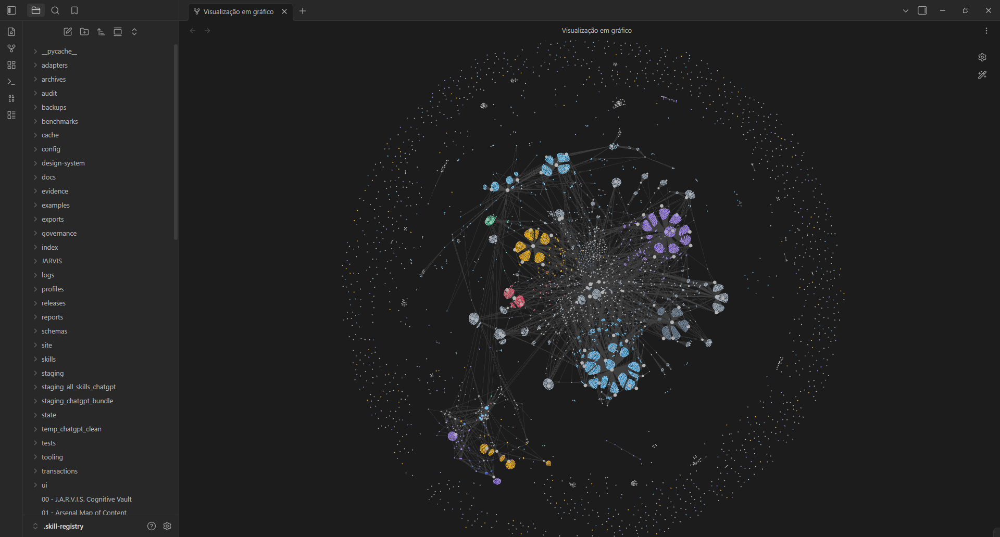
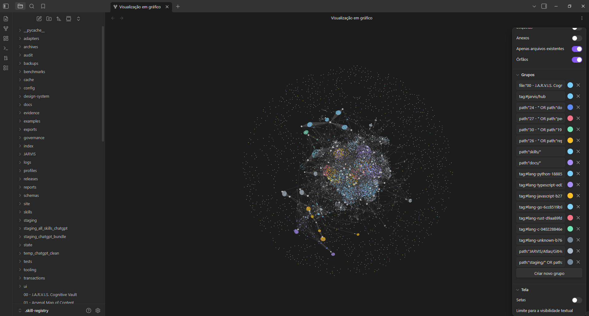
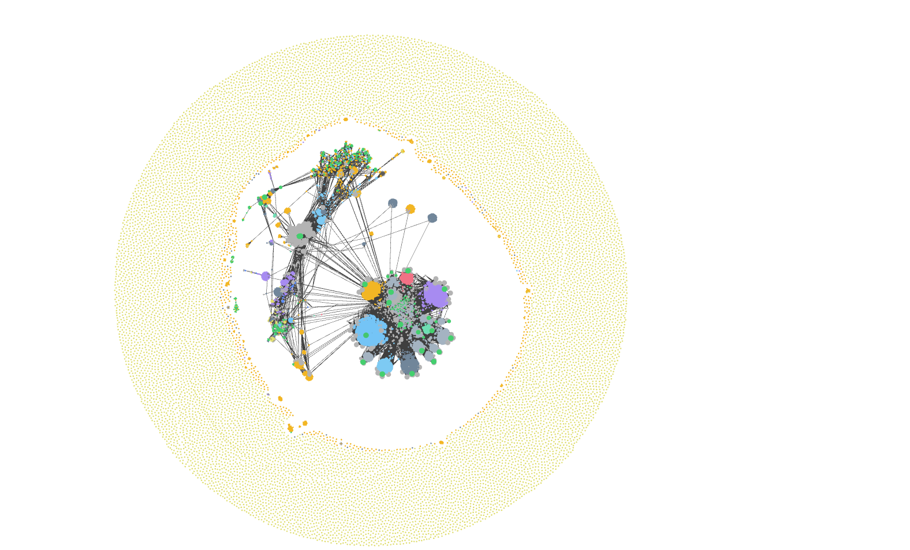

# Cognitive Vault — Atlas, relações e Graph View

Este é o contrato operacional da navegação humana do Vault. O runtime continua sendo a autoridade de execução. O ponto de entrada existente é `CognitiveVaultBridge.sync_registry`, usado pelo botão da interface e por `tooling/Sync-ObsidianVault.ps1`. O Atlas é uma extensão dessa projeção, não outro Vault, servidor, seletor de skills ou sistema de memória.

## Estrutura e propriedade

- **00 — Cognitive Vault** continua como centro; 01 — Arsenal e 02 — Security continuam nos mesmos caminhos.
- Todos os MOCs 03–23 existentes permanecem intactos fora de suas regiões gerenciadas.
- **24 — Projetos e Planos**, **25 — Documentação e Decisões**, **26 — Evidências e Relatórios**, **27 — Pessoas**, **28 — Execuções e Resultados**, **29 — Conhecimento Externo**, **30 — Memória e Eventos**, **31 — Agentes e Ferramentas**, **32 — Relações Declaradas** complementam a navegação.
- `JARVIS/Atlas/` contém projeções locais regeneráveis: páginas de coleções, referências GitHub, linguagens e proprietários. Este diretório fica fora do Git para não publicar milhares de cópias do cache nem conteúdo local privado. O gerador, a configuração, o cache já existente e os hubs são versionados.
- `JARVIS/Atlas/Navigation/00 - Vault File Map.md` abre mapas hierárquicos para os arquivos Markdown encontrados por caminho, inclusive notas isoladas, backups e staging. Os grupos usam até dois segmentos de pasta; listas maiores são paginadas. São ligações de navegação por pertencimento ao caminho, não afirmações de assunto ou dependência. O scanner não lê o conteúdo dessas notas para fazer o mapa, não segue junctions/symlinks e não reescreve os arquivos de origem. Se uma pasta estiver em `userIgnoreFilters` do Obsidian, o caminho continua visível no índice como texto, sem criar um wikilink para uma nota que o grafo não indexa.
- O hub **31 — Agentes e Ferramentas** aponta para as três skills Obsidian já `ACTIVE` e `VERIFIED_ADAPTED` no registry. Pedidos do J.A.R.V.I.S. sobre Obsidian carregam as instruções canônicas de CLI, Markdown e Bases automaticamente; o dispatcher não executa comandos nem altera notas por conta própria. O CLI localizado indica disponibilidade do executável, não confirmação de sessão aberta.
- Conteúdo humano antes/depois de `jarvis:projection` é preservado. As projeções usam backups verificados e substituição atômica por arquivo. Uma geração de vários arquivos não é uma transação global; se interrompida, execute novamente. Nenhum arquivo antigo é apagado automaticamente.
- O Canvas existente mantém seus nós humanos e a propriedade `jarvis:projection:`. O Atlas não substitui seu desenho manual.

## Evidência para cada conexão

| Conexão | Fonte permitida | Significado e limite |
| --- | --- | --- |
| Hub → coleção → nota | Caminho existente ou `type` explícito | Pertencimento a uma coleção de navegação; não prova dependência semântica |
| Referência → linguagem | Campo `language` do cache | Metadado declarado; `Unknown` é ausência de classificação |
| Referência → proprietário | Parte `owner` de `full_name` | Mesmo proprietário; não prova integração ou autoria pessoal |
| Relação tipada | `jarvis_relations` na nota de origem | Declaração explícita de quem escreveu a nota; não verificação independente |
| Nota → outra nota | Link escrito pelo autor | Preservado; Obsidian calcula o backlink nativamente |
| Skill → autorização | Nenhuma conexão do Atlas | O Atlas nunca concede elegibilidade, confiança ou execução |

Não criar relações por coocorrência, similaridade de título, palavras-chave ou embeddings. Não preencher pessoas ou resultados fictícios. Os hubs vazios explicam a ausência de fontes. O campo `type` só é interpretado no frontmatter inicial, e corpos de skills/staging/archives não são interpretados como instruções.

O cache pode conter duplicatas de `full_name` que diferem só em capitalização. A identidade GitHub é normalizada; todos os registros de origem, descrições e metadados divergentes são preservados em uma única nota com hashes individuais. Isso não atualiza o cache nem escolhe arbitrariamente a contagem de estrelas mais recente. Uma referência pode ter mais de uma linguagem se as versões de origem divergirem.

## Regras de autoria: links, tags e frontmatter

Use caminhos completos relativos ao Vault para eliminar ambiguidade entre centenas de `SKILL.md`. Cada link deve levar a um arquivo existente. Não duplique links reversos apenas para aumentar o tamanho dos nós; os backlinks do Obsidian já fazem isso. Use links junto à frase que explica sua relação.

Notas novas escritas por humanos podem seguir este modelo (substitua os valores por fontes existentes):

```yaml
---
title: Nome da decisão
type: decision
status: proposed
source: caminho/da/fonte-existente.md
observed_at: 2026-09-27
tags:
  - jarvis/decision
jarvis_relations: [{"type":"supported_by","target":"reports/relatorio-existente.md"}]
---
```

Tipos de nota: `project`, `plan`, `decision`, `documentation`, `evidence`, `report`, `person`, `execution`, `result`, `reference`, `external`, `memory`, `event`, `agent`, `tool`. O Atlas aceita também coleções pelos prefixos declarados em `config/vault/atlas.json`.

Tipos de relação: `uses_skill`, `belongs_to_project`, `supported_by`, `produced_by`, `documents`, `references`, `involves_person`, `supersedes`. `jarvis_relations` aceita exclusivamente um array JSON em uma linha do frontmatter YAML. Este subconjunto deliberado evita dependências e interpretação ambígua; YAML aninhado arbitrário não é suportado. Relações inválidas, autorrelações, destinos ausentes e caminhos fora do Vault bloqueiam a geração antes das escritas. O hub 32 mostra origem, tipo e destino; não injeta automaticamente texto no corpo de notas humanas. O grafo nativo mostra conexões de navegação, e o tipo deve ser lido na nota.

Tags são classificadores curtos (`jarvis/hub`, `jarvis/external`, `jarvis/decision`), nunca milhares de tags derivadas de cada palavra de uma descrição. As notas geradas usam tags no corpo: frontmatter não é introduzido dentro de marcadores, pois Obsidian não o reconheceria como propriedades. Frontmatter existente não é reescrito em massa.

## Três vistas do grafo

| Perfil | Finalidade | Filtro |
| --- | --- | --- |
| `universe` | Vista inicial ampla; toda a massa indexada, inclusive backups, staging e favoritos | Sem filtro adicional; respeita exclusões já configuradas pelo usuário no Obsidian. Os mapas de pasta conectam notas isoladas sem lhes atribuir semântica |
| `core` | Trabalho diário com MOCs, notas internas e documentação | Esconde cartões externos e staging/archives só nesta vista; órfãos ocultos |
| `external` | Exploração do catálogo, suas linguagens e proprietários | Atlas + hubs 06 e 29 |

Os perfis são JSON versionados em `config/vault/graph-*.json`. A aplicação mescla somente as opções declaradas em `.obsidian/graph.json` e preserva campos desconhecidos da versão instalada. `workspace.json`, plugins e aparência geral não são substituídos. Os perfis usam a paleta existente de `design-system/tokens.css`: ciano para hubs/mapas, azul para projetos/skills, violeta para documentação/ferramentas, âmbar para evidências/staging, rosa para pessoas, verde para memória/testes e cinza azulado para arquivos históricos. As cores representam coleções, não certificação ou nível de confiança.

A vista ampla desliga nós de tags, anexos e destinos inexistentes; os mapas tornam as notas órfãs alcançáveis pelo caminho, sem ocultar a massa. O perfil compacto usa força de ligação `0.9`, distância `72`, repulsão `9` e centragem `0.24` para puxar a teia para mais perto; nós `1.3×` e linhas `0.55×` dão presença aos grupos sem cobrir o fundo. Os perfis core e externo usam as mesmas forças, com zooms adequados a cada camada. O tamanho dos nós depende dos links reais mais o multiplicador global; não há tamanho nativo independente por grupo nem posição fixa por camada. Nenhum vínculo semântico é criado só para engordar um hub.

Referências de comportamento: [Graph View oficial](https://help.obsidian.md/plugins/graph), [busca e grupos](https://help.obsidian.md/plugins/search), [CLI oficial](https://help.obsidian.md/cli). Aplicar o arquivo em disco pode exigir reabrir o grafo ou recarregar o Obsidian, pois a janela aberta mantém opções em memória. Os números são um ponto de partida verificável, não uma garantia de ótimo estético em toda máquina.



Para conferir as capacidades elegíveis do J.A.R.V.I.S., execute `tooling/skillctl.ps1 obsidian tools`. O endpoint existente `POST /api/niche/dispatch` agora roteia pedidos sobre Obsidian para `OBSIDIAN_TOOLS` e fornece as instruções canônicas pelo `enrichment_context`. Só entram skills ativas no registry com o arquivo presente e não vinculado; comandos que alteram o Vault continuam sujeitos à solicitação explícita.

## Executar e validar

Na raiz do checkout com esta implementação:

```powershell
# Prévia: nenhuma nota/configuração é alterada.
python -m tooling.agentic.vault_atlas --root E:\.skill-registry --report work/atlas-plan.json
# Aplicação explícita com backup por nota e recibos de autoria.
python -m tooling.agentic.vault_atlas --root E:\.skill-registry --apply --graph universe --report work/atlas-apply.json
# Sincronização completa pelo ponto canônico existente (inclui hubs do centro).
python -m tooling.agentic.workspace_hub --root E:\.skill-registry --sync-obsidian
# Se o Vault ativo estiver em outro checkout, use a configuração revisada desta checkout.
python -m tooling.agentic.vault_atlas --root E:\.skill-registry --config-root . --apply --graph universe --profile-root . --report work/atlas-apply.json
# Um perfil visual pode ser aplicado sem regenerar notas, via apply_graph(root, profile).
python -m unittest discover -s tests -p test_agentic_vault_atlas.py -v
```

`--report` grava apenas o relatório explicitamente solicitado. Sem `--apply`, a inspeção não escreve no Vault. A sincronização automática do Atlas é habilitada por `enabled` em `config/vault/atlas.json`; o botão existente não redefine preferências visuais. A configuração visual só muda com aplicação explícita.

Todas as saídas são pré-validadas, inclusive destinos de links, marcadores, limites de tamanho e caminhos vinculados. A aplicação verifica os hashes das fontes e as versões dos destinos antes de começar. Cada escrita ainda verifica concorrência pelo escritor existente. Recibos individuais evitam reescrever um agregado de milhares de registros a cada nota e mantêm a supressão por hash exato no watcher.

O scanner de conteúdo para classificação continua sem interpretar backups, caches de linguagem, staging importado e cópias de distribuição. A etapa de mapas lê somente os nomes/caminhos Markdown nessas áreas para permitir navegação, sem ler o corpo ou alterar o arquivo de origem. `.git`, `.obsidian`, `node_modules`, caches Python e o próprio `JARVIS/Atlas/` ficam fora dos mapas. O inventário do repositório é separado da quantidade de arquivos que o Obsidian indexa ou desenha. A geração não faz fetch, instalação, promoção, comandos de terceiros ou chamadas a modelos.

## Recuperação e migração

Antes da primeira aplicação real, registre o SHA da branch e hashes do catálogo, notas e configurações existentes. Backups dos originais ficam em `backups/vault-projection` junto ao diretório do arquivo alterado; a aplicação desta mudança também registra um manifesto prévio de backup fora do Vault. Para recuperar, identifique pelo hash o original, confirme que o destino ainda tem o hash pós-aplicação e restaure somente esse arquivo. Não faça reset amplo nem apague `JARVIS/Atlas` se houver edições humanas nele.

Conteúdo externo removido do cache no futuro não é apagado do Atlas. A nota retida continua sendo um snapshot com hash de origem; revisão de obsolescência é uma etapa de curadoria, não descarte automático. Novos arquivos são gerados novamente pelo cache e regras atuais. Para desativar atualizações, altere `enabled` para `false`; isso preserva todo o conteúdo e os links humanos.

### Captura de referência e comparação

A imagem abaixo registra a referência visual colorida do perfil Universo no Obsidian. O arquivo anterior à melhoria fica preservado ao lado para comparação; capturas sucessivas podem mudar conforme o layout nativo recalcula.




### Animação real do renderizador Obsidian

O vídeo abaixo começa com o canvas realmente vazio: os primeiros 10 quadros registram zero nós. Em seguida, restaurei os filtros originais do Graph View e acionei **Animar**, o botão nativo do Obsidian. O renderizador começou com 394 nós e cresceu até 23.897 nós, mantendo essa contagem por 60 quadros de confirmação. São 963 quadros do canvas real, codificados a 2 quadros por segundo (8 min 1,5 s; H.264, 1280×776). O vídeo não recria nem inventa posições: mostra a animação produzida pelo próprio Obsidian e foca somente sua área para evitar elementos da janela cobrindo o grafo. Apenas a captura dos quadros e a codificação MP4 foram externas.

[](../assets/cognitive-vault-graph-animation.mp4)
