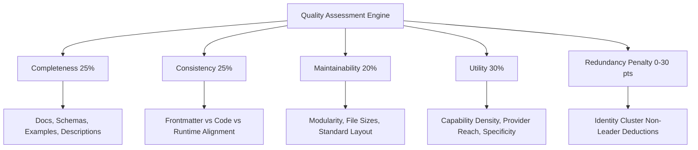

# Phase 10 — Multidimensional Quality & Utility Evaluation Reconnaissance Report

**Skill Registry Lifecycle Platform**  
**Date**: 2026-08-31  
**Phase**: Phase 10 — Quality & Utility Evaluation  
**Status**: `RECONNAISSANCE_COMPLETE` / `READY_FOR_AUTHORIZATION`

---

## 1. Executive Summary & Governance Baseline

A comprehensive read-only reconnaissance was conducted on `E:\.skill-registry` to design the multidimensional quality assessment and functional utility evaluation model for Phase 10.

### Fundamental Principle: Security ≠ Utility ≠ Trust

```text
+-------------------------------------------------------------------------+

| SECURITY PASS                                                           |
| (Clean of vulnerabilities, zero injection, safe to inspect)            |
+------------------------------------+------------------------------------+

                                     |
                                     v
+-------------------------------------------------------------------------+

| QUALITY & UTILITY EVALUATION (Phase 10)                                 |
| - Is it complete, well-documented, and consistent?                      |
| - Is it actionable, specific, and useful across providers?              |
| - Is it modular, maintainable, and non-redundant?                       |
+------------------------------------+------------------------------------+

                                     |
                                     v
+-------------------------------------------------------------------------+

| QUALITY_SCORE != TRUST_LEVEL                                            |
| Quality evidence informs curation/staging; does NOT bypass trust gate.  |
+-------------------------------------------------------------------------+

```

---

## 2. Multi-Dimensional Quality & Utility Model



### Dimensions & Scoring Weights

1. **`completeness` (25%)**: Richness of frontmatter headers, detailed capability descriptions, parameter input/output schemas, presence of reference guides.
2. **`consistency` (25%)**: Conformance between declared frontmatter metadata, observed scripts/extensions, structural layout type (`STANDARD_SKILL_DIR`), and capability tags.
3. **`maintainability` (20%)**: Clean directory hierarchy (`scripts/`, `references/`, `schemas/`), sane file sizes, absence of monoliths, clear naming.
4. **`utility` (30%)**: Domain actionable capability density, multi-provider execution readiness (`NATIVE`/`ADAPTABLE` count from Phase 8), semantic richness.
5. **`redundancy_penalty` (0–30 pts deduction)**: Non-leader duplicate penalty derived from Phase 6 identity clusters.

---

## 3. Quality Tiers & Policy Verdicts

| Quality Tier | Composite Score | Description | Policy Verdict |
|---|---|---|---|
| **`EXEMPLARY`** | 85 – 100 | Rich multi-file skill with schemas, scripts, references, and high provider compatibility | `PROMOTABLE` |
| **`SUFFICIENT`** | 65 – 84 | Conforming standard skill with complete metadata and good utility | `PROMOTABLE` |
| **`SUBSTANDARD`** | 40 – 64 | Minimal prompt, missing schemas/examples, or non-trivial redundancy | `NEEDS_IMPROVEMENT` |
| **`DEFICIENT`** | 0 – 39 | Malformed layout, contradictory metadata, missing entrypoints, or quarantined | `UNSUITABLE` |

---

## 4. Planned Deliverables for Phase 10 Implementation

1. **JSON Schema**: `schemas/quality-assessment.schema.json` (Draft 2020-12, schema #23).
2. **Append-Only Index**: `index/quality-evaluations.jsonl` (ACID sealed via `QUALITY_EVALUATION_SEAL`).
3. **Core Functions in `RegistryCore.psm1`**:
   - `New-RegistryQualityEvaluationId`
   - `Invoke-RegistryQualityEvaluation`
   - `Get-RegistryQualityEvaluations`
   - `Test-RegistryQualityGate`
4. **CLI Front-End (`skillctl`)**:
   - `skillctl quality status`
   - `skillctl quality list`
   - `skillctl quality inspect <id>`
   - `skillctl quality evaluate <id>`
   - `skillctl quality doctor`
5. **Test Harness (`tests/Invoke-QualityTests.ps1`)**:
   - 30 synthetic test scenarios covering all dimensions, composite score formulas, tier thresholds, redundancy penalties, transaction commits/rollbacks, and 23-schema doctor validations.
