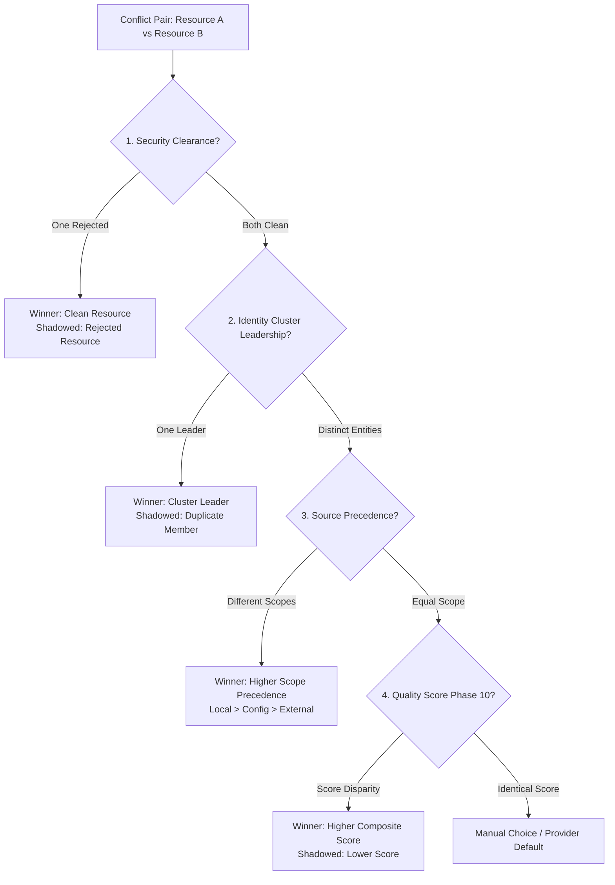

# Phase 11 — Conflict Detection & Shadowing Reconnaissance Report

**Skill Registry Lifecycle Platform**  
**Date**: 2026-08-31  
**Phase**: Phase 11 — Conflict Detection & Shadowing  
**Status**: `RECONNAISSANCE_COMPLETE` / `READY_FOR_AUTHORIZATION`

---

## 1. Executive Summary & Governance Baseline

A comprehensive read-only reconnaissance was conducted on `E:\.skill-registry` to design the Conflict Detection and Namespace / Precedence Shadowing Subsystem for Phase 11.

In a multi-source, multi-provider agent environment, skills frequently compete for the same capabilities, declare identical trigger names, or present contradictory instructions. Phase 11 establishes static, deterministic conflict identification and shadowing resolution.

### Deterministic Conflict Precedence Hierarchy

---

## 2. Conflict Taxonomy & Categories

| Conflict Type | Default Severity | Description | Resolution Strategy |
|---|---|---|---|
| **`SECURITY_OVERRIDE`** | `CRITICAL` | One resource rejected by Phase 9 security scan | Prefer clean resource; block rejected resource |
| **`NAMESPACE_COLLISION`** | `HIGH` | Identical canonical name claimed by distinct non-clustered sources | Apply source scope and cluster leadership precedence |
| **`CONTRADICTORY_INSTRUCTIONS`** | `HIGH` | Mutually incompatible prompts or instructions | Disambiguate by quality score or mark for manual choice |
| **`VERSION_INCOMPATIBLE`** | `HIGH` | Breaking semantic version disparity for same tool | Prefer highest compatible semantic version |
| **`SAME_CAPABILITY_COMPETING`** | `MEDIUM` | Multiple resources provide identical canonical capability tag | Shadow lower-ranked resource for specific capability |
| **`PROVIDER_RESTRICTION`** | `MEDIUM` | Conflicting target runtime constraints | Apply `PROVIDER_DEFAULT` dynamic adaptation |

---

## 3. Planned Deliverables for Phase 11 Implementation

1. **Transactional Append-Only Index**: `index/conflicts.jsonl` (sealed via `CONFLICT_RESOLUTION_SEAL`).
2. **Registry Core Engine Functions in `RegistryCore.psm1`**:
   - `New-RegistryConflictId`
   - `Invoke-RegistryConflictDetection`
   - `Get-RegistryConflicts`
   - `Test-RegistryConflictShadowing`
3. **CLI Front-End (`skillctl`)**:
   - `skillctl conflict status`
   - `skillctl conflict list`
   - `skillctl conflict inspect <id>`
   - `skillctl conflict scan`
   - `skillctl conflict doctor`
4. **Test Harness (`tests/Invoke-ConflictTests.ps1`)**:
   - 30 synthetic test scenarios covering all conflict types, severities, resolution rules, shadowing assertions, transaction seals/rollbacks, and 23-schema doctor validation.
