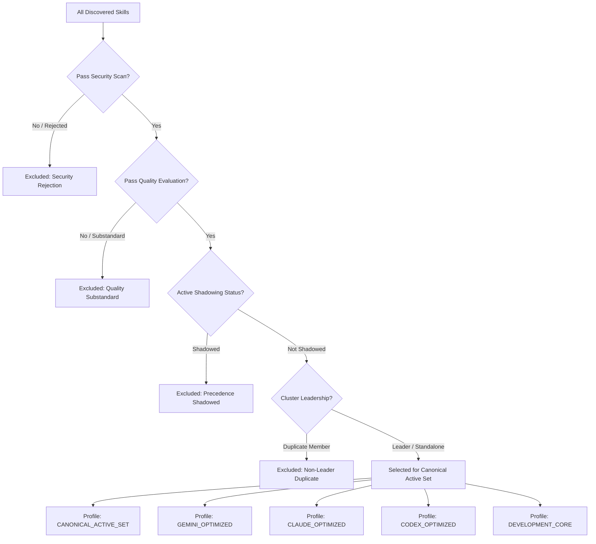

# Phase 12 — Selection & Curating Reconnaissance Report

**Skill Registry Lifecycle Platform**  
**Date**: 2026-08-31  
**Phase**: Phase 12 — Selection & Curating  
**Status**: `RECONNAISSANCE_COMPLETE` / `READY_FOR_AUTHORIZATION`

---

## 1. Executive Summary & Governance Baseline

A comprehensive read-only reconnaissance was conducted on `E:\.skill-registry` to design the **Selection, Canonical Active Set Assembly, and Curated Profile Bundling Subsystem** for Phase 12.

### Fundamental Principle: Selection ≠ Operational Trust

```text
+-------------------------------------------------------------------------+

| PHASES 0-11 EVIDENCE PIPELINE                                           |
| Discovery -> Structure -> Provenance -> Integrity -> Identity ->       |
| Capabilities -> Compatibility -> Security -> Quality -> Conflicts      |
+------------------------------------+------------------------------------+

                                     |
                                     v
+-------------------------------------------------------------------------+

| PHASE 12: CANONICAL SELECTION & CURATION                                |
| 1. Security Gate: CLEAN/LOW_RISK + PASS verdict                         |
| 2. Quality Gate: Score >= 65 + PROMOTABLE verdict                       |
| 3. Precedence Gate: NOT SHADOWED (Phase 11)                             |
| 4. Identity Gate: Cluster Leader (Phase 6)                              |
| 5. Quarantine Gate: Zero Tombstone/Blocked Overlap                      |
+------------------------------------+------------------------------------+

                                     |
                                     v
+-------------------------------------------------------------------------+

| GOVERNANCE INVARIANT: TRUST IMMUTABILITY                                |
| Selected skills form the staging bundle WITHOUT trust escalation.       |
| trust_level remains UNTRUSTED until formal manual activation (Phase 15).|
+-------------------------------------------------------------------------+

```

---

## 2. Selection Pipeline & Active Set Formation



---

## 3. Planned Deliverables for Phase 12 Implementation

1. **JSON Schema (Draft 2020-12)**:
   - `schemas/curated-set.schema.json` (Schema #24).
2. **Transactional Append-Only Index**:
   - `index/curated-sets.jsonl` (sealed via `CURATION_SET_SEAL`).
3. **Core Engine Functions in `RegistryCore.psm1`**:
   - `New-RegistryCuratedSetId`
   - `Invoke-RegistrySkillSelection`
   - `New-RegistryCuratedBundle`
   - `Get-RegistryCuratedSets`
   - `Test-RegistrySelectionCriteria`
4. **CLI Front-End (`skillctl`)**:
   - `skillctl curation status`
   - `skillctl curation list`
   - `skillctl curation inspect <id>`
   - `skillctl curation compile [-Profile <name>] [-Provider <provider>]`
   - `skillctl curation doctor`
5. **Test Harness (`tests/Invoke-CurationTests.ps1`)**:
   - 30 synthetic test scenarios covering filtering, shadow exclusion, quarantine defense, bundle compilation, Merkle root sealing, trust immutability, ACID transactions, rollbacks, and CLI verification.
