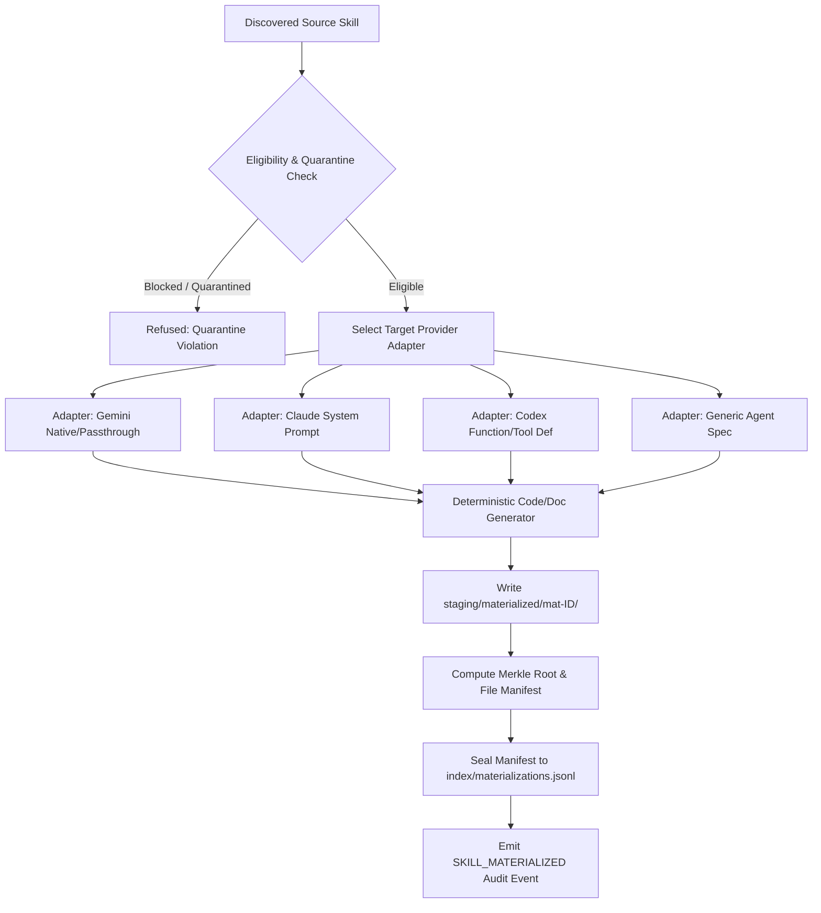

# Phase 13 — Adaptation & Materialization Reconnaissance Report

**Skill Registry Lifecycle Platform**  
**Date**: 2026-08-31  
**Phase**: Phase 13 — Adaptation & Materialization  
**Status**: `RECONNAISSANCE_COMPLETE` / `READY_FOR_AUTHORIZATION`

---

## 1. Executive Summary & Governance Baseline

A comprehensive read-only reconnaissance was conducted on `E:\.skill-registry` to design the **Adaptation and Materialization Subsystem** for Phase 13.

### Fundamental Principle: Deterministic Transformation & Zero Source Mutation

```text
+-------------------------------------------------------------------------+

| SOURCE RESOURCE (READ-ONLY)                                             |
| Source File Tree -> Provenance (Phase 5) -> SHA-256 Pre-Transform Hash  |
+------------------------------------+------------------------------------+

                                     |
                                     v
+-------------------------------------------------------------------------+

| REGISTERED ADAPTER (Phase 1 & Phase 8)                                  |
| [GEMINI | CLAUDE | CODEX | OPENAI | GENERIC_AGENT]                      |
| Mode: PASSTHROUGH / PROMPT_TO_TOOL / SYSTEM_PROMPT                      |
+------------------------------------+------------------------------------+

                                     |
                                     v
+-------------------------------------------------------------------------+

| MATERIALIZED ARTIFACT (STAGING WORKSPACE)                               |
| staging/materialized/<mat-id>/ -> Deterministic Merkle Root Post-Hash   |
| Sealed in index/materializations.jsonl via MATERIALIZATION_SEAL        |
+------------------------------------+------------------------------------+

                                     |
                                     v
+-------------------------------------------------------------------------+

| GOVERNANCE INVARIANT: TRUST IMMUTABILITY                                |
| Materialized artifact inherits exact trust_level (UNTRUSTED).           |
| Materialization != Activation/Execution (Phase 15 is Activation).       |
+-------------------------------------------------------------------------+

```

---

## 2. Adaptation & Lineage Model



---

## 3. Planned Deliverables for Phase 13 Implementation

1. **JSON Schema (Draft 2020-12)**:
   - `schemas/materialization-manifest.schema.json` (Schema #25).
2. **Transactional Append-Only Index**:
   - `index/materializations.jsonl` (sealed via `MATERIALIZATION_SEAL`).
3. **Staging Storage**:
   - `staging/materialized/` directory structure.
4. **Core Engine Functions in `RegistryCore.psm1`**:
   - `New-RegistryMaterializationId`
   - `Get-RegistryAdapters`
   - `Invoke-RegistrySkillMaterialization`
   - `Get-RegistryMaterializations`
   - `Test-RegistryMaterializationIntegrity`
5. **CLI Front-End (`skillctl`)**:
   - `skillctl materialize status`
   - `skillctl materialize list`
   - `skillctl materialize inspect <id>`
   - `skillctl materialize build -ResourceId <id> -Provider <provider>`
   - `skillctl materialize verify <id>`
   - `skillctl materialize doctor`
6. **Test Harness (`tests/Invoke-MaterializationTests.ps1`)**:
   - 30 synthetic test scenarios covering source immutability, deterministic output, hash lineage, quarantine defense, trust immutability, zero execution, adapter transformations for Gemini/Claude/Codex, ACID transactions, rollbacks, disk integrity verification, and doctor checks.
