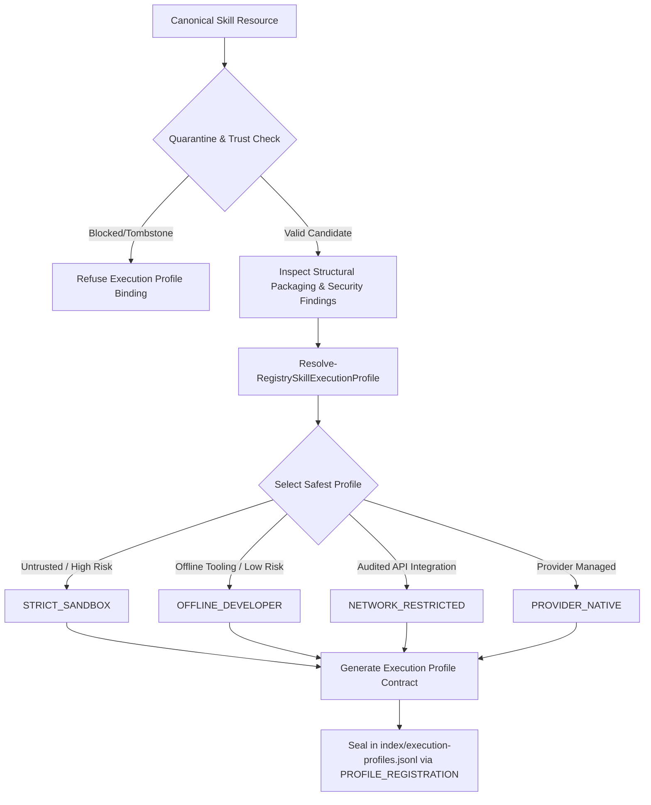

# Phase 14 — Execution Profiles & Runtime Sandbox Environments Reconnaissance Report

- **Registry ID**: `reg-e01f28b4-6a89-4b21-9c3f-7e9b04821a11`
- **Phase**: `PHASE_14_EXECUTION_PROFILES_RUNTIME_SANDBOX`
- **Status**: `RECONNAISSANCE_COMPLETE` / `READY_FOR_AUTHORIZATION`
- **Timestamp**: `2026-08-31T04:02:00Z`
- **Active Schemas**: 25
- **Quarantine Authority**: `gov-quarantine-link-v1` (118 tombstones, 8 subtrees blocked)

---

## 1. Executive Summary & Objective

Phase 14 defines the **Execution Profiles and Runtime Sandbox Specification Subsystem** for the Skill Registry platform.

While Phase 13 materialized provider-specific static artifacts in staging, **Phase 14 governs the environmental constraints, resource boundaries, network rules, filesystem isolation levels, and process limits required if and when a skill is executed**.

### Strict Governance Invariants

1. **Zero Dynamic Execution**: Reconnaissance and planning involve **zero execution** of discovered code or skill scripts.
2. **Quarantine Supremacy**: Quarantined and blocked skills cannot be bound to any execution profile under any circumstances (`status: REFUSED_QUARANTINE`).
3. **Trust Level Immutability**: Assigning a restrictive execution profile to an `UNTRUSTED` skill does not escalate its `trust_level`.
4. **Least-Privilege Enforcement**: Untrusted skills default strictly to `STRICT_SANDBOX` (zero network, ephemeral temporary filesystem, process throttling, secret scrubbing).
5. **Separation of Profile Resolution vs. Activation**: Execution profiles define declarative containment contracts; activation and live wiring occur in Phase 15.

---

## 2. Threat & Isolation Matrix

```text
┌────────────────────────────────────────────────────────────────────────┐
│                   EXECUTION PROFILE BOUNDARY TIERS                     │
├─────────────────────┬──────────────────┬──────────────┬────────────────┤
│ Profile Name        │ Network Egress   │ Filesystem   │ Process Limits │
├─────────────────────┼──────────────────┼──────────────┼────────────────┤
│ STRICT_SANDBOX      │ BLOCKED (None)   │ ISOLATED_TEMP│ 15s / 256MB    │
│ OFFLINE_DEVELOPER   │ BLOCKED (None)   │ WORKSPACE_RW │ 60s / 1024MB   │
│ NETWORK_RESTRICTED  │ WHITELIST_ONLY   │ WORKSPACE_RW │ 120s / 2048MB  │
│ PROVIDER_NATIVE     │ PROVIDER_MANAGED │ PROVIDER_SAND│ 300s / 4096MB  │
└─────────────────────┴──────────────────┴──────────────┴────────────────┘

```

---

## 3. Four Standard Execution Profiles

### 1. `STRICT_SANDBOX` (`prof-strict-sandbox-v1`)

- **Default for**: All newly discovered / `UNTRUSTED` skills, skills with unknown scripts, or skills with medium/high risk ratings.
- **Network**: Egress completely disabled (`0.0.0.0/0` blocked, zero socket creation).
- **Filesystem**: Write access strictly confined to an ephemeral, isolated directory under `staging/sandbox/<sandbox-id>/`. No traversal into user home, root directories, or parent repositories.
- **Environment**: Parent environment variables (`PATH`, cloud credentials, tokens, SSH keys) stripped; only clean minimal mock variables provided.
- **Process**: Hard timeout 15 seconds, max memory 256 MB, zero child processes spawned.

### 2. `OFFLINE_DEVELOPER` (`prof-offline-developer-v1`)

- **Default for**: Evaluated skills with `SUFFICIENT` or `EXEMPLARY` quality, `LOW_RISK` security score, requiring local build tooling (e.g. Python compilers, linters, local unit testing).
- **Network**: Egress blocked.
- **Filesystem**: Read/write access within designated workspace staging root.
- **Environment**: Whitelisted environment variables without credential leakage.
- **Process**: Hard timeout 60 seconds, max memory 1024 MB, child processes allowed within job boundary.

### 3. `NETWORK_RESTRICTED` (`prof-network-restricted-v1`)

- **Default for**: Skills explicitly requiring external API queries (e.g. documentation fetchers, public REST connectors), with audited endpoint declarations.
- **Network**: Outbound HTTP/HTTPS strictly restricted to declared destination domains via proxy or socket filter.
- **Filesystem**: Workspace read/write.
- **Process**: Hard timeout 120 seconds, max memory 2048 MB.

### 4. `PROVIDER_NATIVE` (`prof-provider-native-v1`)

- **Default for**: Verified canonical provider integrations running in provider's native isolation environments (e.g. Claude Code tool execution container, Gemini Code Assist worker).
- **Control**: Governed by provider-specific security policies.

---

## 4. Architectural Model & Lineage Flow



---

## 5. Schema & Deliverables Specification

1. **Schema #26**: [schemas/execution-profile.schema.json](file:///E:/.skill-registry/schemas/execution-profile.schema.json) (Draft 2020-12).
2. **Append-Only Index**: `index/execution-profiles.jsonl` and profile declarations under `profiles/`.
3. **Core Functions in `RegistryCore.psm1`**:
   - `New-RegistryExecutionProfileId`
   - `Get-RegistryExecutionProfiles`
   - `Register-RegistryExecutionProfile`
   - `Resolve-RegistrySkillExecutionProfile`
   - `Test-RegistryExecutionProfileConformance`
4. **CLI Domain (`skillctl profile`)**:
   - `status`, `list`, `inspect <id>`, `resolve <resource_id>`, `validate <profile_id>`, `doctor`.
5. **Synthetic Test Suite**:
   - `tests/Invoke-ExecutionProfileTests.ps1` (30 test scenarios covering profile schemas, constraint resolution, quarantine precedence, memory/timeout limits, environment scrubbing, and doctor validation across 26 schemas).
