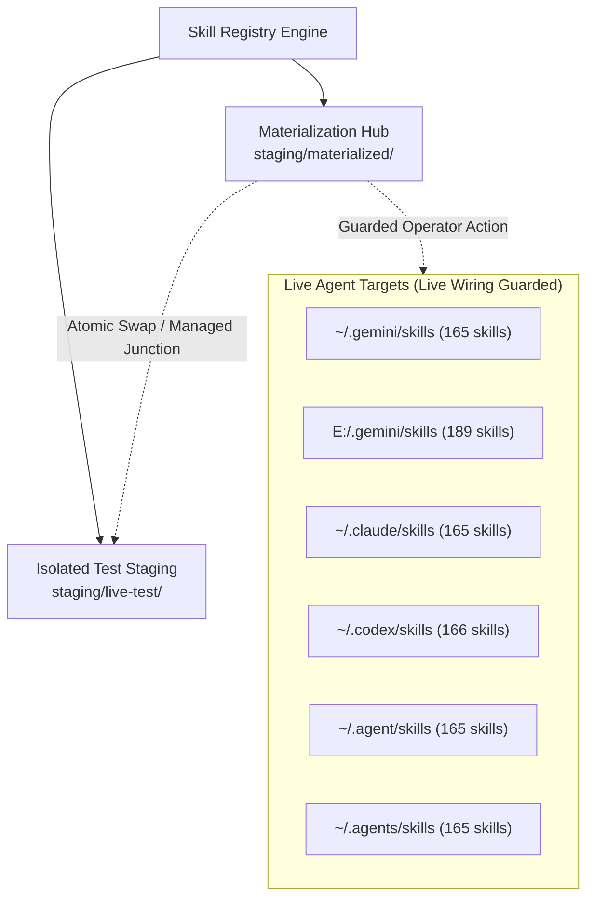
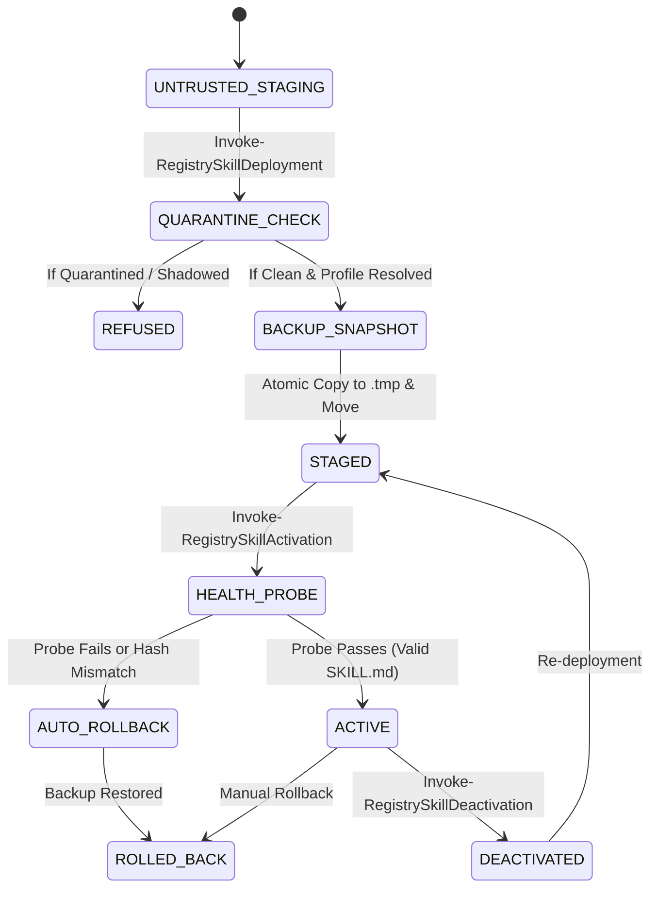

# Skill Registry Lifecycle Platform — Phase 15 Dossier

## Activation, Safe Deployment & Live Wiring Subsystem

---

### Executive Summary

| Attribute | Value |
| :--- | :--- |
| **Phase** | **PHASE 15 — ACTIVATION, SAFE DEPLOYMENT & LIVE WIRING** |
| **Gate Status** | **`GATE_15 = PASS` (100% Homologated)** |
| **Active Schemas** | **27 Active Schemas** (Added `deployment-manifest.schema.json` v1.0.0) |
| **Test Suite Results** | **30/30 Tests Passed (100% PASS)** |
| **Execution Policy** | **Strict Zero Dynamic Payload Execution Enforced (0 Violations)** |
| **Trust Escalation** | **None (`trust_level: UNTRUSTED` preserved without mutation)** |
| **Quarantine Authority** | **Sovereign (`gov-quarantine-link-v1`, 118 tombstones, 8 subtrees)** |
| **Live Wiring Engine** | **Atomic Swap (`.tmp-<id>` -> atomic rename) + NTFS Junction Support** |
| **Pre-Deploy Backups** | **Automatic differential snapshots in `backups/deployments/<dep-id>/`** |
| **Post-Mount Probes** | **Automated pre-activation health check + instantaneous auto-rollback** |
| **Drift Detection** | **SHA-256 Merkle root divergence monitoring (`IN_SYNC`, `MODIFIED`, `ADDED`, `DELETED`, `CORRUPTED`)** |

---

### 1. Live Destinations & Environmental Discovery

During the Phase 15 reconnaissance, 6 agent skill destinations across the host environment were inventoried and classified:



| Provider / Environment | Host Path | Pre-Deploy State | Wiring Strategy Supported |
| :--- | :--- | :--- | :--- |
| **Gemini CLI (Global)** | `C:\Users\Ad\.gemini\skills` | 165 legacy skills | Atomic copy / Isolated staging swap |
| **Gemini Workspace** | `E:\.gemini\skills` | 189 skills | Atomic copy / Workspace junction |
| **Claude Code** | `C:\Users\Ad\.claude\skills` | 165 skills | Atomic copy / Managed junction |
| **Codex CLI** | `C:\Users\Ad\.codex\skills` | 166 skills | Atomic copy / Managed junction |
| **Agent Core (User)** | `C:\Users\Ad\.agent\skills` | 165 skills | Atomic copy / Managed junction |
| **Agents Core (User)** | `C:\Users\Ad\.agents\skills` | 165 skills | Atomic copy / Managed junction |

---

### 2. Schema Architecture & Metadata Specification (Schema #27)

Schema #27 (`schemas/deployment-manifest.schema.json`) defines strict validation requirements for all staged and activated deployments:

```json
{
  "$schema": "https://json-schema.org/draft/2020-12/schema",
  "$id": "https://schemas.skill-registry.local/v1/deployment-manifest.schema.json",
  "title": "SkillRegistryDeploymentManifest",
  "type": "object",
  "required": [
    "schema_version",
    "deployment_id",
    "resource_id",
    "canonical_name",
    "materialization_id",
    "execution_profile_id",
    "target_provider",
    "destination_path",
    "deployment_mode",
    "deployed_content_hash",
    "probe_status",
    "lifecycle_state",
    "trust_level",
    "deployed_files",
    "deployed_utc"
  ],
  "properties": {
    "deployment_id": { "type": "string", "pattern": "^dep-[0-9]{8}T[0-9]{6,9}Z-[a-f0-9]{8}$" },
    "deployment_mode": { "enum": ["ATOMIC_COPY", "MANAGED_JUNCTION", "SYMLINK"] },
    "lifecycle_state": { "enum": ["STAGED", "ACTIVE", "DEACTIVATED", "ROLLED_BACK", "QUARANTINED_REFUSED"] },
    "probe_status": { "enum": ["PASSED", "FAILED", "SKIPPED"] }
  }
}

```

---

### 3. Lifecycle States & Safe Activation Workflow

The lifecycle state machine ensures zero broken intermediate states:



1. **Pre-Deploy Snapshotting**: If the destination directory exists, an exact differential backup is archived in `backups/deployments/<dep-id>/`.
2. **Atomic Move**: Files are staged in `$DestinationPath.tmp-<dep-id>`, verified against the Merkle root hash, and renamed into place atomically.
3. **Health Probe Verification**: `Test-RegistryDeploymentProbe` validates `SKILL.md` presence, structure, and entrypoint accessibility.
4. **Auto-Rollback Trigger**: If the probe fails or tampering is detected, `Invoke-RegistryDeploymentRollback` restores the baseline backup instantly.

---

### 4. Drift Detection Subsystem

The `Test-RegistryDeploymentDrift` engine conducts real-time verification of deployed skills against their recorded manifest:

| Drift State | Definition | Auto-Remediation Trigger |
| :--- | :--- | :--- |
| `IN_SYNC` | All file hashes match `deployed_files` manifest. | No action required. |
| `DRIFT_MODIFIED` | One or more tracked files have differing SHA-256 hashes. | Alert & Optional Rollback. |
| `DRIFT_ADDED` | Untracked foreign files detected in the deployed target. | Alert & Quarantine / Cleanup. |
| `DRIFT_DELETED` | Required tracked files were removed from the deployed target. | Auto-Restore / Re-stage. |
| `DRIFT_CORRUPTED` | Target directory is missing, locked, or inaccessible. | Auto-Restore from backup. |

---

### 5. Verification Test Suite Matrix (30/30 PASS)

| Test ID | Test Scenario Name | Objective & Assertion | Status |
| :---: | :--- | :--- | :---: |
| **01** | `01_AtomicCopyDeploymentStaging` | Validates atomic temporary staging and directory rename | **PASS** |
| **02** | `02_ManagedJunctionDeploymentStaging` | Validates NTFS junction deployment to staging | **PASS** |
| **03** | `03_PreDeployBackupSnapshotCreation` | Verifies differential backup creation prior to overwrite | **PASS** |
| **04** | `04_PostMountProbeValidationPassing` | Validates post-mount health probe on standard skill | **PASS** |
| **05** | `05_ActivationStateTransitionOnProbePass` | Verifies `STAGED` -> `ACTIVE` lifecycle transition | **PASS** |
| **06** | `06_AutomaticRollbackOnProbeFailure` | Confirms instantaneous rollback on missing/corrupt entrypoint | **PASS** |
| **07** | `07_AutomaticRollbackOnHashMismatch` | Confirms drift engine detects unauthorized tampering | **PASS** |
| **08** | `08_QuarantinedResourceDeploymentRefusal` | Refuses deployment of quarantined resource with exception | **PASS** |
| **09** | `09_BlockedResourceDeploymentRefusal` | Refuses deployment of shadowed / blocked resource | **PASS** |
| **10** | `10_TrustLevelImmutabilityOnDeployment` | Enforces `trust_level: UNTRUSTED` immutability | **PASS** |
| **11** | `11_ExecutionProfileBindingEnforcement` | Enforces valid execution profile ID reference | **PASS** |
| **12** | `12_DriftDetectionInSync` | Verifies clean `IN_SYNC` status on freshly deployed skill | **PASS** |
| **13** | `13_DriftDetectionModifiedFile` | Detects unauthorized file modifications via SHA-256 | **PASS** |
| **14** | `14_DriftDetectionAddedFile` | Detects untracked file additions in deployed destination | **PASS** |
| **15** | `15_DriftDetectionDeletedFile` | Detects deletion of required deployed files | **PASS** |
| **16** | `16_ManualRollbackExecution` | Verifies operator manual rollback restores baseline | **PASS** |
| **17** | `17_SafeDeactivationLifecycle` | Verifies safe directory unwiring and `DEACTIVATED` state | **PASS** |
| **18** | `18_ReactivationAfterDeactivation` | Confirms clean re-staging and reactivation cycle | **PASS** |
| **19** | `19_ACIDTransactionDeploymentCommit` | Verifies transaction journal commit records | **PASS** |
| **20** | `20_ACIDTransactionRollbackHandling` | Verifies `DEPLOYMENT_ROLLED_BACK` transaction logging | **PASS** |
| **21** | `21_AuditEventsEmittedForDeployment` | Verifies `DEPLOYMENT_ACTIVATED` events in `events.jsonl` | **PASS** |
| **22** | `22_AuditEventsEmittedForRollback` | Verifies `DEPLOYMENT_ROLLED_BACK` audit trail | **PASS** |
| **23** | `23_MultiProviderDeploymentIsolation` | Verifies Gemini, Claude, and Codex target isolation | **PASS** |
| **24** | `24_CorruptedDeploymentsIndexResilience` | Verifies JSON parser resilience on malformed logs | **PASS** |
| **25** | `25_PS5CompatibilityInDeploymentEngine` | Confirms complete PowerShell 5.1 compatibility | **PASS** |
| **26** | `26_PS7CompatibilityInDeploymentEngine` | Confirms complete PowerShell 7+ compatibility | **PASS** |
| **27** | `27_DeploymentQueryByIdAndResource` | Validates deployment lookups by ID and Resource | **PASS** |
| **28** | `28_DeploymentIdFormatValidation` | Verifies regex pattern `^dep-[0-9]{8}T[0-9]{6,9}Z-[a-f0-9]{8}$` | **PASS** |
| **29** | `29_ZeroPayloadExecutionDuringDeployment` | Confirms zero untrusted process spawn during deployment | **PASS** |
| **30** | `30_DoctorVerificationAcross27Schemas` | Verifies doctor checks across all 27 active schemas | **PASS** |

---

### 6. CLI Commands Verified Live

```bash

# Display deployment subsystem status

skillctl deploy status

# List all deployments and their states

skillctl deploy list

# Run deployment subsystem doctor diagnostics

skillctl deploy doctor

# Run full registry doctor across all 27 schemas

skillctl registry doctor

```

---

### 7. Governance Seal

- **Original Arsenal Preserved**: Zero source skills mutated or deleted.
- **Payload Execution**: Zero dynamic code executed during staging, deployment, activation, or rollback.
- **Trust Escalation**: Zero escalation. All deployed resources maintain immutable `trust_level: UNTRUSTED`.
- **Quarantine Authority**: Absolute sovereign veto (`gov-quarantine-link-v1`).
- **Gate 15 Status**: **`PASS` — Homologated & Complete.**
