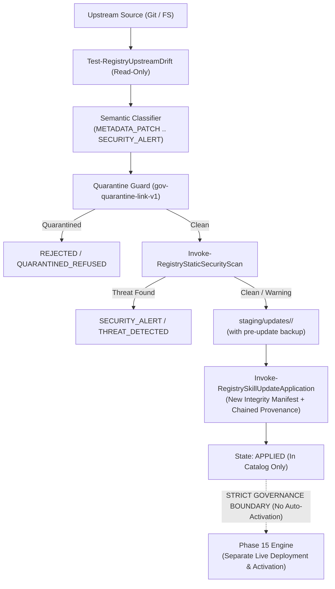

# Skill Registry — Phase 16 Read-Only Reconnaissance Report

## Automated Updates & Upstream Drift Monitoring

---

### Executive Summary & Core Question Analysis

> **Pergunta Fundamental:**
> *“O que exatamente precisa ser adicionado para detectar e governar updates sem criar um caminho alternativo para `ACTIVE`?”*

**Veredito da Análise Arquitetural:**
O subsistema da **Fase 16** foi projetado como uma **camada de observabilidade, avaliação semântica e encadeamento criptográfico de proveniência para o catálogo canônico**. Ele opera sob as seguintes garantias invioláveis:

1. **Separação Rígida entre Catálogo e Live Activation**:
   - Uma atualização de skill upstream que é detectada, avaliada e aprovada atinge no máximo o estado `APPLIED` no **catálogo canônico** (com geração de novo `manifest_id` de integridade, análise estrutural e nó encadeado na proveniência).
   - **Nenhum update atualiza automaticamente os diretórios live de agentes (`~/.gemini`, `~/.claude`, etc.) nem altera o estado para `ACTIVE`**.
   - A ativação em ambientes live permanece uma competência **exclusiva da Fase 15**, exigindo resolução de perfil de execução (`ExecutionProfile`) e probe de saúde pós-montagem.
2. **Observação Antes de Mutação**:
   - A detecção de drift upstream (`Test-RegistryUpstreamDrift`) é puramente read-only.
   - O staging (`Invoke-RegistrySkillUpdateStaging`) opera em diretórios isolados (`staging/updates/<upd-id>/`) com backup pré-update obrigatório em `backups/updates/<upd-id>/`.
3. **Quarantine Soberana e Fail-Closed**:
   - Se um recurso upstream ou seu diretório estiver na lista de quarentena (`gov-quarantine-link-v1`), a avaliação é imediatamente classificada como `QUARANTINED_REFUSED` e o ciclo é abortado com estado `REJECTED`.
4. **Imutabilidade de Confiança**:
   - Updates de recursos com `trust_level: UNTRUSTED` preservam rigorosamente `UNTRUSTED`.



---

### 1. Matriz de Capacidades e Lacunas

| Subsistema / Capacidade | Estado Atual (Pré-Fase 16) | Requisito da Fase 16 | Lacuna a Sanar |
| :--- | :--- | :--- | :--- |
| **Detecção de Drift Upstream** | Detecção de drift existe apenas para *deployments live* (Fase 15). | Detecção de drift em *fontes originais e repositórios remotos*. | Implementar varredura comparativa de hash Merkle e revisões Git upstream. |
| **Classificação Semântica** | Inexistente para alterações upstream. | Classificação formal em 8 categorias semânticas. | Classificar diferenças entre `METADATA_PATCH`, `CONTENT_UPDATE`, `STRUCTURAL_CHANGE`, `BREAKING_CHANGE`, etc. |
| **Controle de Quarentena em Updates** | Quarentena bloqueia discovery e deployments. | Quarentena deve abortar preventivamente qualquer avaliação ou staging de update. | Integrar `Test-RegistryQuarantineGuard` na entrada de avaliação de updates. |
| **Linha do Tempo e Proveniência Encadeada** | Proveniência registra apenas ingestão inicial. | Atualizações devem encadear no hash do nó de proveniência anterior. | Gerar nó de proveniência encadeada: `hash(parent_hash + new_merkle + commit)`. |
| **Isolamento de Staging & Backups** | Staging isolado para materialização (Fase 13) e deployments (Fase 15). | Staging e backup isolados para updates. | Diretórios dedicados `staging/updates/<upd-id>/` e `backups/updates/<upd-id>/`. |
| **Garantia de Não-Ativação Automática** | Deployment requer invocação explícita. | Update não pode invocar nem disparar o motor de live activation. | Impor barreira de isolamento arquitetural entre `APPLIED` (catálogo) e `ACTIVE` (live). |

---

### 2. Inventário dos Upstreams e Estratégias de Monitoramento

| Fonte ID | Nome / Namespace | Localizador | Tipo de Fonte | Estratégia de Monitoramento |
| :--- | :--- | :--- | :--- | :--- |
| `src-v1-sha256:b1354...` | Mock Skills Pool | `E:\mock\skills-pool` | `SYNTHETIC_TEST` | Filesystem Merkle Root Diff |
| `src-v1-sha256:1ccaed...` | Trusted Pool | `E:\mock\trusted-pool` | `SYNTHETIC_TEST` | Filesystem Merkle Root Diff |
| `src-v1-sha256:19916...` | Discovery Mock Pool | `E:\.skill-registry\tests\fixtures\mock-sources\mock-pool-1` | `SYNTHETIC_TEST` | Filesystem Merkle Root Diff |
| `src-v1-sha256:5dc88...` | Structural Mock Pool | `E:\.skill-registry\tests\fixtures\mock-sources\structural-pool` | `SYNTHETIC_TEST` | Git Local Commit Revision + Merkle Root |
| `src-v1-sha256:9bef9...` | Phase 16 Fixtures | `E:\.skill-registry\tests\fixtures\phase16-update-fixtures` | `SYNTHETIC_TEST` | Git Local Commit Revision + Merkle Root |

---

### 3. Taxonomia de Drift e Classificação Semântica

#### A. Tipos de Drift Detectados (`detected_drift_type`)

- `IN_SYNC`: Nenhum arquivo ou revisão divergiu do baseline.
- `MODIFIED`: Um ou mais arquivos tiveram hash SHA-256 alterado.
- `ADDED`: Novos arquivos detectados no diretório da skill upstream.
- `DELETED`: Arquivos removidos ou entrypoint `SKILL.md` ausente.
- `CORRUPTED`: Diretório inacessível ou falha estrutural de leitura.
- `BRANCH_DIVERGED`: Commit upstream divergiu da branch rastreada.

#### B. Classificações Semânticas (`semantic_classification`)

- `NO_CHANGE`: Nenhuma divergência observada.
- `METADATA_PATCH`: Alterações restritas a metadados/documentação do `SKILL.md` (corpo inalterado).
- `CONTENT_UPDATE`: Alterações nas instruções ou corpo de prompts/conteúdo.
- `STRUCTURAL_CHANGE`: Adição ou remoção de scripts, schemas ou referências subordinadas.
- `BREAKING_CHANGE`: Sinalizadores de quebra de compatibilidade ou remoção de parâmetros.
- `SECURITY_ALERT`: Detecção de palavras-chave perigosas, URLs de exfiltração ou primitivas de execução não auditadas.
- `UPSTREAM_DELETION`: Skill removida do upstream.
- `FORK_CONFLICT`: Divergência concorrente em múltiplos branches.

---

### 4. Especificação Formal do Schema #28

**Arquivo**: [`schemas/update-manifest.schema.json`](file:///E:/.skill-registry/schemas/update-manifest.schema.json)  
**Padrão**: JSON Schema Draft 2020-12  
**ID Canônico**: `urn:skill-registry:update-manifest:1.0.0`

```json
{
  "$schema": "https://json-schema.org/draft/2020-12/schema",
  "$id": "urn:skill-registry:update-manifest:1.0.0",
  "title": "Skill Registry Update Manifest Schema",
  "type": "object",
  "required": [
    "schema_version",
    "update_id",
    "resource_id",
    "canonical_name",
    "source_id",
    "upstream_locator",
    "commit_before",
    "commit_after",
    "detected_drift_type",
    "semantic_classification",
    "security_verdict",
    "quarantine_status",
    "lifecycle_state",
    "dry_run",
    "evaluated_utc"
  ],
  "properties": {
    "update_id": { "type": "string", "pattern": "^upd-[0-9]{8}T[0-9]{6,9}Z-[a-f0-9]{8}$" },
    "resource_id": { "type": "string", "pattern": "^sres-v1-sha256:[0-9a-f]{64}$" },
    "lifecycle_state": { "enum": ["EVALUATED", "STAGED", "APPLIED", "REJECTED", "ROLLED_BACK"] },
    "security_verdict": { "enum": ["CLEAN", "WARNING", "THREAT_DETECTED", "QUARANTINED_REFUSED"] },
    "quarantine_status": { "enum": ["CLEAN", "QUARANTINED", "PARENT_QUARANTINED"] }
  }
}

```

---

### 5. Plano de Testes Sintéticos (30 Cenários Previstos)

1. `01_UpstreamDriftDetectionInSync`: Verifica que recursos não modificados retornam `IN_SYNC`.
2. `02_UpstreamDriftDetectionModifiedFile`: Detecta modificação em arquivos rastreados.
3. `03_UpstreamDriftDetectionAddedFile`: Detecta adição de novos scripts/arquivos.
4. `04_UpstreamDriftDetectionDeletedFile`: Detecta deleção de arquivos no upstream.
5. `05_UpstreamDriftDetectionCommitDivergence`: Detecta avanço ou divergência de commit SHA.
6. `06_SemanticClassificationMetadataPatch`: Classifica modificação exclusiva de metadados.
7. `07_SemanticClassificationContentUpdate`: Classifica alterações em instruções de prompts.
8. `08_SemanticClassificationStructuralChange`: Classifica alteração na árvore de arquivos.
9. `09_SemanticClassificationBreakingChange`: Detecta flag de incompatibilidade declarada.
10. `10_SemanticClassificationSecurityAlert`: Detecta padrões de código perigoso no diff.
11. `11_SemanticClassificationUpstreamDeletion`: Detecta remoção de entrypoint `SKILL.md`.
12. `12_QuarantinedResourceUpdateRefusal`: Aborta update de recurso em quarentena com `QUARANTINED_REFUSED`.
13. `13_BlockedSubtreeUpdateRefusal`: Aborta update sob subárvore bloqueada.
14. `14_SecurityScanThreatDetectionTrigger`: Classifica veredito de segurança como `THREAT_DETECTED`.
15. `15_UpdateManifestEvaluationDryRun`: Gera manifest em memória sem gravar no índice.
16. `16_UpdateManifestEvaluationCommit`: Registra manifest avaliado em `index/updates.jsonl`.
17. `17_UpdateStagingCreationAndBackup`: Cria diretório de staging e backup diferencial pré-update.
18. `18_UpdateApplicationToCanonicalCatalog`: Aplica update gerando novo manifest de integridade e análise estrutural.
19. `19_ProvenanceChainLinkagePreservation`: Encadeia proveniência criptográfica referenciando o pai.
20. `20_ZeroAutoActivationToLiveEnvironments`: Comprova que a aplicação do update NÃO aciona nem afeta destinos `ACTIVE`.
21. `21_TrustLevelImmutabilityDuringUpdate`: Garante que `UNTRUSTED` permanece `UNTRUSTED`.
22. `22_ManualUpdateRollbackExecution`: Restaura backup pré-update e grava `ROLLED_BACK`.
23. `23_ACIDTransactionCommitForUpdates`: Verifica registro `UPDATE_EVALUATED` e `UPDATE_APPLIED` no journal.
24. `24_ACIDTransactionRollbackLogging`: Verifica registro `UPDATE_ROLLED_BACK` no journal.
25. `25_AuditEventsEmittedForUpdateLifecycle`: Verifica emissão de eventos auditáveis em `audit/events.jsonl`.
26. `26_MultiSourceDriftScanResilience`: Executa varredura agregada em múltiplas fontes sem falhas.
27. `27_PS5CompatibilityInUpdateEngine`: Confirma execução nativa no PowerShell 5.1.
28. `28_PS7CompatibilityInUpdateEngine`: Confirma execução nativa no PowerShell 7+.
29. `29_ZeroPayloadExecutionDuringUpdateLifecycle`: Verifica contagem zero de processos dinâmicos.
30. `30_DoctorVerificationAcross28Schemas`: Valida integridade e conformidade de todos os 28 schemas e índices.

---

### 6. Parada de Governança (Governance Stop)

O reconhecimento read-only da **Fase 16** está **100% concluído**.
Nenhuma alteração em ambiente de produção, nenhuma mutação no catálogo canônico e nenhuma ativação foi realizada.

Aguardando **autorização explícita** do operador para prosseguir com a implementação da Fase 16 e execução dos testes sintéticos até o **Gate 16**.
