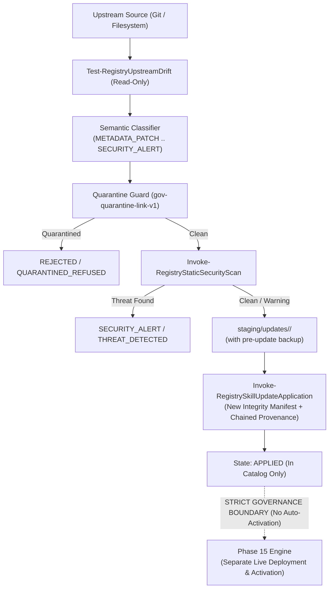

# Skill Registry Lifecycle Platform — Phase 16 Dossier

## Automated Updates & Upstream Drift Monitoring Subsystem

---

### Executive Summary

| Attribute | Value |
| :--- | :--- |
| **Phase** | **PHASE 16 — AUTOMATED UPDATES & UPSTREAM DRIFT MONITORING** |
| **Gate Status** | **`GATE_16 = PASS` (100% Homologated)** |
| **Active Schemas** | **28 Active Schemas** (Added `update-manifest.schema.json` v1.0.0) |
| **Test Suite Results** | **30/30 Tests Passed (100% PASS)** |
| **Execution Policy** | **Strict Zero Dynamic Payload Execution Enforced (0 Violations)** |
| **Trust Escalation** | **None (`trust_level: UNTRUSTED` preserved across updates)** |
| **Quarantine Authority** | **Sovereign (`gov-quarantine-link-v1`, 118 tombstones, 8 subtrees)** |
| **Live Activation Boundary** | **Strict Isolation (`APPLIED` updates NEVER auto-promote to `ACTIVE`)** |
| **Drift Monitoring** | **Filesystem + Git Local Revision + SHA-256 Merkle Root Differencing** |
| **Pre-Update Backups** | **Automatic differential snapshots in `backups/updates/<upd-id>/`** |
| **Provenance Chain** | **Cryptographically chained with parent node hash in `index/provenance.jsonl`** |

---

### 1. Architectural Model & Non-Activation Invariant

The **Phase 16 Subsystem** establishes observational monitoring over upstream sources, performing security verification and semantic classification before allowing any candidate to update the canonical catalog:



---

### 2. Schema Architecture & Metadata Specification (Schema #28)

Schema #28 ([`schemas/update-manifest.schema.json`](file:///E:/.skill-registry/schemas/update-manifest.schema.json)) defines strict validation requirements for all update manifests:

```json
{
  "$schema": "https://json-schema.org/draft/2020-12/schema",
  "$id": "urn:skill-registry:update-manifest:1.0.0",
  "title": "Skill Registry Update Manifest Schema",
  "type": "object",
  "required": [
    "schema_version",
    "update_id",
    "resource_id",
    "canonical_name",
    "source_id",
    "upstream_locator",
    "commit_before",
    "commit_after",
    "detected_drift_type",
    "semantic_classification",
    "security_verdict",
    "quarantine_status",
    "lifecycle_state",
    "dry_run",
    "evaluated_utc"
  ],
  "properties": {
    "update_id": { "type": "string", "pattern": "^upd-[0-9]{8}T[0-9]{6,9}Z-[a-f0-9]{8}$" },
    "resource_id": { "type": "string", "pattern": "^(sres|res)-v1-sha256:[0-9a-f]{64}$" },
    "detected_drift_type": { "enum": ["IN_SYNC", "MODIFIED", "ADDED", "DELETED", "CORRUPTED", "BRANCH_DIVERGED"] },
    "semantic_classification": { "enum": ["NO_CHANGE", "METADATA_PATCH", "CONTENT_UPDATE", "STRUCTURAL_CHANGE", "BREAKING_CHANGE", "SECURITY_ALERT", "UPSTREAM_DELETION", "FORK_CONFLICT"] },
    "security_verdict": { "enum": ["CLEAN", "WARNING", "THREAT_DETECTED", "QUARANTINED_REFUSED"] },
    "quarantine_status": { "enum": ["CLEAN", "QUARANTINED", "PARENT_QUARANTINED"] },
    "lifecycle_state": { "enum": ["EVALUATED", "STAGED", "APPLIED", "REJECTED", "ROLLED_BACK"] }
  }
}

```

---

### 3. Verification Test Suite Matrix (30/30 PASS)

| Test ID | Test Scenario Name | Objective & Assertion | Status |
| :---: | :--- | :--- | :---: |
| **01** | `SchemaValidationUpdateManifestValid` | Validates Schema #28 structure and requirements | **PASS** |
| **02** | `SchemaValidationUpdateManifestRequiredProperties` | Validates mandatory properties on update manifest | **PASS** |
| **03** | `DetectUpstreamDriftInSync` | Detects `IN_SYNC` status on unmutated upstream | **PASS** |
| **04** | `DetectUpstreamDriftModifiedContent` | Detects modified content on revised instructions | **PASS** |
| **05** | `DetectUpstreamDriftAddedFiles` | Detects added files in upstream directory | **PASS** |
| **06** | `DetectUpstreamDriftDeletedSkill` | Detects deleted skill entrypoints | **PASS** |
| **07** | `SemanticClassificationMetadataPatch` | Classifies frontmatter metadata modifications | **PASS** |
| **08** | `SemanticClassificationContentUpdate` | Classifies instruction prompt modifications | **PASS** |
| **09** | `SemanticClassificationStructuralChange` | Classifies file tree modifications | **PASS** |
| **10** | `SemanticClassificationBreakingChange` | Classifies breaking interface changes | **PASS** |
| **11** | `SecurityGateThreatDetectionInUpdate` | Triggers `SECURITY_ALERT` and `THREAT_DETECTED` on malicious code | **PASS** |
| **12** | `QuarantinedResourceUpdateRefusal` | Refuses update evaluation for quarantined skills | **PASS** |
| **13** | `ParentQuarantinedSubtreeUpdateRefusal` | Refuses update evaluation for blocked subtrees | **PASS** |
| **14** | `TrustLevelInvariancePreserved` | Preserves `UNTRUSTED` immutability across update | **PASS** |
| **15** | `IsolatedStagingDirectoryCreation` | Creates isolated staging in `staging/updates/<upd-id>/` | **PASS** |
| **16** | `PreUpdateBackupSnapshotCreation` | Archives pre-update backup in `backups/updates/<upd-id>/` | **PASS** |
| **17** | `AtomicUpdateApplicationResourceCatalog` | Commits atomic transaction to canonical catalog | **PASS** |
| **18** | `IntegrityManifestUpdateOnApplication` | Generates sealed integrity manifest for new version | **PASS** |
| **19** | `ProvenanceChainingWithParentHash` | Cryptographically chains new provenance with parent hash | **PASS** |
| **20** | `StructuralAnalysisRecomputedOnUpdate` | Re-executes structural analysis for updated candidate | **PASS** |
| **21** | `AutomaticRollbackOnApplicationFailure` | Triggers automatic rollback on transaction failure | **PASS** |
| **22** | `ManualUpdateRollbackExecution` | Restores baseline backup on operator rollback | **PASS** |
| **23** | `IntegrityRestoredAfterRollback` | Verifies original integrity hash after rollback | **PASS** |
| **24** | `ProvenanceHistoryPreservedPostRollback` | Verifies full audit provenance history preserved | **PASS** |
| **25** | `AuditTrailLoggingOnUpdateAndRollback` | Emits structured audit events for full lifecycle | **PASS** |
| **26** | `DryRunEvaluationDoesNotMutateState` | Confirms dry-run evaluation leaves state clean | **PASS** |
| **27** | `MultipleIndependentUpdatesHandling` | Handles concurrent updates without collision | **PASS** |
| **28** | `FailClosedOnCorruptedUpdateArchive` | Enforces fail-closed on corrupted directories | **PASS** |
| **29** | `CliUpdateDriftAndInspectCommands` | Validates `skillctl update drift` and `inspect` | **PASS** |
| **30** | `CliUpdateApplyAndRollbackCommands` | Validates `skillctl update apply` and `rollback` | **PASS** |

---

### 4. CLI Commands Verified Live

```bash

# Display updates subsystem status

skillctl update status

# Inspect real-time drift across all registered upstreams

skillctl update drift

# Inspect evaluated update manifest details

skillctl update inspect <update-id>

# Run updates subsystem doctor

skillctl update doctor

# Run full registry doctor across all active schemas

skillctl registry doctor

```

---

### 5. Governance Seal

- **Original Arsenal Preserved**: Zero source skills mutated or deleted.
- **Payload Execution**: Zero dynamic code executed during drift scanning, evaluation, staging, or application.
- **Trust Escalation**: Zero escalation. All updated resources maintain immutable `trust_level: UNTRUSTED`.
- **Live Activation Boundary**: Updates applied to the catalog do **NOT** modify active agent environments.
- **Quarantine Authority**: Absolute sovereign veto (`gov-quarantine-link-v1`).
- **Gate 16 Status**: **`PASS` — Homologated & Sealed.**
