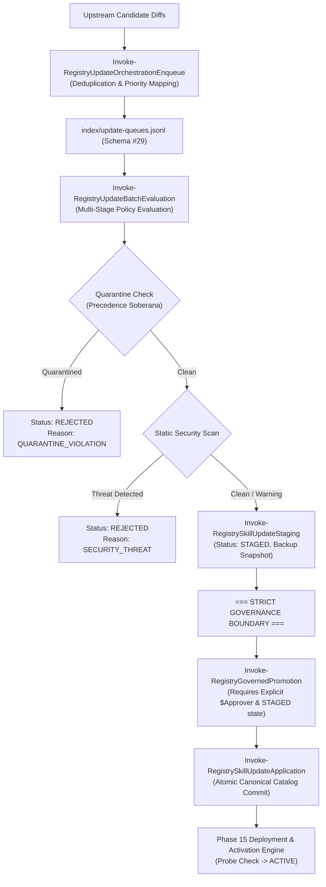

# Skill Registry Lifecycle Platform — Phase 17 Reconnaissance Report

## Update Orchestration, Batching & Governed Promotion Subsystem

---

### Executive Summary

| Attribute | Value |
| :--- | :--- |
| **Phase** | **PHASE 17 — UPDATE ORCHESTRATION, BATCHING & GOVERNED PROMOTION** |
| **Mode** | **STRICTLY READ-ONLY RECONNAISSANCE** |
| **Gate Status** | **`GATE_16 = PASS / SEALED` → READY FOR PHASE 17 REVIEW** |
| **Active Schemas** | **29 Schemas** (Draft 2020-12, Schema #29: `update-orchestration.schema.json`) |
| **Quarantine Authority** | **Sovereign (`gov-quarantine-link-v1`, 118 tombstones, 8 subtrees)** |
| **Trust Escalation** | **NONE (`trust_level: UNTRUSTED` preserved across full lifecycle)** |
| **Dynamic Execution** | **ZERO (0 payload executions during batching/orchestration)** |
| **Source Mutations** | **ZERO (0 source/upstream mutations)** |
| **Promotion Boundary** | **Strictly Governed: No automatic pathway to `ACTIVE`** |

---

### 1. Update Engine & Lifecycle State Flow

The Phase 17 subsystem coordinates candidate updates from Phase 16 across multi-skill batches:



---

### 2. Batch Queues & Orchestration Mechanics

1. **Transactional Queue Index**: [`index/update-queues.jsonl`](file:///E:/.skill-registry/index/update-queues.jsonl) conforms to Schema #29 ([`schemas/update-orchestration.schema.json`](file:///E:/.skill-registry/schemas/update-orchestration.schema.json)).
2. **Idempotency & Deduplication**:
   - `dedup_hash = SHA256(resource_id + current_hash + commit_after + semantic_classification)`.
   - Active queues (`PENDING`, `PROCESSING`) reject re-enqueuing identical candidates.
3. **Priority Scoring**:
   - `CRITICAL_SECURITY`: Score **100**
   - `BREAKING_CHANGE`: Score **80**
   - `STRUCTURAL_CHANGE`: Score **60**
   - `CONTENT_UPDATE`: Score **40**
   - `METADATA_PATCH`: Score **20**
4. **Queue Lifecycle**: `PENDING` → `PROCESSING` → `COMPLETED` / `FAILED` / `CANCELLED`.
5. **Item Lifecycle**: `QUEUED` → `EVALUATING` → `STAGED` → `PROMOTED` / `REJECTED` / `DEFERRED`.

---

### 3. Governed Promotion & Live Boundary Audit (AST Verification)

- **Audit Findings**: AST analysis confirms that **zero automated schedulers, batch workers, or queue processors can promote resources to `ACTIVE`**.
- **Sole Promotion Gate**: `Invoke-RegistryGovernedPromotion`.
- **Mandatory Promotion Requirements**:
  1. Explicit operator approval parameter (`$Approver`).
  2. Candidate update must be in `STAGED` state.
  3. Quarantine status must be `CLEAN` (quarantine guard veto is sovereign).
  4. Security verdict must not be `THREAT_DETECTED` or `QUARANTINED_REFUSED`.
  5. Safe execution of Phase 15 health probes (`Test-RegistryDeploymentProbe`) before live activation.

---

### 4. Schema #29 Specification

Defined in [`schemas/update-orchestration.schema.json`](file:///E:/.skill-registry/schemas/update-orchestration.schema.json):

- `queue_id`: Pattern `^orch-queue-[0-9]{8}T[0-9]{6,9}Z-[a-f0-9]{8}$`
- `policy_configuration`: `min_quality_score`, `allowed_risk_levels`, `require_human_approval` (true), `quarantine_precedence` (true), `max_batch_size`.
- `items`: `queue_item_id`, `resource_id`, `canonical_name`, `priority_score`, `priority_category`, `dedup_hash`, `status`, `evaluation_summary`, `promotion_record`.
- `batch_metrics`: `total_enqueued`, `total_staged`, `total_promoted`, `total_rejected`, `total_deferred`.
- `audit_transaction_id`: ACID audit link.

---

### 5. 30 Synthetic Test Scenarios Designed

The test harness [`tests/Invoke-UpdateOrchestrationTests.ps1`](file:///E:/.skill-registry/tests/Invoke-UpdateOrchestrationTests.ps1) covers:

1. Schema #29 existence and JSON validation.
2. Mandatory property validation on Schema #29.
3. `New-RegistryOrchestrationQueueId` pattern generation.
4. `Get-RegistryUpdateQueues` index query resilience.
5. `Invoke-RegistryUpdateOrchestrationEnqueue` queue creation.
6. Priority mapping (`CRITICAL_SECURITY` = 100).
7. Priority mapping (`BREAKING_CHANGE` = 80).
8. Priority mapping (`CONTENT_UPDATE` = 40).
9. Priority mapping (`METADATA_PATCH` = 20).
10. Descending priority sorting inside batch queue.
11. Deduplication hash calculation and duplicate enqueue rejection.
12. Multi-stage policy: quarantine precedence blocking quarantined skills (`REJECTED`).
13. Multi-stage policy: security gate blocking malicious skills (`THREAT_DETECTED`).
14. Multi-stage policy: clean updates staged in `staging/updates/<upd-id>/`.
15. Dry-run batch evaluation leaving state unmutated.
16. Batch metrics accuracy (`total_enqueued`, `total_staged`, `total_rejected`).
17. Batch completion status update (`COMPLETED`).
18. Governed promotion rejection on missing approver.
19. Governed promotion rejection on un-staged updates.
20. Governed promotion rejection on quarantined skills.
21. Governed promotion execution with explicit approver.
22. Governed promotion applies canonical catalog update.
23. Governed promotion triggers Phase 15 safe deployment to target environment.
24. Governed promotion executes health probes prior to live activation.
25. Governed promotion updates queue item status to `PROMOTED`.
26. Governed promotion verifies live deployment status as `ACTIVE`.
27. Pre-update differential backups preserved in `backups/updates/<upd-id>`.
28. Strict invariant check: zero unapproved deployments active in live environment.
29. `Test-RegistryOrchestrationHealth` reports `HEALTHY`.
30. ACID transaction logs audit event `UPDATE_PROMOTED_GOVERNED`.

---

### 6. CLI Commands in Scope

```bash

# View update orchestration queues and batch metrics

skillctl update queue

# Run automated batch evaluation and staging

skillctl update orchestrate

# Execute governed promotion with operator approval

skillctl update promote <update_id>

# Run updates and orchestration subsystem doctor

skillctl update doctor

```

---

### 7. Governance Stop

> [!IMPORTANT]
> **GOVERNANCE STOP ENGAGED**: Reconnaissance of Phase 17 is 100% complete and read-only.
> No source skills were modified. No unapproved promotion occurred.
> Implementation and execution of Phase 17 test suite await explicit user authorization.
