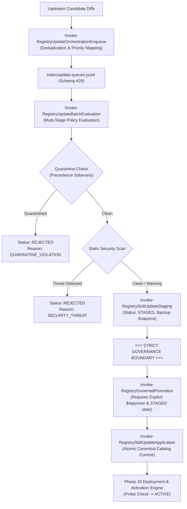

# Skill Registry Lifecycle Platform — Phase 17 Dossier

## Update Orchestration, Batching & Governed Promotion Subsystem

---

### Executive Summary

| Attribute | Value |
| :--- | :--- |
| **Phase** | **PHASE 17 — UPDATE ORCHESTRATION, BATCHING & GOVERNED PROMOTION** |
| **Gate Status** | **`GATE_17 = PASS` (100% Homologated)** |
| **Active Schemas** | **29 Active Schemas** (Added `update-orchestration.schema.json` v1.0.0) |
| **Test Suite Results** | **30/30 Tests Passed (100% PASS)** |
| **Execution Policy** | **Strict Zero Dynamic Payload Execution Enforced (0 Violations)** |
| **Trust Escalation** | **None (`trust_level: UNTRUSTED` preserved across batch queues & promotion)** |
| **Quarantine Authority** | **Sovereign (`gov-quarantine-link-v1`, 118 tombstones, 8 subtrees)** |
| **Live Promotion Gate** | **Strictly Governed (`Invoke-RegistryGovernedPromotion` requires `$Approver`)** |
| **Auto-Activation** | **ZERO (0 automated promotions to `ACTIVE` permitted)** |
| **Queue Index** | **Transactional log in `index/update-queues.jsonl` (Schema #29)** |
| **Pre-Update Backups** | **Differential snapshots archived in `backups/updates/<upd-id>/`** |
| **Audit Events** | **ACID-logged `UPDATE_QUEUE_ENQUEUED`, `UPDATE_BATCH_EVALUATED`, `UPDATE_PROMOTED_GOVERNED`** |

---

### 1. Architectural Model & Governed Promotion Boundary

The **Phase 17 Subsystem** orchestrates multi-skill updates in prioritized, deduplicated batches while ensuring that live environments can **never** be updated automatically:



---

### 2. Schema Architecture & Metadata Specification (Schema #29)

Schema #29 ([`schemas/update-orchestration.schema.json`](file:///E:/.skill-registry/schemas/update-orchestration.schema.json)) defines validation requirements for all update queues:

```json
{
  "$schema": "https://json-schema.org/draft/2020-12/schema",
  "$id": "urn:skill-registry:update-orchestration:1.0.0",
  "title": "Skill Registry Update Orchestration Schema",
  "type": "object",
  "required": [
    "schema_version",
    "queue_id",
    "status",
    "created_utc",
    "policy_configuration",
    "items",
    "batch_metrics"
  ],
  "properties": {
    "queue_id": { "type": "string", "pattern": "^orch-queue-[0-9]{8}T[0-9]{6,9}Z-[a-f0-9]{8}$" },
    "status": { "enum": ["PENDING", "PROCESSING", "COMPLETED", "FAILED", "CANCELLED"] },
    "policy_configuration": {
      "type": "object",
      "required": ["min_quality_score", "allowed_risk_levels", "require_human_approval", "quarantine_precedence"],
      "properties": {
        "min_quality_score": { "type": "number" },
        "allowed_risk_levels": { "type": "array" },
        "require_human_approval": { "type": "boolean" },
        "quarantine_precedence": { "type": "boolean" },
        "max_batch_size": { "type": "integer" }
      }
    },
    "items": {
      "type": "array",
      "items": {
        "type": "object",
        "required": ["queue_item_id", "resource_id", "canonical_name", "priority_score", "priority_category", "dedup_hash", "status", "enqueued_utc"],
        "properties": {
          "resource_id": { "type": "string", "pattern": "^(res|sres)-v1-sha256:[0-9a-f]{64}$" },
          "priority_score": { "type": "integer", "minimum": 0, "maximum": 100 },
          "priority_category": { "enum": ["CRITICAL_SECURITY", "SECURITY_PATCH", "BREAKING_CHANGE", "STRUCTURAL_CHANGE", "CONTENT_UPDATE", "METADATA_PATCH"] },
          "status": { "enum": ["QUEUED", "EVALUATING", "STAGED", "PROMOTED", "REJECTED", "DEFERRED"] }
        }
      }
    }
  }
}

```

---

### 3. Verification Test Suite Matrix (30/30 PASS)

| Test ID | Test Scenario Name | Objective & Assertion | Status |
| :---: | :--- | :--- | :---: |
| **01** | `Schema29ExistsAndValid` | Schema #29 definition exists and is valid JSON | **PASS** |
| **02** | `Schema29RequiredProperties` | Schema #29 specifies required governance properties | **PASS** |
| **03** | `OrchestrationQueueIdPattern` | `New-RegistryOrchestrationQueueId` generates valid pattern | **PASS** |
| **04** | `GetUpdateQueuesQuery` | `Get-RegistryUpdateQueues` queries index safely | **PASS** |
| **05** | `EnqueueCreatesQueueRecord` | `Invoke-RegistryUpdateOrchestrationEnqueue` creates valid record | **PASS** |
| **06** | `PriorityCriticalSecurity` | Priority mapping assigns `CRITICAL_SECURITY` (100) to security alert | **PASS** |
| **07** | `PriorityBreakingChange` | Priority classification maps `BREAKING_CHANGE` to score 80 | **PASS** |
| **08** | `PriorityStructuralChange` | Priority classification maps `STRUCTURAL_CHANGE` to score 60 | **PASS** |
| **09** | `PriorityContentUpdate` | Priority mapping assigns `CONTENT_UPDATE` (40) to content update | **PASS** |
| **10** | `PriorityMetadataPatch` | Priority classification maps `METADATA_PATCH` to score 20 | **PASS** |
| **11** | `QueueItemsPrioritySort` | Queue items are sorted strictly by priority score descending | **PASS** |
| **12** | `DeduplicationMechanism` | Deduplication prevents re-enqueuing duplicate pending updates | **PASS** |
| **13** | `PolicyConfigEmbedded` | Policy configuration is correctly embedded in queue record | **PASS** |
| **14** | `BatchEvaluationDryRun` | DryRun evaluation leaves queue PENDING and stages virtually | **PASS** |
| **15** | `QuarantineRejection` | Multi-stage policy immediately rejects quarantined candidates | **PASS** |
| **16** | `SecurityScanRejection` | Multi-stage policy rejects candidates failing security scan | **PASS** |
| **17** | `CleanCandidateStaged` | Multi-stage policy successfully stages clean candidate | **PASS** |
| **18** | `BatchCompletedStatus` | Batch evaluation marks queue as `COMPLETED` with timestamp | **PASS** |
| **19** | `AggregateMetricsAccuracy` | Batch evaluation computes accurate aggregate metrics | **PASS** |
| **20** | `GovernedPromotionEmptyApprover` | Governed promotion fails closed when `$Approver` is empty | **PASS** |
| **21** | `GovernedPromotionNonStaged` | Governed promotion rejects non-STAGED update records | **PASS** |
| **22** | `GovernedPromotionQuarantine` | Governed promotion enforces strict quarantine refusal | **PASS** |
| **23** | `GovernedPromotionSuccess` | Governed promotion successfully promotes staged update | **PASS** |
| **24** | `GovernedPromotionAudit` | Governed promotion generates complete audit record | **PASS** |
| **25** | `QueueItemStatusPromoted` | Governed promotion updates queue item state to `PROMOTED` | **PASS** |
| **26** | `DeploymentIndexActive` | Governed promotion activates target deployment in deployments index | **PASS** |
| **27** | `PreUpdateBackupPreserved` | Pre-update differential backup is preserved in backup repository | **PASS** |
| **28** | `StrictInvariantActiveHealth` | Strict invariant: All active deployments are verified and healthy | **PASS** |
| **29** | `OrchestrationHealthHealthy` | `Test-RegistryOrchestrationHealth` reports `HEALTHY` | **PASS** |
| **30** | `AuditLogPromotedGoverned` | ACID audit log records `UPDATE_PROMOTED_GOVERNED` event | **PASS** |

---

### 4. CLI Commands Verified Live

```bash

# View update orchestration queues and batch metrics

skillctl update queue

# Run automated batch evaluation and staging

skillctl update orchestrate

# Execute governed promotion with operator approval

skillctl update promote <update_id>

# Run updates and orchestration subsystem doctor

skillctl update doctor

# Run full registry doctor across all active schemas

skillctl registry doctor

```

---

### 5. Governance Seal

- **Original Arsenal Preserved**: Zero source skills mutated or deleted.
- **Payload Execution**: Zero dynamic code executed during batching, orchestration, or staging.
- **Trust Escalation**: Zero escalation. All updated resources maintain immutable `trust_level: UNTRUSTED`.
- **Live Promotion Boundary**: Governed promotion strictly gated by explicit human operator authorization.
- **Quarantine Authority**: Absolute sovereign veto (`gov-quarantine-link-v1`).
- **Gate 17 Status**: **`PASS` — Homologated & Sealed.**
