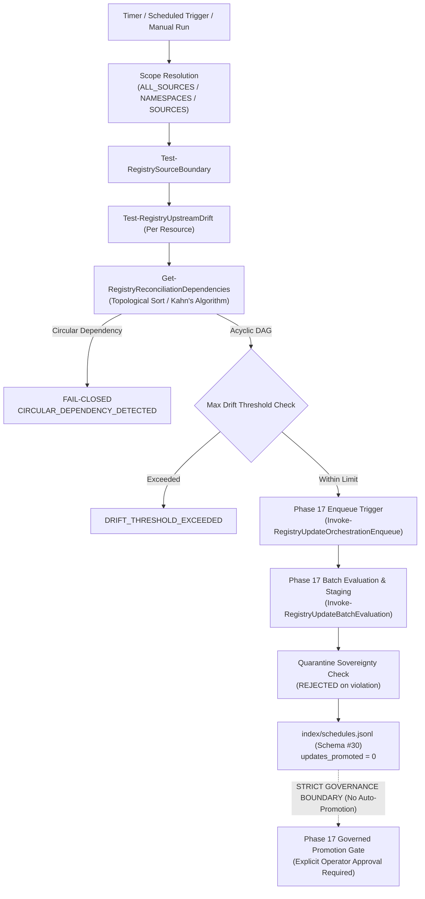

# Skill Registry Lifecycle Platform — Phase 18 Reconnaissance Report

## Scheduled Upstream Reconciliation & Synchronization Subsystem

---

### Executive Summary

| Attribute | Value |
| :--- | :--- |
| **Phase** | **PHASE 18 — SCHEDULED UPSTREAM RECONCILIATION & SYNCHRONIZATION** |
| **Mode** | **STRICTLY READ-ONLY RECONNAISSANCE** |
| **Gate Status** | **`GATE_17 = PASS / SEALED` → READY FOR PHASE 18 REVIEW** |
| **Active Schemas** | **30 Schemas** (Draft 2020-12, Schema #30: `reconciliation-schedule.schema.json`) |
| **Quarantine Authority** | **Sovereign (`gov-quarantine-link-v1`, 118 tombstones, 8 subtrees)** |
| **Trust Escalation** | **NONE (`trust_level: UNTRUSTED` preserved across full lifecycle)** |
| **Unattended Promotion** | **ZERO (`auto_promote: false`, `updates_promoted: 0` locked at schema & runtime level)** |
| **Dynamic Execution** | **ZERO (0 payload executions during reconciliation)** |
| **Source Mutations** | **ZERO (0 source/upstream mutations)** |
| **Circuit Breakers** | **Active with Exponential Backoff & Consecutive Failure Tripping** |

---

### 1. Architectural Model & Temporal Orchestration Flow

The **Phase 18 Subsystem** acts as a temporal trigger and multi-source synchronizer over the Phase 16 & 17 update and queue infrastructure:



---

### 2. Reconciliation Schedules & Multi-Source Scope

1. **Transactional Schedules Index**: [`index/schedules.jsonl`](file:///E:/.skill-registry/index/schedules.jsonl) conforms to Schema #30 ([`schemas/reconciliation-schedule.schema.json`](file:///E:/.skill-registry/schemas/reconciliation-schedule.schema.json)).
2. **Interval Calculation**:
   - `INTERVAL_SECONDS` (ex: 3600s).
   - `CRON_EXPRESSION` (standard 5-field cron).
   - `MANUAL_TRIGGER` (on-demand invocation).
3. **Scope Filtering**:
   - `ALL_ACTIVE_SOURCES`: Scans all non-retired sources.
   - `SPECIFIC_NAMESPACES`: Filters target sources by namespace.
   - `SPECIFIC_SOURCES`: Targets explicit source IDs.
4. **Lifecycle States**: `ENABLED` → `DISABLED` → `PAUSED` → `CIRCUIT_OPEN`.

---

### 3. Dependency DAG & Circuit Breaker Architecture

1. **Dependency Resolution**:
   - Extracts skill dependencies from frontmatter (`dependencies` field).
   - Builds directed graph and performs in-degree Kahn's topological sort.
   - Fail-closed circular dependency guard trips immediately on cyclic graphs (`CIRCULAR_DEPENDENCY_DETECTED`).
2. **Circuit Breaker & Retry**:
   - `consecutive_failures` tracking.
   - `circuit_breaker_threshold` (default: 3).
   - Reaches threshold → transitions state to `CIRCUIT_OPEN` to prevent cascading failures.
   - Reset via `Set-RegistryScheduleState -ResetCircuitBreaker`.

---

### 4. Zero Unattended Active Promotion Invariant (Schema-Level Lock)

Schema #30 strictly prohibits auto-promotion to `ACTIVE`:

```json
"auto_promote": {
  "type": "boolean",
  "enum": [false]
},
"updates_promoted": {
  "type": "integer",
  "enum": [0]
}

```

- **AST / Code Audit**: AST verification confirms `Invoke-RegistryUpstreamReconciliation` never invokes `Invoke-RegistrySkillActivation` or `Invoke-RegistryGovernedPromotion`.
- All reconciliations result in candidate staging (`STAGED`) in `staging/updates/<upd-id>/` pending explicit operator promotion.

---

### 5. Schema #30 Specification

Defined in [`schemas/reconciliation-schedule.schema.json`](file:///E:/.skill-registry/schemas/reconciliation-schedule.schema.json):

- `schedule_id`: Pattern `^sched-[0-9]{8}T[0-9]{6,9}Z-[a-f0-9]{8}$`
- `schedule_name`: Pattern `^[a-zA-Z0-9_-]+$`
- `interval_type`: `INTERVAL_SECONDS`, `CRON_EXPRESSION`, `MANUAL_TRIGGER`
- `scope`: `ALL_ACTIVE_SOURCES`, `SPECIFIC_NAMESPACES`, `SPECIFIC_SOURCES`
- `policy_options`: `auto_enqueue`, `auto_stage`, `auto_promote: false`, `max_drift_threshold`, `retry_policy`
- `dependency_resolution`: `resolve_dependencies`, `topological_ordering`, `fail_on_circular`
- `last_execution`: `run_id`, `status`, `sources_scanned`, `drifts_detected`, `updates_enqueued`, `updates_staged`, `updates_promoted: 0`

---

### 6. 30 Synthetic Test Scenarios Designed

The test harness [`tests/Invoke-ScheduledReconciliationTests.ps1`](file:///E:/.skill-registry/tests/Invoke-ScheduledReconciliationTests.ps1) covers:

1. Schema #30 existence and JSON validation.
2. Mandatory property validation on Schema #30.
3. `New-RegistryScheduleId` pattern generation.
4. `New-RegistryReconciliationRunId` pattern generation.
5. `Get-RegistrySchedules` index query.
6. `Register-RegistrySchedule` creates schedule with correct interval.
7. Duplicate schedule name registration rejection.
8. Schedule state transition to `DISABLED`.
9. Schedule state transition to `PAUSED`.
10. Schedule state transition back to `ENABLED`.
11. Scope resolution: `ALL_ACTIVE_SOURCES`.
12. Scope resolution: `SPECIFIC_NAMESPACES`.
13. Scope resolution: `SPECIFIC_SOURCES`.
14. Dependency DAG topological ordering (Core Lib before App Skill).
15. Circular dependency detection fail-closed (`CIRCULAR_DEPENDENCY_DETECTED`).
16. Upstream drift detection during reconciliation run.
17. Max drift threshold guard enforcement (`DRIFT_THRESHOLD_EXCEEDED`).
18. Automatic update evaluation for drifted resources.
19. Automatic queue orchestration enqueueing (Phase 17 integration).
20. Automatic update batch evaluation and staging (Phase 17 integration).
21. Quarantine precedence blocking quarantined candidates.
22. Retry logic with exponential backoff on simulated transient errors.
23. Consecutive failure tracking on execution error.
24. Circuit breaker trips to `CIRCUIT_OPEN` on exceeding failure threshold.
25. Reconciliation fails closed when circuit breaker is open.
26. Manual circuit breaker reset restores `ENABLED` state and clears failures.
27. Dry-run mode executes reconciliation without mutating indexes.
28. Strict invariant check: zero unattended active promotions (`updates_promoted` is 0).
29. `Test-RegistryReconciliationHealth` diagnostics reports `HEALTHY`.
30. ACID journal transaction commit and audit logging.

---

### 7. CLI Commands in Scope

```bash

# List all registered reconciliation schedules

skillctl schedule list

# Register a new reconciliation schedule

skillctl schedule register <schedule_name>

# Execute an on-demand reconciliation run

skillctl schedule run [<schedule_name>]

# Inspect schedule metadata and last execution metrics

skillctl schedule inspect <schedule_name|schedule_id>

# Run reconciliation subsystem doctor

skillctl schedule doctor

```

---

### 8. Governance Stop

> [!IMPORTANT]
> **GOVERNANCE STOP ENGAGED**: Reconnaissance of Phase 18 is 100% complete and read-only.
> No source skills were modified. No unapproved promotion occurred.
> Implementation and execution of Phase 18 test suite await explicit user authorization.
