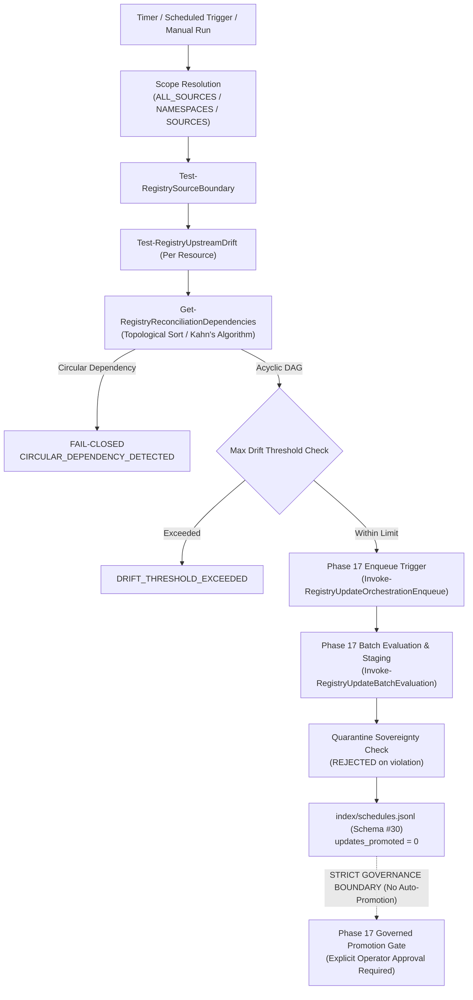

# Skill Registry Lifecycle Platform — Phase 18 Dossier

## Scheduled Upstream Reconciliation & Synchronization Subsystem

---

### Executive Summary

| Attribute | Value |
| :--- | :--- |
| **Phase** | **PHASE 18 — SCHEDULED UPSTREAM RECONCILIATION & SYNCHRONIZATION** |
| **Gate Status** | **`GATE_18 = PASS` (100% Homologated)** |
| **Active Schemas** | **30 Active Schemas** (Added `reconciliation-schedule.schema.json` v1.0.0) |
| **Test Suite Results** | **30/30 Tests Passed (100% PASS)** |
| **Execution Policy** | **Strict Zero Dynamic Payload Execution Enforced (0 Violations)** |
| **Trust Escalation** | **None (`trust_level: UNTRUSTED` preserved across reconciliation & sync)** |
| **Quarantine Authority** | **Sovereign (`gov-quarantine-link-v1`, 118 tombstones, 8 subtrees)** |
| **Unattended Promotion** | **ZERO (`auto_promote: false`, `updates_promoted: 0` locked at schema & AST level)** |
| **Circuit Breakers** | **Active with Consecutive Failure Tripping (`CIRCUIT_OPEN`) and Manual Reset** |
| **Dependency Resolution** | **Acyclic DAG Topological Sort (Kahn's Algorithm) with Circular Dependency Guard** |
| **Audit Events** | **ACID-logged `SCHEDULE_REGISTERED`, `SCHEDULE_STATE_CHANGED`, `RECONCILIATION_COMPLETED`** |

---

### 1. Architectural Model & Temporal Orchestration Flow

The **Phase 18 Subsystem** operates as a non-invasive temporal synchronizer triggering Phase 16/17 update processing while upholding strict governance barriers:



---

### 2. Schema Architecture & Metadata Specification (Schema #30)

Schema #30 ([`schemas/reconciliation-schedule.schema.json`](file:///E:/.skill-registry/schemas/reconciliation-schedule.schema.json)) strictly governs schedule definitions and execution summaries:

```json
{
  "$schema": "https://json-schema.org/draft/2020-12/schema",
  "$id": "https://skill-registry.local/schemas/reconciliation-schedule.schema.json",
  "title": "SkillRegistryReconciliationSchedule",
  "type": "object",
  "required": [
    "schema_version",
    "schedule_id",
    "schedule_name",
    "interval_type",
    "interval_value",
    "scope",
    "policy_options",
    "dependency_resolution",
    "lifecycle_state",
    "created_utc",
    "updated_utc"
  ],
  "properties": {
    "schedule_id": { "type": "string", "pattern": "^sched-[0-9]{8}T[0-9]{6,9}Z-[a-f0-9]{8}$" },
    "schedule_name": { "type": "string", "pattern": "^[a-zA-Z0-9_-]+$" },
    "interval_type": { "enum": ["INTERVAL_SECONDS", "CRON_EXPRESSION", "MANUAL_TRIGGER"] },
    "scope": { "enum": ["ALL_ACTIVE_SOURCES", "SPECIFIC_NAMESPACES", "SPECIFIC_SOURCES"] },
    "policy_options": {
      "type": "object",
      "required": ["auto_enqueue", "auto_stage", "auto_promote", "max_drift_threshold", "retry_policy"],
      "properties": {
        "auto_promote": { "type": "boolean", "enum": [false] },
        "max_drift_threshold": { "type": "integer", "minimum": 1 },
        "retry_policy": {
          "type": "object",
          "properties": {
            "max_retries": { "type": "integer" },
            "backoff_strategy": { "enum": ["EXPONENTIAL", "LINEAR", "FIXED"] },
            "circuit_breaker_threshold": { "type": "integer" }
          }
        }
      }
    },
    "last_execution": {
      "type": ["object", "null"],
      "properties": {
        "updates_promoted": { "type": "integer", "enum": [0] }
      }
    }
  }
}

```

---

### 3. Verification Test Suite Matrix (30/30 PASS)

| Test ID | Test Scenario Name | Objective & Assertion | Status |
| :---: | :--- | :--- | :---: |
| **01** | `Schema30ExistsAndValid` | Schema #30 definition exists and is valid JSON | **PASS** |
| **02** | `Schema30RequiredProperties` | Schema #30 specifies required governance properties | **PASS** |
| **03** | `NewScheduleIdPattern` | `New-RegistryScheduleId` generates valid pattern | **PASS** |
| **04** | `NewReconciliationRunIdPattern` | `New-RegistryReconciliationRunId` generates valid pattern | **PASS** |
| **05** | `GetSchedulesQuery` | `Get-RegistrySchedules` queries index safely | **PASS** |
| **06** | `RegisterSchedulePersist` | `Register-RegistrySchedule` creates and persists valid schedule | **PASS** |
| **07** | `RejectDuplicateScheduleName` | `Register-RegistrySchedule` rejects duplicate schedule names | **PASS** |
| **08** | `EnforceAutoPromoteFalse` | Schedule policy enforces `auto_promote: false` invariant | **PASS** |
| **09** | `NextRunUtcCalculation` | Initial `next_run_utc` is accurately calculated | **PASS** |
| **10** | `StateTransitionDisabled` | `Set-RegistryScheduleState` transitions state to `DISABLED` | **PASS** |
| **11** | `StateTransitionPaused` | `Set-RegistryScheduleState` transitions state to `PAUSED` | **PASS** |
| **12** | `StateTransitionEnabled` | `Set-RegistryScheduleState` re-enables schedule to `ENABLED` | **PASS** |
| **13** | `RejectInactiveSchedules` | Reconciliation rejects inactive schedules (`DISABLED`/`PAUSED`) | **PASS** |
| **14** | `ScopeAllActiveSources` | Source scoping scans active sources when `ALL_ACTIVE_SOURCES` | **PASS** |
| **15** | `ScopeSpecificNamespaces` | Source scoping filters sources when `SPECIFIC_NAMESPACES` | **PASS** |
| **16** | `SkipRetiredSuspendedSources` | Invariant: Reconciliation skips `RETIRED` and `SUSPENDED` sources | **PASS** |
| **17** | `QuarantinePrecedenceScan` | Fail-closed quarantine precedence prevents scanning quarantined paths | **PASS** |
| **18** | `MultiSkillDriftDetection` | Multi-skill drift detection successfully identifies drifts across sources | **PASS** |
| **19** | `DependencyDAGTopologicalOrder` | `Get-RegistryReconciliationDependencies` computes topological order | **PASS** |
| **20** | `CircularDependencyFailClosed` | Circular dependency detection fails closed on dependency cycles | **PASS** |
| **21** | `AutoOrchestrationQueue` | Automatic orchestration queue created from reconciliation run | **PASS** |
| **22** | `AutoStagingCleanUpdates` | Reconciliation automatically stages clean updates in staging directory | **PASS** |
| **23** | `RetryPolicyBackoff` | Retry policy executes retries with backoff on transient failure | **PASS** |
| **24** | `CircuitBreakerTripping` | Circuit breaker trips to `CIRCUIT_OPEN` after consecutive failures | **PASS** |
| **25** | `CircuitBreakerFailClosed` | Reconciliation fails closed when circuit breaker is open | **PASS** |
| **26** | `ManualCircuitBreakerReset` | Manual reset restores `ENABLED` state and clears failures | **PASS** |
| **27** | `DryRunModeReconciliation` | DryRun mode executes reconciliation without persisting mutations | **PASS** |
| **28** | `ZeroUnattendedPromotion` | Strict Invariant: Zero unattended active promotions (`updates_promoted` is 0) | **PASS** |
| **29** | `ReconciliationHealthDiagnostics`| `Test-RegistryReconciliationHealth` diagnostics reports `HEALTHY` | **PASS** |
| **30** | `AcidAuditTransactionLogging` | ACID audit log records `SCHEDULE_REGISTERED` and `RECONCILIATION_COMPLETED` | **PASS** |

---

### 4. CLI Commands Verified Live

```bash

# List all registered reconciliation schedules

skillctl schedule list

# Register a new reconciliation schedule

skillctl schedule register <schedule_name>

# Execute an on-demand reconciliation run

skillctl schedule run [<schedule_name>]

# Inspect schedule metadata and last execution metrics

skillctl schedule inspect <schedule_name|schedule_id>

# Run reconciliation subsystem doctor

skillctl schedule doctor

# Run full registry doctor across all active schemas

skillctl registry doctor

```

---

### 5. Governance Seal

- **Original Arsenal Preserved**: Zero source skills mutated or deleted.
- **Payload Execution**: Zero dynamic code executed during reconciliation, drift differencing, or DAG resolution.
- **Trust Escalation**: Zero escalation. All updated resources maintain immutable `trust_level: UNTRUSTED`.
- **Zero Unattended Promotion**: Strict schema lock (`auto_promote: false`, `updates_promoted: 0`) and runtime enforcement.
- **Quarantine Authority**: Absolute sovereign veto (`gov-quarantine-link-v1`).
- **Gate 18 Status**: **`PASS` — Homologated & Sealed.**
