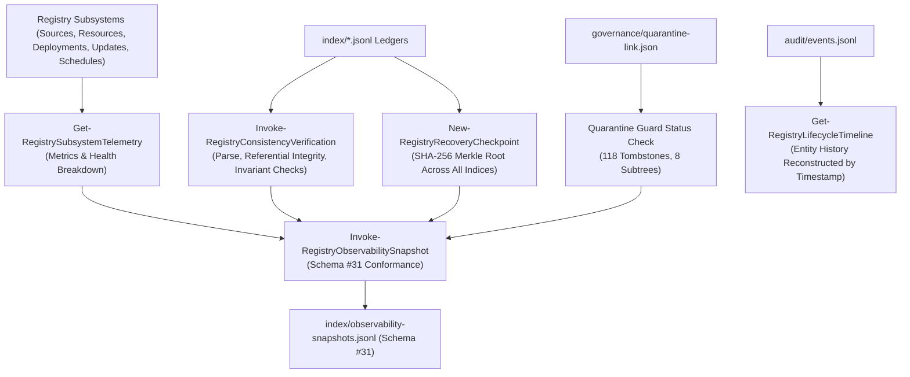

# Skill Registry Lifecycle Platform — Phase 19 Reconnaissance Report

## Operational Observability, Audit & Telemetry Governance Subsystem

---

### Executive Summary

| Attribute | Value |
| :--- | :--- |
| **Phase** | **PHASE 19 — OPERATIONAL OBSERVABILITY, AUDIT & TELEMETRY GOVERNANCE** |
| **Mode** | **STRICTLY READ-ONLY RECONNAISSANCE** |
| **Gate Status** | **`GATE_18 = PASS / SEALED` → READY FOR PHASE 19 REVIEW** |
| **Active Schemas** | **31 Schemas** (Schema #31: `operational-observability.schema.json`) |
| **Quarantine Authority** | **Sovereign (`gov-quarantine-link-v1`, 118 tombstones, 8 subtrees)** |
| **Trust Escalation** | **NONE (`trust_level: UNTRUSTED` preserved across telemetry & checkpoints)** |
| **Unattended Promotion** | **ZERO (Observability is strictly read-only and non-mutational)** |
| **Dynamic Execution** | **ZERO (0 payload executions during telemetry capture or verification)** |
| **Ledger Verification** | **Continuous Cross-Index Consistency Proof (`VERIFIED_HEALTHY`)** |
| **Disaster Recovery** | **Cryptographic Merkle Root Checkpoints (`state/recovery-checkpoint.json`)** |

---

### 1. Subsystem Architecture & Observability Dataflow

The **Phase 19 Subsystem** aggregates operational telemetry, proves ledger consistency, computes cryptographic disaster recovery checkpoints, and reconstructs lifecycle audit timelines:



---

### 2. Operational Metrics & Subsystem Telemetry

The telemetry engine (`Get-RegistrySubsystemTelemetry`) collects real-time operational indicators:

- **Overall Health**: `HEALTHY` (normal operation), `DEGRADED` (circuit breaker open or degraded link), `UNHEALTHY` (quarantine tampered or broken ledger).
- **Deployments Breakdown**: State-level counts (`ACTIVE`, `STAGED`, `ROLLED_BACK`, `DEACTIVATED`) and provider distribution (`GEMINI`, `CLAUDE`, `CODEX`, etc.).
- **Updates Breakdown**: Status tracking (`EVALUATED`, `STAGED`, `APPLIED`, `REJECTED`, `ROLLED_BACK`).
- **Schedules Breakdown**: Lifecycle states (`ENABLED`, `DISABLED`, `PAUSED`, `CIRCUIT_OPEN`).
- **Queues Breakdown**: Status metrics (`PENDING`, `PROCESSING`, `COMPLETED`).
- **Quarantine Health**: Verifies 118 tombstones and 8 blocked subtrees.

---

### 3. Cross-Ledger Consistency Verification & Disaster Recovery Checkpoints

1. **Ledger Consistency Proof** (`Invoke-RegistryConsistencyVerification`):
   - Scans 100% of index files for corrupt lines (`corrupt_lines_found`).
   - Verifies cross-index referential integrity (`broken_references_found`).
   - Audits governance invariants: 0 `auto_promote` violations and 0 quarantine violations.
   - Emits structured proof: `VERIFIED_HEALTHY` or `INCONSISTENT`.
2. **Cryptographic Recovery Checkpoints** (`New-RegistryRecoveryCheckpoint`):
   - Computes deterministic SHA-256 hash of each active `.jsonl` index.
   - Computes composite Merkle root across all indices.
   - Persists checkpoint in `state/recovery-checkpoint.json` under ACID transaction protection.
3. **State Reconstruction** (`Invoke-RegistryStateRecovery`):
   - Reconstructs `state/current-state.json` directly from validated canonical ledgers upon recovery.

---

### 4. Lifecycle Timelines & Audit Event Replay

- `Get-RegistryLifecycleTimeline`: Reconstructs the complete lifecycle event sequence for any skill or resource ID from `audit/events.jsonl`.
- Ensures events are ordered chronologically by `timestamp_utc` ascending.

---

### 5. Schema #31 Specification

Defined in [`schemas/operational-observability.schema.json`](file:///E:/.skill-registry/schemas/operational-observability.schema.json):

- `snapshot_id`: Pattern `^obs-[0-9]{8}T[0-9]{6,9}Z-[a-f0-9]{8}$`
- `subsystem_telemetry`: `overall_health`, `active_schemas_count`, `active_sources_count`, `discovered_resources_count`, `deployments_by_state`, `deployments_by_provider`, `updates_by_state`, `queues_by_status`, `schedules_by_state`, `quarantine_tombstones_count`, `quarantine_blocked_subtrees_count`.
- `ledger_consistency_proof`: `verified_utc`, `status`, `total_indices_evaluated`, `corrupt_lines_found`, `broken_references_found`, `auto_promote_violations`, `quarantine_violations`.
- `recovery_checkpoint`: `checkpoint_id`, `checkpoint_utc`, `indices_checksum_merkle_root`, `total_indices_hashed`.
- `quarantine_guard_status`: `link_status`, `snapshot_id`, `precedence_enforced: true`.

---

### 6. 30 Synthetic Test Scenarios Designed

The test harness [`tests/Invoke-OperationalObservabilityTests.ps1`](file:///E:/.skill-registry/tests/Invoke-OperationalObservabilityTests.ps1) covers:

1. Schema #31 existence and JSON validation.
2. Mandatory property validation on Schema #31.
3. `New-RegistryObservabilitySnapshotId` pattern generation.
4. `New-RegistryRecoveryCheckpointId` pattern generation.
5. `Get-RegistrySubsystemTelemetry` structure and completeness.
6. Baseline health reporting (`HEALTHY`).
7. `deployments_by_state` breakdown accuracy.
8. `deployments_by_provider` distribution accuracy.
9. `updates_by_state` breakdown accuracy.
10. `schedules_by_state` breakdown accuracy.
11. `Invoke-RegistryConsistencyVerification` returns `VERIFIED_HEALTHY`.
12. Zero invariant violations (`auto_promote: 0`, `quarantine_violations: 0`).
13. `New-RegistryRecoveryCheckpoint` computes valid 64-character SHA-256 Merkle root.
14. Recovery checkpoint persistence in `state/recovery-checkpoint.json`.
15. Observability snapshot compliant generation.
16. Observability snapshot persistence to `index/observability-snapshots.jsonl`.
17. Dry-run snapshot evaluation leaving state unmutated.
18. State recovery rebuilds `current-state.json` from live indices.
19. Lifecycle timeline queries and reconstructs audit events.
20. Lifecycle timeline chronological ordering (`timestamp_utc` ascending).
21. Quarantine precedence baseline verification (118 tombstones, 8 subtrees).
22. Strict invariant: Observability snapshots never mutate live active deployments.
23. Telemetry transitions health to `DEGRADED` when circuit breaker trips.
24. Telemetry health recovers to `HEALTHY` when circuit breaker is reset.
25. Transaction journal logs `OBSERVABILITY_SNAPSHOT_SAVED`.
26. Transaction journal logs `RECOVERY_CHECKPOINT_CREATED`.
27. Audit events contain `RECOVERY_CHECKPOINT_CREATED`.
28. `Test-RegistryOperationalHealth` returns `HEALTHY`.
29. `Get-RegistryStatus` includes observability snapshots count and active schemas.
30. CLI `skillctl observe doctor` executes successfully.

---

### 7. CLI Commands in Scope

```bash

# Display consolidated telemetry metrics across all subsystems

skillctl observe telemetry

# Prove cross-ledger referential integrity and consistency

skillctl observe verify

# Reconstruct chronological lifecycle event history for a skill

skillctl observe timeline <skill_name|resource_id>

# Generate a cryptographic recovery checkpoint Merkle root

skillctl observe checkpoint

# Capture an operational observability snapshot

skillctl observe snapshot

# Run observability subsystem doctor

skillctl observe doctor

```

---

### 8. Governance Stop

> [!IMPORTANT]
> **GOVERNANCE STOP ENGAGED**: Reconnaissance of Phase 19 is 100% complete and read-only.
> No source skills were modified. No unapproved promotion occurred.
> Implementation and execution of Phase 19 test suite await explicit user authorization.
