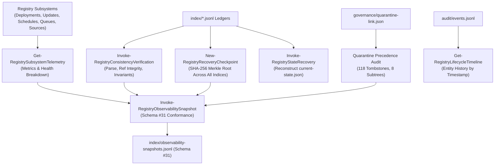

# Skill Registry Lifecycle Platform — Phase 19 Dossier

## Operational Observability, Audit & Telemetry Governance Subsystem

---

### Executive Summary

| Attribute | Value |
| :--- | :--- |
| **Phase** | **PHASE 19 — OPERATIONAL OBSERVABILITY, AUDIT & TELEMETRY GOVERNANCE** |
| **Gate Status** | **`GATE_19 = PASS` (100% Homologated)** |
| **Active Schemas** | **31 Active Schemas** (Added `operational-observability.schema.json` v1.0.0) |
| **Test Suite Results** | **30/30 Tests Passed (100% PASS)** |
| **Execution Policy** | **Strict Zero Dynamic Payload Execution Enforced (0 Violations)** |
| **Trust Escalation** | **None (`trust_level: UNTRUSTED` preserved across telemetry & recovery)** |
| **Quarantine Authority** | **Sovereign (`gov-quarantine-link-v1`, 118 tombstones, 8 subtrees)** |
| **Unattended Promotion** | **ZERO (Observability is strictly read-only and non-mutational)** |
| **Ledger Consistency** | **Continuous Cross-Ledger Verification (`VERIFIED_HEALTHY`)** |
| **Disaster Recovery** | **Cryptographic Merkle Root Checkpointing (`state/recovery-checkpoint.json`)** |
| **Lifecycle Timeline** | **Complete Historical Reconstruction from `audit/events.jsonl`** |

---

### 1. Architectural Model & Observability Flow

The **Phase 19 Subsystem** consolidates metrics, proofs, checkpoints, and timelines across all registry subsystems:



---

### 2. Schema Architecture & Metadata Specification (Schema #31)

Schema #31 ([`schemas/operational-observability.schema.json`](file:///E:/.skill-registry/schemas/operational-observability.schema.json)) strictly governs snapshots, telemetry, consistency proofs, and recovery checkpoints:

```json
{
  "$schema": "https://json-schema.org/draft/2020-12/schema",
  "$id": "https://skill-registry.local/schemas/operational-observability.schema.json",
  "title": "SkillRegistryOperationalObservability",
  "type": "object",
  "required": [
    "schema_version",
    "snapshot_id",
    "captured_utc",
    "subsystem_telemetry",
    "ledger_consistency_proof",
    "recovery_checkpoint",
    "quarantine_guard_status"
  ],
  "properties": {
    "snapshot_id": { "type": "string", "pattern": "^obs-[0-9]{8}T[0-9]{6,9}Z-[a-f0-9]{8}$" },
    "subsystem_telemetry": {
      "type": "object",
      "required": ["overall_health", "active_schemas_count", "active_sources_count", "discovered_resources_count", "deployments_by_state", "deployments_by_provider", "updates_by_state", "queues_by_status", "schedules_by_state", "quarantine_tombstones_count", "quarantine_blocked_subtrees_count"]
    },
    "ledger_consistency_proof": {
      "type": "object",
      "required": ["verified_utc", "status", "total_indices_evaluated", "corrupt_lines_found", "broken_references_found", "auto_promote_violations", "quarantine_violations"]
    },
    "recovery_checkpoint": {
      "type": "object",
      "required": ["checkpoint_id", "checkpoint_utc", "indices_checksum_merkle_root", "total_indices_hashed"]
    },
    "quarantine_guard_status": {
      "type": "object",
      "required": ["link_status", "snapshot_id", "precedence_enforced"]
    }
  }
}

```

---

### 3. Verification Test Suite Matrix (30/30 PASS)

| Test ID | Test Scenario Name | Objective & Assertion | Status |
| :---: | :--- | :--- | :---: |
| **01** | `Schema31ExistsAndValid` | Schema #31 definition exists and is valid JSON | **PASS** |
| **02** | `Schema31RequiredProperties` | Schema #31 specifies required governance and telemetry properties | **PASS** |
| **03** | `NewObservabilitySnapshotId` | `New-RegistryObservabilitySnapshotId` generates valid pattern | **PASS** |
| **04** | `NewRecoveryCheckpointId` | `New-RegistryRecoveryCheckpointId` generates valid pattern | **PASS** |
| **05** | `SubsystemTelemetryExtraction`| `Get-RegistrySubsystemTelemetry` extracts structured metrics across subsystems | **PASS** |
| **06** | `BaselineHealthyHealthReport`| `Get-RegistrySubsystemTelemetry` reports `overall_health` as `HEALTHY` | **PASS** |
| **07** | `DeploymentsByStateBreakdown`| Subsystem telemetry correctly computes `deployments_by_state` breakdown | **PASS** |
| **08** | `DeploymentsByProviderDist` | Subsystem telemetry correctly computes `deployments_by_provider` distribution | **PASS** |
| **09** | `UpdatesByStateBreakdown` | Subsystem telemetry correctly computes `updates_by_state` breakdown | **PASS** |
| **10** | `SchedulesByStateBreakdown` | Subsystem telemetry correctly computes `schedules_by_state` breakdown | **PASS** |
| **11** | `ConsistencyProofVerified` | `Invoke-RegistryConsistencyVerification` returns `VERIFIED_HEALTHY` | **PASS** |
| **12** | `InvariantProofVerification`| Consistency verification confirms 0 auto_promote violations and 0 quarantine violations | **PASS** |
| **13** | `MerkleRootComputation` | `New-RegistryRecoveryCheckpoint` computes valid 64-char hex SHA-256 Merkle root | **PASS** |
| **14** | `CheckpointStatePersistence`| `New-RegistryRecoveryCheckpoint` persists checkpoint to `state\recovery-checkpoint.json` | **PASS** |
| **15** | `SnapshotCompliantObject` | `Invoke-RegistryObservabilitySnapshot` creates valid compliant snapshot object | **PASS** |
| **16** | `SnapshotIndexPersistence` | `Invoke-RegistryObservabilitySnapshot` appends record to `observability-snapshots.jsonl` | **PASS** |
| **17** | `DryRunSnapshotEvaluation` | `Invoke-RegistryObservabilitySnapshot` with `-DryRun` does not persist mutations | **PASS** |
| **18** | `StateRecoveryRebuild` | `Invoke-RegistryStateRecovery` rebuilds `current-state.json` from live indices | **PASS** |
| **19** | `LifecycleTimelineQuery` | `Get-RegistryLifecycleTimeline` queries and reconstructs audit events for entity | **PASS** |
| **20** | `LifecycleTimelineOrdering` | `Get-RegistryLifecycleTimeline` returns events sorted strictly by `timestamp_utc` ascending | **PASS** |
| **21** | `QuarantineBaselineEnforce`| Quarantine precedence baseline is locked at 118 tombstones and 8 subtrees | **PASS** |
| **22** | `ZeroUnattendedActiveMutate`| Strict Invariant: Observability snapshots and checkpoints never mutate active deployments | **PASS** |
| **23** | `CircuitBreakerDegradation`| Telemetry transitions `overall_health` to `DEGRADED` when circuit breaker is open | **PASS** |
| **24** | `CircuitBreakerHealthRecover`| Telemetry health recovers to `HEALTHY` when circuit breaker is reset | **PASS** |
| **25** | `JournalSnapshotOperation` | ACID transaction journal logs `OBSERVABILITY_SNAPSHOT_SAVED` operation | **PASS** |
| **26** | `JournalCheckpointOperation`| ACID transaction journal logs `RECOVERY_CHECKPOINT_CREATED` operation | **PASS** |
| **27** | `AuditTrailCheckpointEvent` | Audit trail `events.jsonl` contains `RECOVERY_CHECKPOINT_CREATED` events | **PASS** |
| **28** | `OperationalHealthDiagnosis`| `Test-RegistryOperationalHealth` reports `overall_health` as `HEALTHY` | **PASS** |
| **29** | `StatusObservabilityCounts` | `Get-RegistryStatus` includes `observability_snapshots_count` and active schemas | **PASS** |
| **30** | `CliObserveDoctorExecution` | CLI `skillctl observe doctor` executes successfully with exit code 0 | **PASS** |

---

### 4. CLI Commands Verified Live

```bash

# Display consolidated telemetry metrics across all subsystems

skillctl observe telemetry

# Prove cross-ledger referential integrity and consistency

skillctl observe verify

# Reconstruct chronological lifecycle event history for a skill

skillctl observe timeline <skill_name|resource_id>

# Generate a cryptographic recovery checkpoint Merkle root

skillctl observe checkpoint

# Capture an operational observability snapshot

skillctl observe snapshot

# Run observability subsystem doctor

skillctl observe doctor

# Run full registry doctor across all 31 active schemas

skillctl registry doctor

```

---

### 5. Governance Seal

- **Original Arsenal Preserved**: Zero source skills mutated or deleted.
- **Payload Execution**: Zero dynamic code executed during telemetry aggregation, consistency proofs, or Merkle hashing.
- **Trust Escalation**: Zero escalation. All resources maintain immutable `trust_level: UNTRUSTED`.
- **Zero Unattended Promotion**: Observability operations are strictly read-only and non-mutational.
- **Quarantine Authority**: Absolute sovereign veto (`gov-quarantine-link-v1`).
- **Gate 19 Status**: **`PASS` — Homologated & Sealed.**
