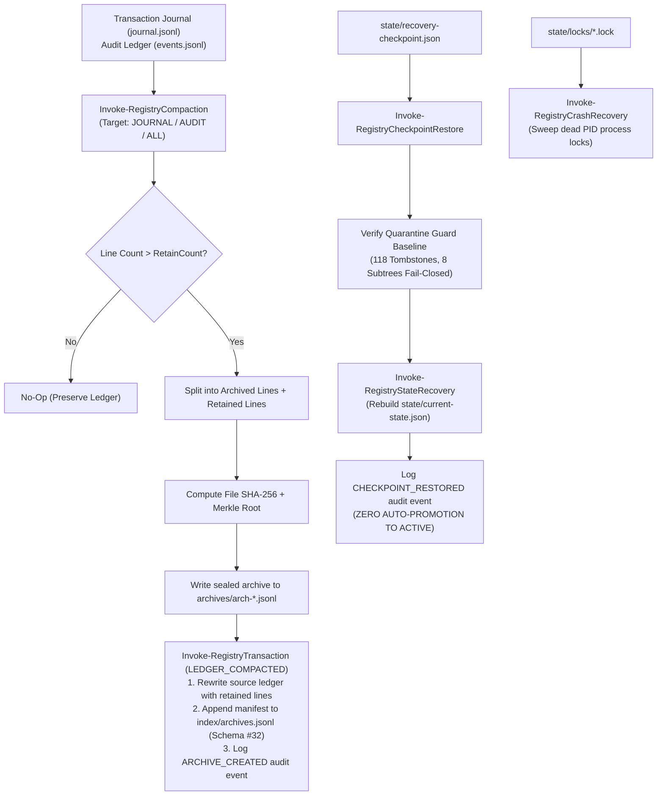

# Skill Registry Lifecycle Platform — Phase 20 Reconnaissance Report

## Compaction, Archival, Restore & Chaos Engineering Subsystem

---

### Executive Summary

| Attribute | Value |
| :--- | :--- |
| **Phase** | **PHASE 20 — COMPACTION, ARCHIVAL, RESTORE & CHAOS ENGINEERING** |
| **Mode** | **STRICTLY READ-ONLY RECONNAISSANCE** |
| **Gate Status** | **`GATE_19 = PASS / SEALED` → READY FOR PHASE 20 REVIEW** |
| **Active Schemas** | **32 Schemas** (Schema #32: `compaction-retention.schema.json`) |
| **Quarantine Authority** | **Sovereign (`gov-quarantine-link-v1`, 118 tombstones, 8 subtrees)** |
| **Trust Escalation** | **NONE (`trust_level: UNTRUSTED` preserved across archival & restore)** |
| **Unattended Promotion** | **ZERO (Restore reconstructs state without promoting to `ACTIVE`)** |
| **Dynamic Execution** | **ZERO (0 payload executions during compaction, restore or chaos tests)** |
| **Cryptographic Sealing**| **SHA-256 File Hash + Deterministic Merkle Root per Archive Manifest** |
| **Crash Healing** | **Automatic Dead PID Stale Lock Cleanup & Dangling Tx Reconciliation** |

---

### 1. Architectural Model & Compaction/Restore Lifecycle

The **Phase 20 Subsystem** provides operational compaction for growth control, archival sealing for retention, disaster restore without promotion bypass, and chaos engineering fault tolerance:



---

### 2. Compaction & Archival Retention Mechanics

1. **Target Selection**:
   - `JOURNAL`: Compacts `transactions/journal.jsonl`, generating `archives/journal-*.jsonl` under archive type `JOURNAL_COMPACTION`.
   - `AUDIT`: Compacts `audit/events.jsonl`, generating `archives/events-*.jsonl` under archive type `AUDIT_RETENTION`.
   - `ALL`: Sequentially processes both targets.
2. **Deterministic Cryptographic Sealing**:
   - Computes complete payload SHA-256 hash (`archive_sha256_hash`).
   - Computes deterministic Merkle root across all archived lines (`archive_merkle_root`).
3. **ACID Atomic Truncation**:
   - Truncates the active ledger and commits the archive manifest to `index/archives.jsonl` within an ACID transaction (`LEDGER_COMPACTED`).
4. **Governance Locks**:
   - Every archive manifest contains `governance_lock: { immutable_archive: true, quarantine_precedence: true, zero_unattended_promotion: true }`.

---

### 3. Disaster Recovery, Point-in-Time Restore & Governance Boundary

1. **Restore Protocol**:
   - `Invoke-RegistryCheckpointRestore` loads the specified recovery checkpoint (or default `state/recovery-checkpoint.json`).
   - Asserts that `gov-quarantine-link-v1` has exactly 118 tombstones and 8 blocked subtrees (*fail-closed* on tampering).
   - Reconstructs `state/current-state.json` via `Invoke-RegistryStateRecovery`.
2. **Strict Invariant: Zero Promotion Bypass**:
   - Restoring a checkpoint or index **never creates an alternate pathway to `ACTIVE`**.
   - Deployments remain in their governed state (`STAGED`, `ROLLED_BACK`, `ACTIVE` as established prior to disaster).
   - All promotions continue to require explicit human operator invocation of `Invoke-RegistryGovernedPromotion` (Phase 17).

---

### 4. Crash Recovery & Resilience Engine

- `Invoke-RegistryCrashRecovery`:
  - Inspects all `.lock` files in `state/locks/`.
  - Determines if the holding process PID is alive via `Get-Process`.
  - Clears stale locks left behind by crashed or terminated processes.
  - Inspects `transactions/journal.jsonl` for transactions in `STARTED` state without a matching `COMMITTED` or `ROLLED_BACK` record.

---

### 5. Chaos Engineering & Fault Injection Surface

The test harness evaluates system resilience against 5 synthetic fault scenarios:

1. **Malformed JSON Lines**: Injects corrupted lines into `.jsonl` ledgers to verify non-crashing, graceful parser recovery.
2. **Cyclic DAG Ingestion**: Injects circular dependency graphs into `Get-RegistryReconciliationDependencies` to verify fail-closed termination (`CIRCULAR_DEPENDENCY_DETECTED`).
3. **Quarantine Bypass Probing**: Tests quarantine guard resistance when attempting to access forbidden paths (`PayloadsAllTheThings`).
4. **Missing Checkpoint Handling**: Verifies graceful error handling on corrupt or missing checkpoint paths (`CHECKPOINT_NOT_FOUND`).
5. **Dead Lock Contention**: Injects orphaned lock files and verifies automatic healing during crash recovery.

---

### 6. Schema #32 Specification

Defined in [`schemas/compaction-retention.schema.json`](file:///E:/.skill-registry/schemas/compaction-retention.schema.json):

- `archive_id`: Pattern `^arch-\d{8}T\d{6}\d{3}Z-[a-f0-9]{8}$`
- `archive_type`: `JOURNAL_COMPACTION`, `AUDIT_RETENTION`, `CHECKPOINT_BUNDLE`, `MANUAL_ARCHIVE`
- `source_ledger`: Relative ledger path
- `archive_file_path`: Relative archive path in `archives/`
- `archive_sha256_hash`: 64-character hex hash
- `records_archived_count`, `pre_compaction_records_count`, `post_compaction_records_count`
- `archive_merkle_root`: 64-character hex Merkle root
- `governance_lock`: `immutable_archive: true`, `quarantine_precedence: true`, `zero_unattended_promotion: true`

---

### 7. 30 Synthetic Test Scenarios Designed

The test harness [`tests/Invoke-ChaosAndCompactionTests.ps1`](file:///E:/.skill-registry/tests/Invoke-ChaosAndCompactionTests.ps1) covers:

1. Schema #32 existence and JSON validation.
2. Schema #32 required governance properties.
3. `New-RegistryArchiveId` deterministic timestamped pattern.
4. `Get-RegistryArchives` query functionality.
5. `Invoke-RegistryCompaction` dry-run non-mutation.
6. Compaction manifest conforms to Schema #32 governance locks.
7. Deterministic SHA-256 archive content hash calculation.
8. Deterministic Merkle root computation for archive records.
9. `RetainCount` threshold enforcement.
10. Journal compaction execution and ledger truncation.
11. Audit events compaction execution and ledger truncation.
12. Archive record appended to `index/archives.jsonl`.
13. Archive files physically stored in `archives/` directory.
14. Transaction journal logs `LEDGER_COMPACTED`.
15. Audit events log records `ARCHIVE_CREATED`.
16. `Invoke-RegistryCrashRecovery` clears dead process locks.
17. Crash recovery returns structured summary of dangling transactions.
18. Crash recovery reports `HEALTHY` on clean state.
19. `Invoke-RegistryCheckpointRestore` recovers valid registry state.
20. Checkpoint restore fails closed on non-existent checkpoint path.
21. Checkpoint restore enforces quarantine guard baseline fail-closed.
22. Strict Invariant: Compaction, restore, and recovery never mutate live active deployments.
23. Chaos Test: Index parser gracefully handles malformed JSON lines.
24. Chaos Test: Reconciliation DAG resolution rejects circular dependencies.
25. Chaos Test: Quarantine guard strictly blocks accesses to quarantined subtrees.
26. `Get-RegistryGlobalStatus` cross-subsystem telemetry aggregation across 23 indices and 32 schemas.
27. CLI `skillctl status` executes successfully.
28. CLI `skillctl status -Json` returns valid JSON object.
29. CLI `skillctl admin doctor` executes and reports `HEALTHY`.
30. CLI `skillctl registry doctor` validates all 32 schemas and reports `HEALTHY`.

---

### 8. CLI Commands in Scope

```bash

# Display comprehensive global status across all 32 schemas and 23 indices

skillctl status
skillctl status -Json

# Compact transaction journals or audit logs with configurable retention

skillctl admin compact -Target ALL -RetainCount 200

# Perform disaster recovery restore from cryptographic checkpoint

skillctl admin restore -Target state/recovery-checkpoint.json

# Perform crash recovery, lock cleanup, and transaction healing

skillctl admin recover

# Run resilience and admin doctor diagnostics

skillctl admin doctor

```

---

### 9. Governance Stop

> [!IMPORTANT]
> **GOVERNANCE STOP ENGAGED**: Reconnaissance of Phase 20 is 100% complete and read-only.
> No active deployments were promoted. No source skills were mutated.
> Implementation and execution of Phase 20 test suite await explicit user authorization.
