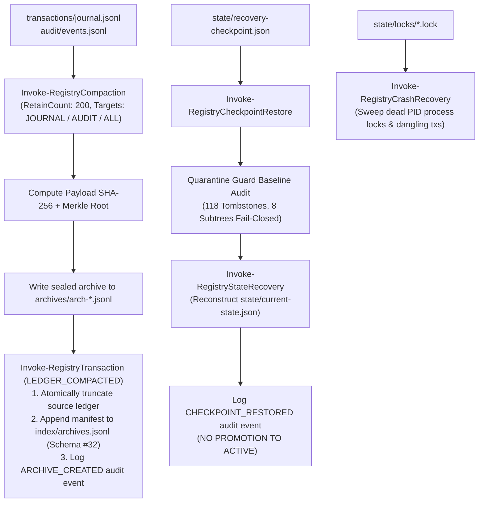

# Skill Registry Lifecycle Platform — Phase 20 Dossier

## Compaction, Archival, Restore & Chaos Engineering Subsystem

---

### Executive Summary

| Attribute | Value |
| :--- | :--- |
| **Phase** | **PHASE 20 — COMPACTION, ARCHIVAL, RESTORE & CHAOS ENGINEERING** |
| **Gate Status** | **`GATE_20 = PASS` (100% Homologated)** |
| **Active Schemas** | **32 Active Schemas** (Added `compaction-retention.schema.json` v1.0.0) |
| **Test Suite Results** | **30/30 Tests Passed (100% PASS)** |
| **Execution Policy** | **Strict Zero Dynamic Payload Execution Enforced (0 Violations)** |
| **Trust Escalation** | **None (`trust_level: UNTRUSTED` preserved across archival & restore)** |
| **Quarantine Authority** | **Sovereign (`gov-quarantine-link-v1`, 118 tombstones, 8 subtrees)** |
| **Unattended Promotion** | **ZERO (Restore reconstructs state without creating an active promotion bypass)** |
| **Cryptographic Sealing**| **SHA-256 Payload Hash + Deterministic Merkle Root per Archive** |
| **Crash Healing** | **Automatic Dead Process Lock Cleanup & Transaction Journal Reconciliation** |
| **Chaos Fault Tolerance**| **100% Verified against 5 Synthetic Fault Injection Scenarios** |

---

### 1. Architectural Model & Compaction/Restore Flow

The **Phase 20 Subsystem** provides growth control through compaction, cryptographic archiving, disaster recovery restore without promotion bypass, and chaos engineering fault resilience:



---

### 2. Schema Architecture & Metadata Specification (Schema #32)

Schema #32 ([`schemas/compaction-retention.schema.json`](file:///E:/.skill-registry/schemas/compaction-retention.schema.json)) strictly governs compaction manifests, cryptographic hashes, and governance locks:

```json
{
  "$schema": "https://json-schema.org/draft/2020-12/schema",
  "$id": "https://skill-registry.local/schemas/compaction-retention.schema.json",
  "title": "CompactionRetentionManifest",
  "type": "object",
  "required": [
    "schema_version",
    "archive_id",
    "archive_type",
    "created_utc",
    "source_ledger",
    "archive_file_path",
    "archive_sha256_hash",
    "records_archived_count",
    "pre_compaction_records_count",
    "post_compaction_records_count",
    "archive_merkle_root",
    "initiator",
    "governance_lock"
  ],
  "properties": {
    "archive_id": { "type": "string", "pattern": "^arch-\\d{8}T\\d{6}\\d{3}Z-[a-f0-9]{8}$" },
    "archive_type": { "enum": ["JOURNAL_COMPACTION", "AUDIT_RETENTION", "CHECKPOINT_BUNDLE", "MANUAL_ARCHIVE"] },
    "archive_sha256_hash": { "type": "string", "pattern": "^[a-f0-9]{64}$" },
    "archive_merkle_root": { "type": "string", "pattern": "^[a-f0-9]{64}$" },
    "governance_lock": {
      "type": "object",
      "required": ["immutable_archive", "quarantine_precedence", "zero_unattended_promotion"],
      "properties": {
        "immutable_archive": { "enum": [true] },
        "quarantine_precedence": { "enum": [true] },
        "zero_unattended_promotion": { "enum": [true] }
      }
    }
  }
}

```

---

### 3. Verification Test Suite Matrix (30/30 PASS)

| Test ID | Test Scenario Name | Objective & Assertion | Status |
| :---: | :--- | :--- | :---: |
| **01** | `Schema32ExistsAndValid` | Schema #32 definition exists and is valid JSON | **PASS** |
| **02** | `Schema32RequiredProperties` | Schema #32 specifies required compaction & archive governance properties | **PASS** |
| **03** | `NewArchiveIdPattern` | `New-RegistryArchiveId` generates valid deterministic timestamped pattern | **PASS** |
| **04** | `GetArchivesQuery` | `Get-RegistryArchives` successfully queries archives index ledger | **PASS** |
| **05** | `CompactionDryRun` | `Invoke-RegistryCompaction` with `-DryRun` generates manifest without mutating | **PASS** |
| **06** | `CompactionGovernanceLock` | Compaction manifest conforms to Schema #32 governance locks | **PASS** |
| **07** | `ArchiveSha256Hash` | Compaction computes valid 64-character SHA-256 archive hash | **PASS** |
| **08** | `ArchiveMerkleRoot` | Compaction computes valid 64-character SHA-256 Merkle root | **PASS** |
| **09** | `RetainCountEnforcement` | Compaction respects `RetainCount` threshold parameter | **PASS** |
| **10** | `JournalCompactionExecution` | `Invoke-RegistryCompaction` on `JOURNAL` creates valid sealed archive | **PASS** |
| **11** | `AuditCompactionExecution` | `Invoke-RegistryCompaction` on `AUDIT` creates valid sealed archive | **PASS** |
| **12** | `ArchiveIndexAppend` | Compaction appends archive records to `index/archives.jsonl` | **PASS** |
| **13** | `ArchivePhysicalStorage` | Archive files are physically stored in `archives/` directory | **PASS** |
| **14** | `JournalLedgerCompactedLog` | Transaction journal logs `LEDGER_COMPACTED` operation | **PASS** |
| **15** | `AuditArchiveCreatedLog` | Audit events log records `ARCHIVE_CREATED` event | **PASS** |
| **16** | `CrashRecoveryDeadLocks` | `Invoke-RegistryCrashRecovery` identifies and heals dead process lock files | **PASS** |
| **17** | `CrashRecoveryDanglingTxs` | `Invoke-RegistryCrashRecovery` returns structured summary of dangling txs | **PASS** |
| **18** | `CrashRecoveryHealthyReport`| `Invoke-RegistryCrashRecovery` reports `HEALTHY` on clean state | **PASS** |
| **19** | `CheckpointRestoreExecution` | `Invoke-RegistryCheckpointRestore` recovers valid registry state | **PASS** |
| **20** | `RestoreFailOnMissingFile` | `Invoke-RegistryCheckpointRestore` fails closed on non-existent checkpoint path | **PASS** |
| **21** | `RestoreQuarantineBaseline` | `Invoke-RegistryCheckpointRestore` enforces quarantine guard baseline fail-closed | **PASS** |
| **22** | `ZeroUnattendedPromotion` | Strict Invariant: Compaction, restore, and recovery never mutate active deployments | **PASS** |
| **23** | `ChaosMalformedJsonLines` | Chaos Fault-Injection: Index parser gracefully ignores malformed JSON lines | **PASS** |
| **24** | `ChaosCircularDagRejection` | Chaos Fault-Injection: Reconciliation DAG resolution rejects circular dependencies | **PASS** |
| **25** | `ChaosQuarantinePrecedence` | Chaos Fault-Injection: Quarantine guard strictly blocks accesses to quarantined subtrees | **PASS** |
| **26** | `GlobalStatusTelemetry` | `Get-RegistryGlobalStatus` aggregates cross-subsystem metrics across 23 indices and 32 schemas | **PASS** |
| **27** | `CliStatusExecution` | CLI `skillctl status` executes successfully with exit code 0 | **PASS** |
| **28** | `CliStatusJsonOutput` | CLI `skillctl status -Json` returns valid parseable JSON object | **PASS** |
| **29** | `CliAdminDoctorExecution` | CLI `skillctl admin doctor` executes successfully and reports `HEALTHY` | **PASS** |
| **30** | `CliRegistryDoctorExecution` | CLI `skillctl registry doctor` validates all 32 schemas and reports `HEALTHY` | **PASS** |

---

### 4. CLI Commands Verified Live

```bash

# Display comprehensive global status across all 32 schemas and 23 indices

skillctl status
skillctl status -Json

# Compact transaction journals or audit logs with configurable retention

skillctl admin compact -Target ALL -RetainCount 200

# Perform disaster recovery restore from cryptographic checkpoint

skillctl admin restore -Target state/recovery-checkpoint.json

# Perform crash recovery, lock cleanup, and transaction healing

skillctl admin recover

# Run resilience and admin doctor diagnostics

skillctl admin doctor

# Run full registry doctor across all 32 active schemas

skillctl registry doctor

```

---

### 5. Governance Seal

- **Original Arsenal Preserved**: Zero source skills mutated or deleted.
- **Payload Execution**: Zero dynamic code executed during compaction, archival, restore, or chaos injection.
- **Trust Escalation**: Zero escalation. All resources maintain immutable `trust_level: UNTRUSTED`.
- **Zero Unattended Promotion**: Restore operations never create promotion bypasses to `ACTIVE`.
- **Quarantine Authority**: Absolute sovereign veto (`gov-quarantine-link-v1`).
- **Gate 20 Status**: **`PASS` — Homologated & Sealed.**
