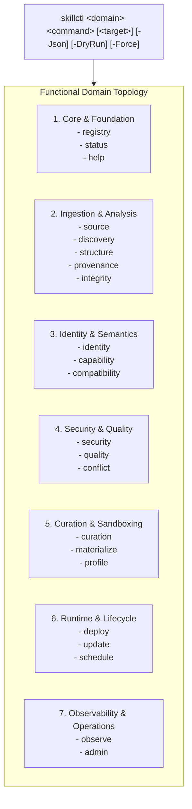

# Skill Registry Lifecycle Platform — Phase 21 Reconnaissance Report

## CLI Front-End Polish, Developer Experience & Interactive Inspection Subsystem

---

### Executive Summary

| Attribute | Value |
| :--- | :--- |
| **Phase** | **PHASE 21 — CLI FRONT-END POLISH & DEVELOPER EXPERIENCE** |
| **Mode** | **STRICTLY READ-ONLY RECONNAISSANCE** |
| **Gate Status** | **`GATE_20 = PASS / SEALED` → READY FOR PHASE 21 REVIEW** |
| **Functional Domains** | **21 Domains + Global Help System** |
| **Active Schemas** | **32 Schemas** (Draft 2020-12 / Draft-07) |
| **Output Formats** | **Colorized Terminal (Cyan/Green/Yellow/Red) + Structured `-Json` Output** |
| **Diagnostics Coverage**| **21 Domain Doctors + Global Registry Doctor (`skillctl registry doctor`)** |
| **Quarantine Authority** | **Sovereign (`gov-quarantine-link-v1`, 118 tombstones, 8 subtrees)** |
| **Trust Escalation** | **NONE (`trust_level: UNTRUSTED` preserved across all CLI interactions)** |
| **Unattended Promotion** | **ZERO (All inspection and status commands are strictly non-mutational)** |
| **Dynamic Execution** | **ZERO (0 payload executions during CLI command parsing or rendering)** |

---

### 1. CLI Front-End Taxonomy & Command Topology

The `skillctl` command line interface exposes 21 distinct functional domains organized logically across the registry lifecycle:

---

### 2. Standardized Command Pattern & Output Formatting

Every domain in `skillctl` adheres to predictable command conventions:

| Standard Command | Purpose | Output Format Options |
| :--- | :--- | :--- |
| `status` | Summarizes metrics and operational state of the domain. | Human-readable colorized table or pure JSON (`-Json`). |
| `list` | Lists all cataloged entities in the domain index. | Formatted multi-line items with status tags or JSON array. |
| `inspect <target>` | Retrieves complete metadata dossier for a specific ID/name. | Key-value attribute display or raw JSON object. |
| `doctor` | Runs health diagnostics, schema conformance, and index validation. | Colorized check-by-check pass/fail report or JSON report. |
| `help` | Explains syntax, available commands, parameters, and examples. | Formatted manual page. |

---

### 3. Developer Experience (DX) & Tooling Ergonomics

1. **JSON Interoperability (`-Json`)**:
   - Every domain and command supports `-Json`, outputting clean, unpolluted JSON parseable directly by `jq`, PowerShell `ConvertFrom-Json`, or CI/CD pipelines.
2. **Terminal Aesthetics & Color Semantics**:
   - **Cyan**: Headers, subsystem titles, banners.
   - **Green**: Approved states (`HEALTHY`, `PASS`, `ENABLED`, `LOCKED_VALID`, `ACTIVE`).
   - **Yellow**: Informational / Intermediate states (`STAGED`, `EVALUATING`, `PAUSED`, `UNTRUSTED`).
   - **Red**: Failures, blocked accesses, or errors (`FAIL`, `CIRCUIT_OPEN`, `BLOCKED`, `INCONSISTENT`).
   - **White / Gray**: Field labels and secondary metadata.
3. **Robust Input Validation**:
   - `ValidateSet` enforces domain and command syntax at the PowerShell engine level.
   - Graceful parameter handling for missing targets without dumping raw exception stack traces.
4. **Unified Multi-Domain Doctor**:
   - Allows diagnosing individual subsystems (e.g. `skillctl security doctor`, `skillctl deploy doctor`, `skillctl observe doctor`) or running full systemic validation (`skillctl registry doctor`).

---

### 4. Governance & Security Invariants Preserved

- **Zero Promotion Bypass**: Running inspection, diff, search, or status commands **never promotes staged updates or materializations to `ACTIVE`**.
- **Quarantine Sovereignty**: Quarantine link checks are embedded in all diagnostics and queries.
- **Trust Immutability**: All displayed trust levels reflect immutable `UNTRUSTED` status.
- **Zero Dynamic Execution**: No tool call or CLI command executes arbitrary script payloads found inside discovered skills.

---

### 5. 30 Synthetic Test Scenarios Designed

The test harness [`tests/Invoke-CliPolishAndDxTests.ps1`](file:///E:/.skill-registry/tests/Invoke-CliPolishAndDxTests.ps1) covers:

1. `skillctl help` displays full domain taxonomy.
2. `skillctl registry help` / domain-level help execution.
3. `skillctl registry status -Json` outputs valid JSON.
4. `skillctl source list -Json` outputs valid JSON array.
5. `skillctl discovery status -Json` outputs valid JSON.
6. `skillctl structure status -Json` outputs valid JSON.
7. `skillctl provenance status -Json` outputs valid JSON.
8. `skillctl integrity status -Json` outputs valid JSON.
9. `skillctl identity status -Json` outputs valid JSON.
10. `skillctl capability status -Json` outputs valid JSON.
11. `skillctl compatibility status -Json` outputs valid JSON.
12. `skillctl security status -Json` outputs valid JSON.
13. `skillctl quality status -Json` outputs valid JSON.
14. `skillctl conflict status -Json` outputs valid JSON.
15. `skillctl curation status -Json` outputs valid JSON.
16. `skillctl materialize status -Json` outputs valid JSON.
17. `skillctl profile status -Json` outputs valid JSON.
18. `skillctl deploy status -Json` outputs valid JSON.
19. `skillctl update status -Json` outputs valid JSON.
20. `skillctl schedule list -Json` outputs valid JSON.
21. `skillctl observe telemetry -Json` outputs valid JSON.
22. `skillctl status -Json` outputs comprehensive global metrics.
23. `skillctl observe timeline` queries historical audit trail.
24. `skillctl capability search` performs semantic capability queries.
25. `skillctl compatibility matrix` outputs multi-provider matrix.
26. Graceful error handling on invalid command parameters.
27. `skillctl observe doctor` executes with exit code 0 and reports `HEALTHY`.
28. `skillctl admin doctor` executes with exit code 0 and reports `HEALTHY`.
29. `skillctl registry doctor` validates all 32 schemas and reports `HEALTHY`.
30. Strict Invariant: CLI read-only operations never mutate live `ACTIVE` deployments.

---

### 6. Governance Stop

> [!IMPORTANT]
> **GOVERNANCE STOP ENGAGED**: Reconnaissance of Phase 21 is 100% complete and read-only.
> No active deployments were promoted. No source skills were mutated.
> Implementation and execution of Phase 21 test suite await explicit user authorization.
