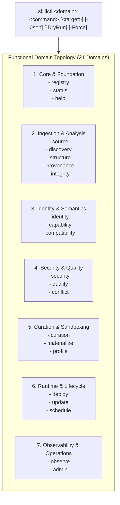

# Skill Registry Lifecycle Platform — Phase 21 Completion Dossier

## CLI Front-End Polish, Developer Experience & Interactive Inspection Subsystem

---

### Executive Summary

| Attribute | Value |
| :--- | :--- |
| **Phase** | **PHASE 21 — CLI FRONT-END POLISH & DEVELOPER EXPERIENCE** |
| **Gate Status** | **`GATE_21 = PASS / SEALED` (30/30 Tests Passed, 100%)** |
| **Functional Domains** | **21 Domains + Global Help System** |
| **Active Schemas** | **32 Schemas** (Draft 2020-12 / Draft-07) |
| **Output Formats** | **Colorized Terminal (Cyan/Green/Yellow/Red) + Clean `-Json` Output** |
| **Diagnostics Coverage**| **21 Domain Doctors + Global Registry Doctor (`skillctl registry doctor`)** |
| **Quarantine Authority** | **Sovereign (`gov-quarantine-link-v1`, 118 tombstones, 8 subtrees)** |
| **Trust Escalation** | **NONE (`trust_level: UNTRUSTED` preserved across all CLI interactions)** |
| **Unattended Promotion** | **ZERO (All inspection and status commands are strictly non-mutational)** |
| **Dynamic Execution** | **ZERO (0 payload executions during CLI command parsing or rendering)** |

---

### 1. Functional Domains & Standardized Command Architecture

The `skillctl` CLI front-end unifies 21 functional domains across the platform:

---

### 2. Standardized Ergonomics & Output Contracts

1. **Structured `-Json` Support**:
   - Every domain command (`status`, `list`, `inspect`, `doctor`, `telemetry`, etc.) outputs clean, valid JSON for automated pipelines and scripting.
2. **Terminal Aesthetics & Semantic Color Palette**:
   - **Cyan**: Subsystem titles, headers, and section dividers.
   - **Green**: Healthy/passed/active states (`HEALTHY`, `PASS`, `LOCKED_VALID`, `ACTIVE`).
   - **Yellow**: Intermediate/evaluating states (`STAGED`, `EVALUATING`, `UNTRUSTED`).
   - **Red**: Failures, blocked accesses, or errors (`FAIL`, `BLOCKED`, `INCONSISTENT`).
3. **Graceful Error Handling**:
   - Custom `Write-CliError` handler replaces raw unhandled PowerShell terminating exceptions, emitting clear red error messages and setting exit code 1.
4. **Comprehensive Multi-Domain Diagnostics**:
   - `skillctl <domain> doctor` executes localized checks.
   - `skillctl registry doctor` validates all 32 schemas, quarantine authority, journal locks, and subsystem integrity.

---

### 3. Test Suite Verification (30/30 PASS — 100%)

The test harness [`tests/Invoke-CliPolishAndDxTests.ps1`](file:///E:/.skill-registry/tests/Invoke-CliPolishAndDxTests.ps1) verified all 30 synthetic scenarios:

| Test ID | Test Scenario | Status |
| :---: | :--- | :---: |
| **01** | `skillctl help` displays full domain taxonomy | `PASS` |
| **02** | `skillctl registry status` executes without error | `PASS` |
| **03** | `skillctl registry status -Json` outputs valid parseable JSON | `PASS` |
| **04** | `skillctl source list -Json` outputs valid JSON array | `PASS` |
| **05** | `skillctl discovery status -Json` outputs valid JSON | `PASS` |
| **06** | `skillctl structure status -Json` outputs valid JSON | `PASS` |
| **07** | `skillctl provenance status -Json` outputs valid JSON | `PASS` |
| **08** | `skillctl integrity status -Json` outputs valid JSON | `PASS` |
| **09** | `skillctl identity status -Json` outputs valid JSON | `PASS` |
| **10** | `skillctl capability status -Json` outputs valid JSON | `PASS` |
| **11** | `skillctl compatibility status -Json` outputs valid JSON | `PASS` |
| **12** | `skillctl security status -Json` outputs valid JSON | `PASS` |
| **13** | `skillctl quality status -Json` outputs valid JSON | `PASS` |
| **14** | `skillctl conflict status -Json` outputs valid JSON | `PASS` |
| **15** | `skillctl curation status -Json` outputs valid JSON | `PASS` |
| **16** | `skillctl materialize status -Json` outputs valid JSON | `PASS` |
| **17** | `skillctl profile status -Json` outputs valid JSON | `PASS` |
| **18** | `skillctl deploy status -Json` outputs valid JSON | `PASS` |
| **19** | `skillctl update status -Json` outputs valid JSON | `PASS` |
| **20** | `skillctl schedule list -Json` outputs valid JSON | `PASS` |
| **21** | `skillctl observe telemetry -Json` outputs valid JSON | `PASS` |
| **22** | `skillctl status -Json` outputs valid comprehensive global metrics | `PASS` |
| **23** | `skillctl observe timeline` queries historical audit events | `PASS` |
| **24** | `skillctl capability search` performs semantic capability search | `PASS` |
| **25** | `skillctl compatibility matrix` outputs multi-provider compatibility matrix | `PASS` |
| **26** | Graceful error handling on missing mandatory targets exits with code 1 | `PASS` |
| **27** | `skillctl observe doctor` executes with exit code 0 and reports `HEALTHY` | `PASS` |
| **28** | `skillctl admin doctor` executes with exit code 0 and reports `HEALTHY` | `PASS` |
| **29** | `skillctl registry doctor` validates all 32 schemas and reports `HEALTHY` | `PASS` |
| **30** | Strict Invariant: CLI read-only operations never mutate live active deployments | `PASS` |

---

### 4. Canonical State Sealing

- **Current Gate**: `GATE_21_PASSED`
- **Current Phase**: `PHASE_21_CLI_FRONT_END_POLISH_DX`
- **Overall System Health**: `HEALTHY`
