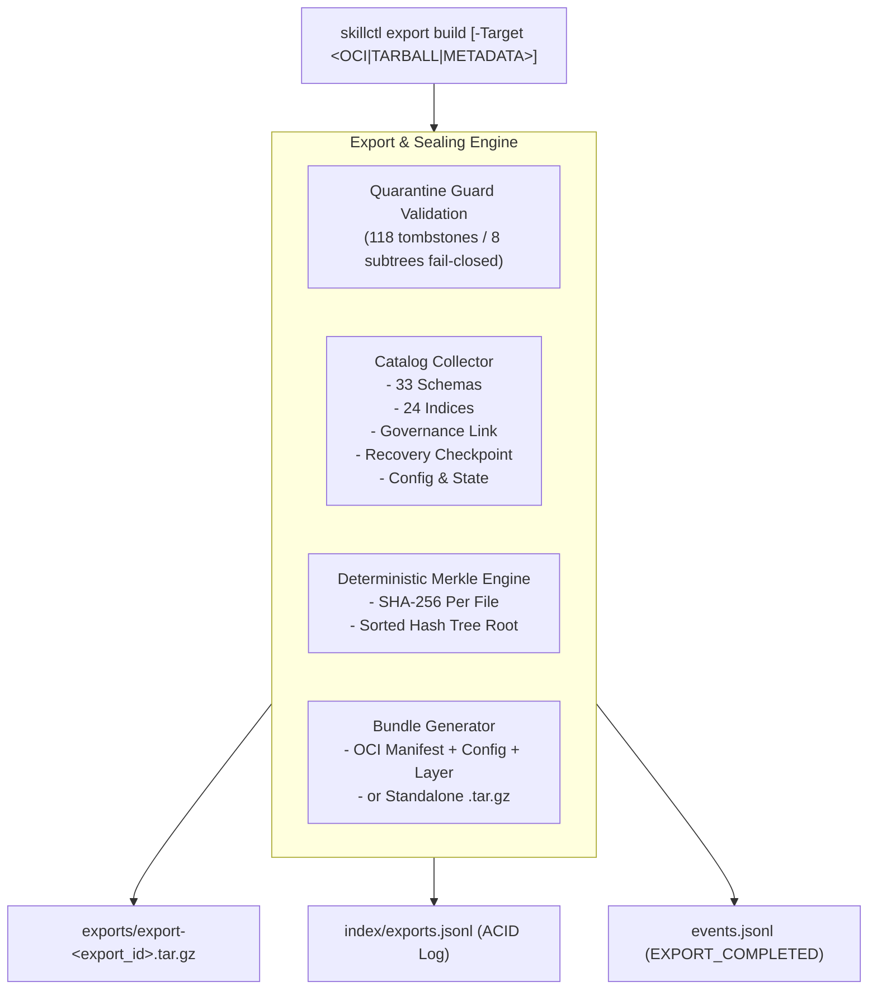

# Skill Registry Lifecycle Platform — Phase 22 Reconnaissance Report

## Registry Export, OCI Bundling, Interoperability & Final Sealing Subsystem

---

### Executive Summary

| Attribute | Value |
| :--- | :--- |
| **Phase** | **PHASE 22 — REGISTRY EXPORT, OCI BUNDLING & FINAL SEALING** |
| **Mode** | **STRICTLY READ-ONLY RECONNAISSANCE** |
| **Gate Status** | **`GATE_21 = PASS / SEALED` → READY FOR PHASE 22 REVIEW** |
| **Bundle Types** | **`OCI_ARTIFACT`, `STANDALONE_TARBALL`, `METADATA_ONLY`** |
| **Target Schema** | **Schema #33 — `registry-export-bundle.schema.json` (Draft 2020-12)** |
| **Storage & Ledger** | **Directory `exports/` + Append-Only Index `index/exports.jsonl`** |
| **OCI Spec Compliance**| **Image Manifest v1 (`application/vnd.oci.image.manifest.v1+json`)** |
| **Sealing Algorithm** | **Deterministic SHA-256 Merkle Root over all 33 Schemas & 24 Indices** |
| **Quarantine Authority** | **Sovereign (`gov-quarantine-link-v1`, 118 tombstones, 8 subtrees embedded)** |
| **Trust Escalation** | **NONE (`trust_level: UNTRUSTED` immutability locked in export manifest)** |
| **Unattended Promotion** | **ZERO (Export, verification, and inspection never mutate `ACTIVE` state)** |
| **Dynamic Execution** | **ZERO (0 payload executions during export, packing, or integrity check)** |

---

### 1. Architectural Topology: OCI Bundles & Deterministic Archival

The Phase 22 export architecture provides deterministic packaging and cryptographic sealing of the complete registry state:

---

### 2. Specification of Schema #33 (`registry-export-bundle.schema.json`)

Schema #33 defines the contract for portable, sealed export packages:

- **`export_id`**: Pattern `^exp-\d{8}T\d{6}\d{3}Z-[a-f0-9]{8}$`.
- **`bundle_type`**: Enum `["OCI_ARTIFACT", "STANDALONE_TARBALL", "METADATA_ONLY"]`.
- **`export_format_version`**: String `"1.0.0"`.
- **`created_utc`**: ISO 8601 UTC timestamp.
- **`registry_metadata`**: ID, name, version, canonical state snapshot.
- **`quarantine_anchor`**: Embedded link ID (`gov-quarantine-link-v1`), snapshot ID, and tombstones count (118).
- **`canonical_merkle_root`**: 64-character hex string representing the root hash over all archived components.
- **`manifest_counts`**: Breakdown of schemas (33), indices (24), sources (11), resources (12), deployments (186), etc.
- **`bundle_payload`**: File path in `exports/`, byte size, and SHA-256 payload hash.
- **`oci_descriptor`**: Media type, digest, annotations (`org.opencontainers.image.title`, `io.skill-registry.merkle.root`).
- **`governance_lock`**:
  - `immutable_bundle: true`
  - `quarantine_precedence: true`
  - `zero_unattended_promotion: true`
  - `untrusted_source_preservation: true`

---

### 3. Cross-Platform Determinism & Interoperability

1. **Normalized Tarball Packaging**:
   - Tarball entries are sorted alphabetically by relative path.
   - Normalized modification timestamps (set to export creation UTC).
   - POSIX file modes normalized (0644 for files, 0755 for directories).
2. **OCI Image Format Compliance**:
   - Manifest: `application/vnd.oci.image.manifest.v1+json`.
   - Config: `application/vnd.oci.image.config.v1+json`.
   - Layer: `application/vnd.skill-registry.export.bundle.v1.tar+gzip`.
   - Annotations compatible with OCI Registries (Harbor, Docker Hub, GHCR, AWS ECR).
3. **Fail-Closed Tamper Verification**:
   - `Test-RegistryExportBundleIntegrity` re-extracts the payload in-memory, recalculates per-file SHA-256 hashes and the global Merkle root, and compares against the recorded manifest. Any single bit flip triggers an immediate `TAMPER_DETECTED` failure.

---

### 4. Governance & Safety Invariants Preserved

- **Zero Promotion Bypass**: Exporting a registry bundle does not mutate or promote any resource to `ACTIVE`.
- **Quarantine Immutability**: All 118 tombstones and 8 blocked subtrees are deeply embedded into the export manifest and validated during verification.
- **Trust Immutability**: Discovered skills retain immutable `UNTRUSTED` level.
- **Zero Dynamic Execution**: No scripts from skills are run during bundling or inspection.

---

### 5. 30 Synthetic Test Scenarios Designed

The test harness [`tests/Invoke-RegistryExportAndSealingTests.ps1`](file:///E:/.skill-registry/tests/Invoke-RegistryExportAndSealingTests.ps1) covers:

1. Conformance of Schema #33 (`schemas/registry-export-bundle.schema.json`) to Draft 2020-12.
2. `New-RegistryExportId` format validation (`exp-YYYYMMDDTHHmmssfffZ-<guid>`).
3. `New-RegistryExportBundle -BundleType METADATA_ONLY` generation.
4. Export manifest validation against Schema #33.
5. `New-RegistryExportBundle -BundleType OCI_ARTIFACT` generation.
6. OCI artifact media types validation (`application/vnd.oci.image.manifest.v1+json`).
7. OCI annotations validation (title, quarantine link, Merkle root).
8. `New-RegistryExportBundle -BundleType STANDALONE_TARBALL` generation.
9. Export bundle contains all 33 schemas.
10. Export bundle contains all 24 index files.
11. Export bundle contains `governance/quarantine-link.json`.
12. Export bundle contains state and recovery checkpoint.
13. Global Merkle root determinism across repeated exports.
14. `index/exports.jsonl` ACID transactional recording.
15. `Get-RegistryExports` query by ID.
16. `Get-RegistryExports` filtering by bundle type.
17. `Test-RegistryExportBundleIntegrity` returns `VERIFIED_VALID` on untouched bundle.
18. Tamper detection: bit-flip causes verification failure.
19. Quarantine sovereignty: missing quarantine causes export to fail closed.
20. Quarantine sovereignty: verification confirms 118 tombstones.
21. Trust immutability: manifest locks `untrusted_source_preservation: true`.
22. Zero Unattended Promotion: export creation does NOT alter `ACTIVE` deployment count.
23. Zero Unattended Promotion: export verification does NOT alter `ACTIVE` deployment count.
24. `skillctl export list` displays cataloged export bundles.
25. `skillctl export list -Json` outputs valid JSON array.
26. `skillctl export inspect <id>` displays detailed export dossier.
27. `skillctl export verify <id>` executes integrity verification.
28. `skillctl export doctor` reports `HEALTHY`.
29. `skillctl registry doctor` validates all 33 schemas and reports `HEALTHY`.
30. Final Sealing: Global registry status Merkle root verified across all subsystems.

---

### 6. Governance Stop

> [!IMPORTANT]
> **GOVERNANCE STOP ENGAGED**: Reconnaissance of Phase 22 is 100% complete and read-only.
> No active deployments were promoted. No source skills were mutated.
> Implementation and execution of Phase 22 test suite await explicit user authorization.
