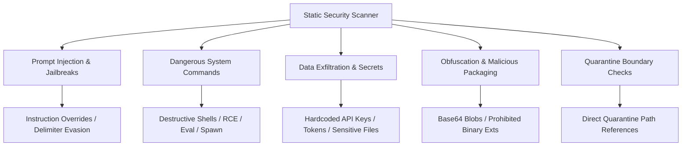

# Phase 9 — Static Security Audit & Threat Modeling Reconnaissance Report

**Skill Registry Lifecycle Platform**  
**Date**: 2026-08-31  
**Phase**: Phase 9 — Security Audit & Scanning  
**Status**: `RECONNAISSANCE_COMPLETE` / `READY_FOR_AUTHORIZATION`

---

## 1. Executive Summary & Governance Baseline

A comprehensive read-only reconnaissance was conducted on `E:\.skill-registry` to model the static security analysis requirements for Phase 9.

### Key Governance Invariants

1. **Zero Execution**: The security engine performs strictly lexical, regex, and AST-like pattern matching. No scripts, binaries, or module loaders are invoked.
2. **Quarantine Primacy**: Quarantined tombstones (118) and blocked subtrees (8) from `Snapshot: 20260812T165347306Z-80e0f888` remain completely untouchable. Any touch or violation returns `QUARANTINE_BLOCKED` and `REJECTED`.
3. **No Unilateral Trust Escalation**: A passing security audit establishes safety evidence but does not automatically elevate trust to `TRUSTED` or `REVIEWED`. Discovered skills maintain `UNTRUSTED` state until later curated phases.
4. **ACID Transactions**: Security audits are committed via `SECURITY_AUDIT_SEAL` operations to `transactions/journal.jsonl` and logged to `audit/events.jsonl` with `SECURITY_AUDITED`.

---

## 2. Threat Vector Categories for Static Scanning

### Categorized Threat Models

1. **Prompt Injection & Adversarial Jailbreaks (`PROMPT_INJECTION`)**:
   - `SEC-PI-001`: Instruction override patterns (`ignore previous instructions`, `forget all safety rules`, `disregard guidelines`, `bypass system restrictions`).
   - `SEC-PI-002`: Delimiter injection / boundary forging (`<system>`, `<<SYS>>`, `[INST]`, `---BEGIN SYSTEM PROMPT---`).
2. **Dangerous System Commands & RCE (`SYSTEM_EXECUTION`)**:
   - `SEC-SYS-001`: Destructive disk commands (`rm -rf`, `del /f /s /q`, `format`, `dd if=/dev/zero`).
   - `SEC-SYS-002`: Unsafe dynamic execution (`Invoke-Expression`, `iex`, `eval()`, `exec()`, `powershell -enc`, `cmd.exe /c`, `subprocess.Popen`).
   - `SEC-SYS-003`: Remote pipe execution (`curl ... | bash`, `wget ... | sh`).
3. **Data Exfiltration & Credential Harvesting (`DATA_EXFILTRATION`)**:
   - `SEC-EXFIL-001`: Hardcoded cloud/API credentials (`AKIA[0-9A-Z]{16}`, `ghp_[0-9a-zA-Z]{36}`, `sk-[0-9a-zA-Z]{32,}`).
   - `SEC-EXFIL-002`: Sensitive OS / Credential path access (`/etc/passwd`, `/etc/shadow`, `~/.aws/credentials`, `~/.ssh/id_rsa`, `.env`).
   - `SEC-EXFIL-003`: Suspicious exfiltration endpoints (`webhook.site`, `requestbin`, `ngrok`, raw IP exfil).
4. **Obfuscation & Malicious Packaging (`OBFUSCATION`)**:
   - `SEC-OBF-001`: High-entropy base64 executable payload blocks.
   - `SEC-OBF-002`: Prohibited binary/script extensions (`.exe`, `.dll`, `.bat`, `.vbs`, `.cmd`).
5. **Quarantine Boundary Violations (`QUARANTINE_VIOLATION`)**:
   - `SEC-QRN-001`: References to quarantined tombstones or blocked `.gemini` subtrees.

---

## 3. Risk Rating & Scoring Model

| Risk Level | Score Range | Description | Policy Verdict |
|---|---|---|---|
| **`CLEAN`** | 0 | Zero threat indicators found across all files | `PASS` |
| **`LOW_RISK`** | 1 – 20 | Minor informational notices (benign placeholders) | `PASS` (with warnings) |
| **`MEDIUM_RISK`** | 21 – 50 | Ambiguous patterns, dynamic scripts or mild boundary hints | `FLAGGED_FOR_REVIEW` |
| **`HIGH_RISK`** | 51 – 80 | Detected dangerous commands, credential harvesting, or obfuscation | `REJECTED` |
| **`CRITICAL_RISK`** | 81 – 100 | Active destructive payloads, prompt jailbreaks, or exfiltration | `REJECTED` |
| **`QUARANTINE_BLOCKED`** | 100 | Prohibited touch of quarantine artifacts | `REJECTED` |

---

## 4. Planned Deliverables for Phase 9 Implementation

1. **Schema**: `schemas/security-report.schema.json` (Draft 2020-12, schema #22).
2. **Index**: `index/security-reports.jsonl` (Append-only transactional index).
3. **Core Functions in `RegistryCore.psm1`**:
   - `Get-RegistrySecurityRuleset`
   - `Invoke-RegistryStaticSecurityScan`
   - `Get-RegistrySecurityReports`
   - `Test-RegistrySecurityGate`
4. **CLI Front-End (`skillctl`)**:
   - `skillctl security status`
   - `skillctl security list`
   - `skillctl security inspect <id>`
   - `skillctl security scan <id>`
   - `skillctl security doctor`
5. **Test Harness (`tests/Invoke-SecurityTests.ps1`)**:
   - 30 synthetic test scenarios covering all rules, edge cases, fault injections, transaction rollbacks, schema validations, and quarantine defenses.
