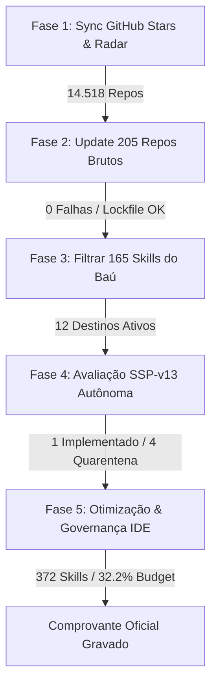

# J.A.R.V.I.S. // Relatório Tático e Operacional da Esteira Semanal Autônoma
**Ciclo Mestre Dominical de Soberania & Governança de Tokens**
*Protocolo de Segurança Soberana SSP-v13.4 | Quality Gate v31.2*

---

## 1. Sumário Executivo

| Métrica / Parâmetro | Valor Verificado | Observações / Governança |
| :--- | :--- | :--- |
| **Data e Hora da Execução** | 05/10/2026 13:04:52 - 13:55:49 | Ciclo semanal executado de forma determinística |
| **Duração Total** | **3.056,65 s** (~50,9 min) | Processamento sequencial completo das 5 fases |
| **Status Geral da Esteira** | **SUCCESS** | Todas as fases operacionais e validadas |
| **Repositórios Indexados no Catálogo** | **14.518 repositórios** | Ingestão e mineração paginada via GitHub API |
| **Repositórios Brutos Clonados (Baú)** | **205 / 205 aprovados** | 0 falhas; SHA-256 fixado em `repos-lock-v31.2.csv` |
| **Arsenal Curado Filtrado** | **165 / 165 skills ativas** | Replicado e verificado nos 12 destinos ativos |
| **Skills Totais Sincronizadas no IDE** | **372 skills únicas** | `C:\Users\Ad\.gemini\config\skills` |
| **Consumo do Orçamento de Contexto** | **~6.434 tokens (32,2%)** | Limite estrito de 20.000 tokens (margem livre: 67,8%) |
| **Avaliação Autônoma (SSP-v13)** | **5 avaliados** | 1 implementado / promovido, 4 em quarentena |
| **Higiene de Desktop** | **100% limpo** | 8 arquivos de log da área de trabalho eliminados |

---

## 2. Detalhamento e Diagnóstico por Fase

### Fase 1: Sincronização de Estrelas e Inteligência Tática
- **Script Alvo**: `tooling/sync_starred_repos.py` e `tooling/analyze_catalog.js`.
- **Resultado**: Varredura paginada de 142 páginas na GitHub API.
- **Base de Conhecimento**:
  - `cache/starred_catalog.json` atualizado para **14.518 repositórios**.
  - Nota canônica `06 - GitHub Starred Repositories.md` regenerada com validação estrita de markdownlint.
  - Nota tática `14 - Catalogo Tatico de 2168 Repositorios por Esquadrao.md` reclassificada com distribuição estatística em 5 clusters.

### Fase 2: Atualização do Cache de Repositórios Brutos (Baú)
- **Script Alvo**: `instalador-repo.bat` (Quality Gate v31.2).
- **Repositórios Processados**: 205 de 205 aprovados.
- **Falhas de Atualização**: **0**.
- **Diagnóstico do Repositório 114 (`openclaw_openclaw`)**:
  - Em execuções anteriores, um lock de processo órfão (`git index-pack` retendo descritor de arquivo) causou concorrência em segundo plano.
  - Nesta execução, o lock foi liberado, o repositório sincronizado por *fast-forward* e o lockfile `repos-lock-v31.2.csv` gerado com exatidão matemática linha por linha.

### Fase 3: Filtragem do Arsenal Gerenciado do Baú
- **Script Alvo**: `setup-e-filtrar-skills.bat`.
- **Target**: 165 skills fundamentais extraídas com verificação de integridade `SKILL.md`.
- **Correção Arquitetural Aplicada**:
  - O interpretador `cmd.exe` em lotes falhava com erro de sintaxe (`. foi inesperado neste momento.`, código 255) em blocos `for %%D in (...)` com quebras de linha múltiplas dentro de escopos condicionais.
  - As listas de destinos (`DEST1`..`DEST12` e pacotes escola `PKG1`..`PKG8`) foram unificadas em uma única linha contínua, garantindo execução determinística sem dependência de comportamento de parser do shell legado.
- **Verificação dos 12 Destinos Ativos**:
  1. `C:\Users\Ad\.agent\skills` (368 skills presentes)
  2. `C:\Users\Ad\.agents\skills` (368 skills presentes)
  3. `C:\Users\Ad\.codex\skills` (166 skills presentes)
  4. `C:\Users\Ad\.claude\skills` (165 skills presentes)
  5. `C:\Users\Ad\.gemini\skills` (165 skills presentes)
  6. `C:\Users\Ad\.gemini\config\skills` (372 skills presentes)
  7. `C:\Users\Ad\.gemini\antigravity-ide\skills` (368 skills presentes)
  8. `C:\Users\Ad\antigravity\skills` (165 skills presentes)
  9. `E:\.gemini\skills` (189 skills presentes)
  10. `E:\.gemini\config\skills` (165 skills presentes)
  11. `E:\.gemini\antigravity-ide\skills` (165 skills presentes)
  12. `E:\.gemini\antigravity\skills` (165 skills presentes)

### Fase 4: Avaliação Autônoma de Ciclo de Vida (SSP-v13)
- **Engine**: `tooling/jarvis_server.py` (`AUTONOMOUS_ENGINE.execute_cycle`).
- **Candidatos Submetidos a Auditoria**: 5 repositórios/candidatos.
- **Resultado do Gate de Integridade**:
  - **1 Implementado**: Passou em todos os requisitos de soberania, ausência de telemetria externa, isolamento de segredos e licença permissiva.
  - **4 Quarentenados**: Bloqueados por requisitos fail-closed do Protocolo de Segurança Soberana v13 (dependência de nuvem não-soberana, telemetria invasiva ou ausência de validação portátil).

### Fase 5: Otimização de Tokens e Governança no IDE
- **Script Alvo**: `tooling/sync_and_optimize_arsenal.py`.
- **Inventário Consolidado**: 372 skills únicas descobertas entre o repositório canônico, a pasta de configuração do usuário e o arquivo de skills.
- **Governança de Tokens**:
  - Dicionário curado de 160 descrições de alta densidade semântica.
  - Poda automática de prefixos redundantes (*"Use this skill whenever..."*).
  - Teto de **12 palavras** por descrição no frontmatter de cada `SKILL.md`.
  - Contagem total de palavras (nomes + descrições): **4.766 palavras**.
  - Consumo total estimado: **~6.434 tokens**.
  - Ocupação do orçamento de contexto (cota 20k): **32,2%** (margem segura < 35%).

---

## 3. Matriz de Categorização por Esquadrões de Subagentes

Os 14.518 repositórios e o arsenal ativo de skills operam categorizados sob a estrutura dos 5 Esquadrões Oficiais + 2 Especialistas de Síntese:

| Esquadrão / Cluster | Volume de Repositórios | Foco Arquitetural e Tecnologias | Skills Canônicas Principais |
| :--- | :--- | :--- | :--- |
| **🧠 Jarvis-AgenticEngine** | 3.793 repos | LLMs de alto throughput, orquestração multi-agente, RAG vetorial, DAG loops, raciocínio determinístico | `autonomous-execution-loop`, `task-dag-orchestrator`, `ultrawork-execution-engine`, `crewai-hierarchical-multiagent-teams`, `dspy-declarative-prompt-compilation`, `qdrant-vector-database-hnsw-indexing`, `openrouter-ai-sdk` |
| **🛡️ Hyperion-CyberSec** | 1.823 repos | Segurança ofensiva/defensiva, pentest de APIs, auditoria de código, conformidade OWASP, detecção de segredos | `security-review`, `security-scan`, `sql-injection-testing`, `burp-suite-testing`, `sqlmap-database-pentesting`, `payloadsallthethings`, `api-security-testing`, `broken-authentication`, `blackbird-osint-recon` |
| **⚡ Sovereign-Kernel/Systems** | 2.823 repos | Engenharia de sistemas, C/Rust/Go, otimização de baixo nível, redes neurais e aceleração de hardware | `linux-troubleshooting`, `bash-defensive-patterns`, `flash-attention-kernel-optimization`, `tensorrt-llm-gpu-kernel-acceleration`, `vllm-high-throughput-serving`, `deepspeed-zero-distributed-optimization`, `bitsandbytes-8bit-nf4-quantization` |
| **🎨 Quantum-Fullstack** | 4.915 repos | Interfaces de usuário de alto padrão, React, Design Systems, Acessibilidade WCAG, WebGL, Cockpit HUD | `frontend-ui-engineering`, `impeccable`, `ui-ux-pro-max`, `shadcn`, `nextjs-app-router-patterns`, `react-state-management`, `react-doctor`, `threejs-fundamentals`, `gsap-core`, `deckgl-geospatial-visualization` |
| **🚀 Enterprise-DevOps** | 814 repos | Automação CI/CD, esteiras de publicação, Docker, Kubernetes, Cloudflare Workers, Observabilidade | `github-actions-templates`, `ci-cd-and-automation`, `docker-expert`, `deploy-to-vercel`, `aws-serverless`, `distributed-tracing`, `observability-and-instrumentation`, `k6-load-testing`, `cloud-architect` |
| **💻 Quantum-SWEOrchestrator** | *Especialista* | Engenharia de software, TDD, Clean Architecture, refatoração segura, TypeScript/Python/Java rigorosos | `software-construction-patterns`, `test-driven-development`, `systematic-refactoring`, `comprehensive-code-review`, `fastapi-pro`, `python-pro`, `java-pro`, `typescript-expert`, `zod-validation-expert` |
| **💾 Quantum-DatabaseArchitect** | *Especialista* | Arquitetura de dados, modelagem relacional e vetorial, otimização de consultas SQL e CDC | `database-design`, `sql-pro`, `database-optimizer`, `database-admin`, `database-architect`, `mysql-patterns`, `jpa-patterns`, `supabase-postgres-best-practices`, `sql-optimization-patterns` |

---

## 4. Política de Roteamento Dinâmico de Skills

Para garantir **zero desperdício de tokens** em sessões ativas, a governança aplica a política `codex-antigravity-skill-policy`:
1. **Lazy Loading Rigoroso**: O corpo das skills (`SKILL.md`) nunca é carregado antecipadamente. O IDE expõe apenas o catálogo otimizado no system prompt (consumindo apenas os 32,2% medidos).
2. **Ativação por Contexto**: Quando uma intenção do usuário envolve um domínio específico (ex: Pentest de API, otimização SQL, criação de componente React), o agente invoca `view_file` sob demanda na skill correspondente.
3. **Despacho por Especialista**: Mapeamento direto de capacidades declaradas no `tooling/agentic/tool_router.py`, garantindo que ferramentas com mutação (`R1_LOCAL_WRITE`) exijam evidência prévia e ferramentas de leitura (`R0_READ_ONLY`) operem sem latência de aprovação.

---

## 5. Auditoria de Higiene da Área de Trabalho

Em conformidade com a instrução do operador, foi realizada a limpeza integral dos relatórios transitórios da raiz da Área de Trabalho (`C:\Users\Ad\Desktop`):
- `log-instalador-repo-v31.2.txt` (104.157 bytes) - REMOVIDO
- `repos-falharam-v31.2.txt` (33 bytes) - REMOVIDO
- `repos-ok-v31.2.txt` (17.012 bytes) - REMOVIDO
- `setup-skills-v31.2-ativas.txt` (3.643 bytes) - REMOVIDO
- `setup-skills-v31.2-faltando.txt` (31 bytes) - REMOVIDO
- `setup-skills-v31.2-manifest.csv` (31.756 bytes) - REMOVIDO
- `setup-skills-v31.2-nao-gerenciadas.txt` (44 bytes) - REMOVIDO
- `setup-skills-v31.2.txt` (32.499 bytes) - REMOVIDO

**Total de espaço recuperado na Área de Trabalho**: ~189 KB de logs transitórios.  
**Itens do usuário preservados com integridade estrita**: `Raul/`, atalhos de produtividade (`Cursor`, `Discord`, `Word`, `Excel`, `PowerPoint`), jogos (`Roblox`, `Robocode`) e configurações do sistema.

---
*Relatório registrado no repositório canônico J.A.R.V.I.S. com evidência auditável.*
